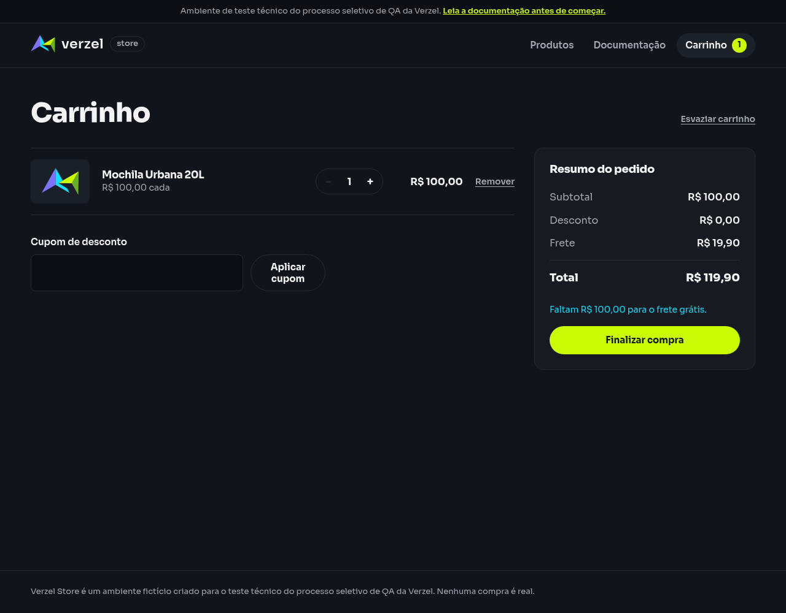

# Relatório de teste — Aplicar desconto apenas aos produtos

**Resultado: Falhou.** O desconto de R$ 10,00 e o total de R$ 109,90 ficaram corretos. A tela mostrou “Cupom BEMVINDO10 aplicado.”, diferente da mensagem literal exigida: “Cupom aplicado: 10% de desconto nos produtos.”

**Data do teste:** 09/10/2026, das 16h58min37s às 16h58min39s (America/Fortaleza).

**Loja:** [Verzel Store — ambiente de testes](https://verzel-store.qa-test-verzel-store.workers.dev).

**Execução:** Playwright 1.64.0; Chromium 151.0.7922.173 e chamadas reais de API. Certificados verificados.

**Referência:** [Documentação VZS-142, versão 2.3.0](https://verzel-store.qa-test-verzel-store.workers.dev/documentacao); [BDD](<../../../Testes Manuais/features/cupons.feature>); [relatório manual de referência](<../../../Testes Manuais/reports/falhas/cupom-desconto-produtos.md>).

## O que foi testado

O desconto de R$ 10,00 e o total de R$ 109,90 ficaram corretos. A tela mostrou “Cupom BEMVINDO10 aplicado.”, diferente da mensagem literal exigida: “Cupom aplicado: 10% de desconto nos produtos.”

Executamos o cenário do relatório manual por meio de testes Playwright. API é o serviço que recebe as requisições da loja; JSON é o formato dos dados enviados e recebidos. Cada comparação foi registrada antes de concluir o resultado.

## Cenário BDD

```gherkin
Contexto:
    Dado que o carrinho contém 1 unidade do produto "P005" de R$ 100,00

  @CA01 @CA09
  Cenário: Aplicar desconto apenas aos produtos
    Quando aplico o cupom "BEMVINDO10"
    Então o subtotal deve ser R$ 100,00
    E o desconto deve ser R$ 10,00
    E o frete deve ser R$ 19,90
    E o total deve ser R$ 109,90
    E deve ser exibida a mensagem "Cupom aplicado: 10% de desconto nos produtos."
```

## Resultados da conferência

Foram concluídos 1 caso(s), com 15 verificações aprovadas e 1 com falha. Nenhum caso foi pulado ou ficou bloqueado.

### Aplicar desconto apenas aos produtos e exibir a mensagem do BDD

| Verificação | Esperado | Encontrado | Resultado |
| --- | --- | --- | --- |
| API independente — Status | 200 | 200 | Aprovado |
| API independente — subtotal | R$ 100,00 | R$ 100,00 | Aprovado |
| API independente — desconto | R$ 10,00 | R$ 10,00 | Aprovado |
| API independente — frete | R$ 19,90 | R$ 19,90 | Aprovado |
| API independente — total | R$ 109,90 | R$ 109,90 | Aprovado |
| API independente — Mensagem do cupom | Cupom aplicado: 10% de desconto nos produtos. | Cupom aplicado: 10% de desconto nos produtos. | Aprovado |
| API usada pela interface — subtotal | R$ 100,00 | R$ 100,00 | Aprovado |
| API usada pela interface — desconto | R$ 10,00 | R$ 10,00 | Aprovado |
| API usada pela interface — frete | R$ 19,90 | R$ 19,90 | Aprovado |
| API usada pela interface — total | R$ 109,90 | R$ 109,90 | Aprovado |
| Interface — subtotal | R$ 100,00 | R$ 100,00 | Aprovado |
| Interface — desconto | R$ 10,00 | R$ 10,00 | Aprovado |
| Interface — frete | R$ 19,90 | R$ 19,90 | Aprovado |
| Interface — total | R$ 109,90 | R$ 109,90 | Aprovado |
| Interface — Mensagem exigida pelo BDD exibida na tela | Sim | Não | Falhou |
| Interface — Um cupom aplicado | 1 | 1 | Aprovado |

## Falhas encontradas

- A mensagem exibida não correspondeu ao texto literal do BDD. A API retornou a mensagem documentada, mas a interface mostrou “Cupom BEMVINDO10 aplicado.”. Os cálculos passaram.

## Comprovantes do teste

- [Resumo e horários](evidencias/cupom-desconto-produtos/20261009-165827/resumo-validacao.json).
- [Teste TypeScript](../../tests/interface/cupom-desconto-produtos.spec.ts).
- [Relatório HTML completo do Playwright](../execucoes/20261009-165827/html/index.html).
- [Saída da execução](../execucoes/20261009-165827/playwright-stdout.txt) e [mensagens da ferramenta](../execucoes/20261009-165827/playwright-stderr.txt).

### Evidências — Aplicar desconto apenas aos produtos e exibir a mensagem do BDD

- [Conferência de cada passo](evidencias/cupom-desconto-produtos/20261009-165827/bemvindo10-P005-1/validacao.json).
- [api-independente-inicio.json](evidencias/cupom-desconto-produtos/20261009-165827/bemvindo10-P005-1/api-independente-inicio.json).
- [api-independente-requisicao.json](evidencias/cupom-desconto-produtos/20261009-165827/bemvindo10-P005-1/api-independente-requisicao.json).
- [api-independente-resposta-http.json](evidencias/cupom-desconto-produtos/20261009-165827/bemvindo10-P005-1/api-independente-resposta-http.json).
- [api-independente-corpo-recebido.json](evidencias/cupom-desconto-produtos/20261009-165827/bemvindo10-P005-1/api-independente-corpo-recebido.json).
- [api-independente-comando.txt](evidencias/cupom-desconto-produtos/20261009-165827/bemvindo10-P005-1/api-independente-comando.txt).
- [antes-do-cupom-estado-interface.json](evidencias/cupom-desconto-produtos/20261009-165827/bemvindo10-P005-1/antes-do-cupom-estado-interface.json).
- [antes-do-cupom-texto-tela.txt](evidencias/cupom-desconto-produtos/20261009-165827/bemvindo10-P005-1/antes-do-cupom-texto-tela.txt).
- [antes-do-cupom-tela.png](evidencias/cupom-desconto-produtos/20261009-165827/bemvindo10-P005-1/antes-do-cupom-tela.png).
- [api-interface-requisicao.json](evidencias/cupom-desconto-produtos/20261009-165827/bemvindo10-P005-1/api-interface-requisicao.json).
- [api-interface-resposta-http.json](evidencias/cupom-desconto-produtos/20261009-165827/bemvindo10-P005-1/api-interface-resposta-http.json).
- [api-interface-corpo-recebido.json](evidencias/cupom-desconto-produtos/20261009-165827/bemvindo10-P005-1/api-interface-corpo-recebido.json).
- [api-interface-comando.txt](evidencias/cupom-desconto-produtos/20261009-165827/bemvindo10-P005-1/api-interface-comando.txt).
- [depois-do-cupom-estado-interface.json](evidencias/cupom-desconto-produtos/20261009-165827/bemvindo10-P005-1/depois-do-cupom-estado-interface.json).
- [depois-do-cupom-texto-tela.txt](evidencias/cupom-desconto-produtos/20261009-165827/bemvindo10-P005-1/depois-do-cupom-texto-tela.txt).
- [depois-do-cupom-tela.png](evidencias/cupom-desconto-produtos/20261009-165827/bemvindo10-P005-1/depois-do-cupom-tela.png).
- [mensagens-interface.json](evidencias/cupom-desconto-produtos/20261009-165827/bemvindo10-P005-1/mensagens-interface.json).
- [error-context](evidencias/cupom-desconto-produtos/20261009-165827/bemvindo10-P005-1/error-context).



Para repetir somente este cenário, execute na pasta `Testes Automatizados`:

```bash
npx playwright test tests/interface/cupom-desconto-produtos.spec.ts --project=interface-chromium
```

Os anexos de resposta preservam o status final da aplicação, os cabeçalhos e o corpo recebidos pelo Playwright. Os arquivos de comando mostram as requisições equivalentes em curl; a execução avaliada foi feita pelo Playwright.

O runner terminou com código 1 porque houve comparações reprovadas no conjunto completo, não por bloqueio de ambiente. A primeira execução foi preservada como diagnóstico de uma correção na leitura do desconto pela automação; a avaliação acima usa somente a execução final.

## Limite desta avaliação

O resultado vale para os exemplos deste BDD e para as respostas e telas da data indicada. Não comprova aprovação de toda a loja. Pedidos e dados de cliente são fictícios no ambiente de QA; não houve pagamento real. Os relatórios manuais e suas evidências não foram alterados.
