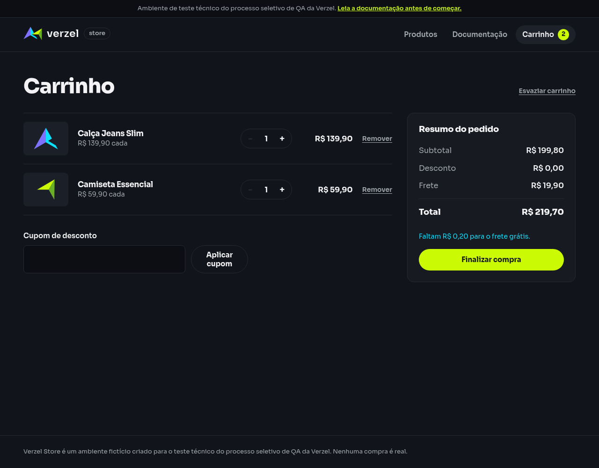
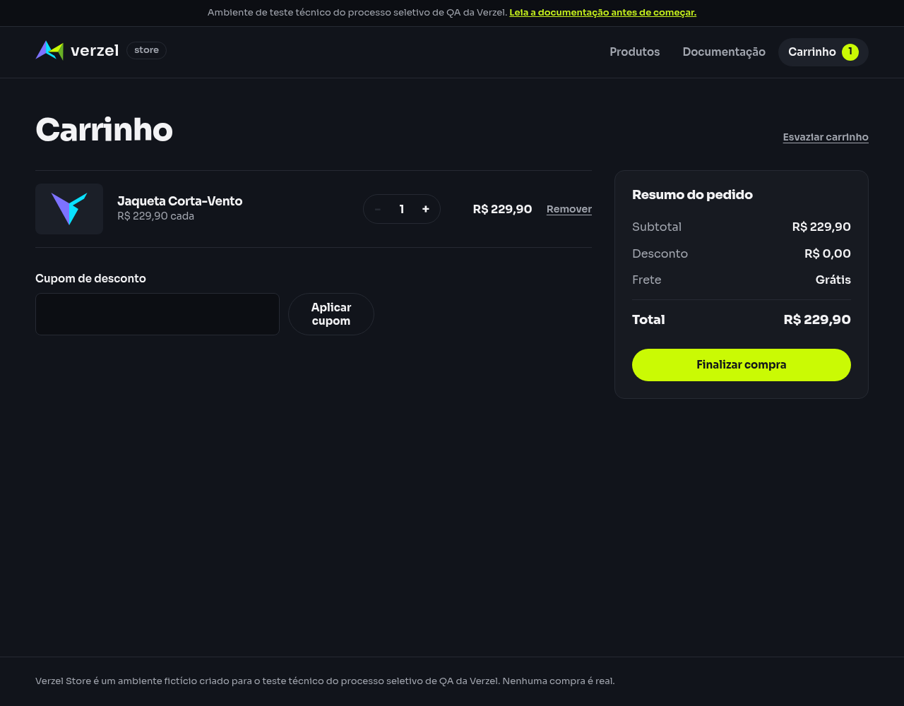

# Relatório de teste — Frete nos limites do subtotal

**Resultado: Falhou.** Dois dos quatro exemplos passaram. Com subtotal de R$ 200,00, a loja cobrou R$ 19,90 de frete e mostrou total de R$ 219,90. Com subtotal de R$ 229,90, o cálculo ficou correto, mas a tela exibiu “Grátis” em vez do valor com duas casas decimais exigido pelo BDD.

**Data do teste:** 09/10/2026, das 16h58min44s às 16h58min52s (America/Fortaleza).

**Loja:** [Verzel Store — ambiente de testes](https://verzel-store.qa-test-verzel-store.workers.dev).

**Execução:** Playwright 1.64.0; Chromium 151.0.7922.173 e chamadas reais de API. Certificados verificados.

**Referência:** [Documentação VZS-142, versão 2.3.0](https://verzel-store.qa-test-verzel-store.workers.dev/documentacao); [BDD](<../../../Testes Manuais/features/frete_e_totais.feature>); [relatório manual de referência](<../../../Testes Manuais/reports/falhas/frete-limites-subtotal.md>).

## O que foi testado

Dois dos quatro exemplos passaram. Com subtotal de R$ 200,00, a loja cobrou R$ 19,90 de frete e mostrou total de R$ 219,90. Com subtotal de R$ 229,90, o cálculo ficou correto, mas a tela exibiu “Grátis” em vez do valor com duas casas decimais exigido pelo BDD.

Executamos o cenário do relatório manual por meio de testes Playwright. API é o serviço que recebe as requisições da loja; JSON é o formato dos dados enviados e recebidos. Cada comparação foi registrada antes de concluir o resultado.

## Cenário BDD

```gherkin
Funcionalidade: Cálculo do subtotal, desconto, frete e total
  Os cálculos da API devem ser exibidos pela interface sem divergência.

  @CA06 @CA07 @CA11 @api @interface
  Esquema do Cenário: Calcular frete nos limites do subtotal
    Dado um carrinho com os itens "<itens>"
    Quando calculo o carrinho sem cupom
    Então a API deve responder com status 200
    E os valores monetários retornados devem ter precisão de até 2 casas decimais
    E a interface deve exibir os valores com 2 casas decimais
    E a API e a interface devem apresentar o resumo:
      | subtotal | desconto | frete   | freteGratis | valorFaltanteFreteGratis | total   |
      | <subtotal> | 0,00   | <frete> | <gratis>    | <faltante>              | <total> |

    Exemplos:
      | itens          | subtotal | frete | gratis | faltante | total  |
      | P003:1         | 189,90   | 19,90 | falso  | 10,10    | 209,80 |
      | P002:1,P001:1  | 199,80   | 19,90 | falso  | 0,20     | 219,70 |
      | P005:2         | 200,00   | 0,00  | verdadeiro | 0,00 | 200,00 |
      | P007:1         | 229,90   | 0,00  | verdadeiro | 0,00 | 229,90 |
```

## Resultados da conferência

Foram concluídos 4 caso(s), com 109 verificações aprovadas e 11 com falha. Nenhum caso foi pulado ou ficou bloqueado.

### Frete nos limites: P003-1

| Verificação | Esperado | Encontrado | Resultado |
| --- | --- | --- | --- |
| API independente — Status | 200 | 200 | Aprovado |
| API independente — subtotal | R$ 189,90 | R$ 189,90 | Aprovado |
| API independente — desconto | R$ 0,00 | R$ 0,00 | Aprovado |
| API independente — frete | R$ 19,90 | R$ 19,90 | Aprovado |
| API independente — freteGratis | Não | Não | Aprovado |
| API independente — valorFaltanteFreteGratis | 10.1 | 10.1 | Aprovado |
| API independente — total | R$ 209,80 | R$ 209,80 | Aprovado |
| API independente — Até duas casas decimais: subtotal | Sim | Sim | Aprovado |
| API independente — Até duas casas decimais: desconto | Sim | Sim | Aprovado |
| API independente — Até duas casas decimais: frete | Sim | Sim | Aprovado |
| API independente — Até duas casas decimais: valorFaltanteFreteGratis | Sim | Sim | Aprovado |
| API independente — Até duas casas decimais: total | Sim | Sim | Aprovado |
| API usada pela interface — Status | 200 | 200 | Aprovado |
| API usada pela interface — subtotal | R$ 189,90 | R$ 189,90 | Aprovado |
| API usada pela interface — desconto | R$ 0,00 | R$ 0,00 | Aprovado |
| API usada pela interface — frete | R$ 19,90 | R$ 19,90 | Aprovado |
| API usada pela interface — freteGratis | Não | Não | Aprovado |
| API usada pela interface — valorFaltanteFreteGratis | 10.1 | 10.1 | Aprovado |
| API usada pela interface — total | R$ 209,80 | R$ 209,80 | Aprovado |
| Interface — Sem cupom aplicado | 0 | 0 | Aprovado |
| Interface — subtotal exibido com duas casas | R$ 189,90 | R$ 189,90 | Aprovado |
| API e interface — subtotal sem divergência | 189.9 | 189.9 | Aprovado |
| Interface — desconto exibido com duas casas | R$ 0,00 | R$ 0,00 | Aprovado |
| API e interface — desconto sem divergência | 0 | 0 | Aprovado |
| Interface — frete exibido com duas casas | R$ 19,90 | R$ 19,90 | Aprovado |
| API e interface — frete sem divergência | 19.9 | 19.9 | Aprovado |
| Interface — total exibido com duas casas | R$ 209,80 | R$ 209,80 | Aprovado |
| API e interface — total sem divergência | 209.8 | 209.8 | Aprovado |
| Interface — Frete grátis | Não | Não | Aprovado |
| Interface — Informação de quanto falta para frete grátis | Faltam R$ 10,10 para o frete grátis. | Faltam R$ 10,10 para o frete grátis. | Aprovado |

### Frete nos limites: P002-1-P001-1

| Verificação | Esperado | Encontrado | Resultado |
| --- | --- | --- | --- |
| API independente — Status | 200 | 200 | Aprovado |
| API independente — subtotal | R$ 199,80 | R$ 199,80 | Aprovado |
| API independente — desconto | R$ 0,00 | R$ 0,00 | Aprovado |
| API independente — frete | R$ 19,90 | R$ 19,90 | Aprovado |
| API independente — freteGratis | Não | Não | Aprovado |
| API independente — valorFaltanteFreteGratis | 0.2 | 0.2 | Aprovado |
| API independente — total | R$ 219,70 | R$ 219,70 | Aprovado |
| API independente — Até duas casas decimais: subtotal | Sim | Sim | Aprovado |
| API independente — Até duas casas decimais: desconto | Sim | Sim | Aprovado |
| API independente — Até duas casas decimais: frete | Sim | Sim | Aprovado |
| API independente — Até duas casas decimais: valorFaltanteFreteGratis | Sim | Sim | Aprovado |
| API independente — Até duas casas decimais: total | Sim | Sim | Aprovado |
| API usada pela interface — Status | 200 | 200 | Aprovado |
| API usada pela interface — subtotal | R$ 199,80 | R$ 199,80 | Aprovado |
| API usada pela interface — desconto | R$ 0,00 | R$ 0,00 | Aprovado |
| API usada pela interface — frete | R$ 19,90 | R$ 19,90 | Aprovado |
| API usada pela interface — freteGratis | Não | Não | Aprovado |
| API usada pela interface — valorFaltanteFreteGratis | 0.2 | 0.2 | Aprovado |
| API usada pela interface — total | R$ 219,70 | R$ 219,70 | Aprovado |
| Interface — Sem cupom aplicado | 0 | 0 | Aprovado |
| Interface — subtotal exibido com duas casas | R$ 199,80 | R$ 199,80 | Aprovado |
| API e interface — subtotal sem divergência | 199.8 | 199.8 | Aprovado |
| Interface — desconto exibido com duas casas | R$ 0,00 | R$ 0,00 | Aprovado |
| API e interface — desconto sem divergência | 0 | 0 | Aprovado |
| Interface — frete exibido com duas casas | R$ 19,90 | R$ 19,90 | Aprovado |
| API e interface — frete sem divergência | 19.9 | 19.9 | Aprovado |
| Interface — total exibido com duas casas | R$ 219,70 | R$ 219,70 | Aprovado |
| API e interface — total sem divergência | 219.7 | 219.7 | Aprovado |
| Interface — Frete grátis | Não | Não | Aprovado |
| Interface — Informação de quanto falta para frete grátis | Faltam R$ 0,20 para o frete grátis. | Faltam R$ 0,20 para o frete grátis. | Aprovado |

### Frete nos limites: P005-2

| Verificação | Esperado | Encontrado | Resultado |
| --- | --- | --- | --- |
| API independente — Status | 200 | 200 | Aprovado |
| API independente — subtotal | R$ 200,00 | R$ 200,00 | Aprovado |
| API independente — desconto | R$ 0,00 | R$ 0,00 | Aprovado |
| API independente — frete | R$ 0,00 | R$ 19,90 | Falhou |
| API independente — freteGratis | Sim | Não | Falhou |
| API independente — valorFaltanteFreteGratis | 0 | 0 | Aprovado |
| API independente — total | R$ 200,00 | R$ 219,90 | Falhou |
| API independente — Até duas casas decimais: subtotal | Sim | Sim | Aprovado |
| API independente — Até duas casas decimais: desconto | Sim | Sim | Aprovado |
| API independente — Até duas casas decimais: frete | Sim | Sim | Aprovado |
| API independente — Até duas casas decimais: valorFaltanteFreteGratis | Sim | Sim | Aprovado |
| API independente — Até duas casas decimais: total | Sim | Sim | Aprovado |
| API usada pela interface — Status | 200 | 200 | Aprovado |
| API usada pela interface — subtotal | R$ 200,00 | R$ 200,00 | Aprovado |
| API usada pela interface — desconto | R$ 0,00 | R$ 0,00 | Aprovado |
| API usada pela interface — frete | R$ 0,00 | R$ 19,90 | Falhou |
| API usada pela interface — freteGratis | Sim | Não | Falhou |
| API usada pela interface — valorFaltanteFreteGratis | 0 | 0 | Aprovado |
| API usada pela interface — total | R$ 200,00 | R$ 219,90 | Falhou |
| Interface — Sem cupom aplicado | 0 | 0 | Aprovado |
| Interface — subtotal exibido com duas casas | R$ 200,00 | R$ 200,00 | Aprovado |
| API e interface — subtotal sem divergência | 200 | 200 | Aprovado |
| Interface — desconto exibido com duas casas | R$ 0,00 | R$ 0,00 | Aprovado |
| API e interface — desconto sem divergência | 0 | 0 | Aprovado |
| Interface — frete exibido com duas casas | R$ 0,00 | R$ 19,90 | Falhou |
| API e interface — frete sem divergência | 19.9 | 19.9 | Aprovado |
| Interface — total exibido com duas casas | R$ 200,00 | R$ 219,90 | Falhou |
| API e interface — total sem divergência | 219.9 | 219.9 | Aprovado |
| Interface — Frete grátis | Sim | Não | Falhou |
| Interface — Informação de quanto falta para frete grátis | Nenhum | Faltam R$ 0,00 para o frete grátis. | Falhou |

### Frete nos limites: P007-1

| Verificação | Esperado | Encontrado | Resultado |
| --- | --- | --- | --- |
| API independente — Status | 200 | 200 | Aprovado |
| API independente — subtotal | R$ 229,90 | R$ 229,90 | Aprovado |
| API independente — desconto | R$ 0,00 | R$ 0,00 | Aprovado |
| API independente — frete | R$ 0,00 | R$ 0,00 | Aprovado |
| API independente — freteGratis | Sim | Sim | Aprovado |
| API independente — valorFaltanteFreteGratis | 0 | 0 | Aprovado |
| API independente — total | R$ 229,90 | R$ 229,90 | Aprovado |
| API independente — Até duas casas decimais: subtotal | Sim | Sim | Aprovado |
| API independente — Até duas casas decimais: desconto | Sim | Sim | Aprovado |
| API independente — Até duas casas decimais: frete | Sim | Sim | Aprovado |
| API independente — Até duas casas decimais: valorFaltanteFreteGratis | Sim | Sim | Aprovado |
| API independente — Até duas casas decimais: total | Sim | Sim | Aprovado |
| API usada pela interface — Status | 200 | 200 | Aprovado |
| API usada pela interface — subtotal | R$ 229,90 | R$ 229,90 | Aprovado |
| API usada pela interface — desconto | R$ 0,00 | R$ 0,00 | Aprovado |
| API usada pela interface — frete | R$ 0,00 | R$ 0,00 | Aprovado |
| API usada pela interface — freteGratis | Sim | Sim | Aprovado |
| API usada pela interface — valorFaltanteFreteGratis | 0 | 0 | Aprovado |
| API usada pela interface — total | R$ 229,90 | R$ 229,90 | Aprovado |
| Interface — Sem cupom aplicado | 0 | 0 | Aprovado |
| Interface — subtotal exibido com duas casas | R$ 229,90 | R$ 229,90 | Aprovado |
| API e interface — subtotal sem divergência | 229.9 | 229.9 | Aprovado |
| Interface — desconto exibido com duas casas | R$ 0,00 | R$ 0,00 | Aprovado |
| API e interface — desconto sem divergência | 0 | 0 | Aprovado |
| Interface — frete exibido com duas casas | R$ 0,00 | Grátis | Falhou |
| API e interface — frete sem divergência | 0 | 0 | Aprovado |
| Interface — total exibido com duas casas | R$ 229,90 | R$ 229,90 | Aprovado |
| API e interface — total sem divergência | 229.9 | 229.9 | Aprovado |
| Interface — Frete grátis | Sim | Sim | Aprovado |
| Interface — Informação de quanto falta para frete grátis | Nenhum | Nenhum | Aprovado |

## Falhas encontradas

- No subtotal exato de R$ 200,00, o frete deveria ser grátis. A API e a interface cobraram R$ 19,90, elevando o total para R$ 219,90. Também foi exibido “Faltam R$ 0,00 para o frete grátis.” mesmo com frete cobrado.
- No subtotal de R$ 229,90, a API concedeu frete grátis corretamente. A interface apresentou “Grátis”; a falha é somente contra a exigência literal deste BDD de exibir os valores monetários com duas casas decimais. O cálculo desse caso passou.

## Comprovantes do teste

- [Resumo e horários](evidencias/frete-limites-subtotal/20261009-165827/resumo-validacao.json).
- [Teste TypeScript](../../tests/interface/frete-limites-subtotal.spec.ts).
- [Relatório HTML completo do Playwright](../execucoes/20261009-165827/html/index.html).
- [Saída da execução](../execucoes/20261009-165827/playwright-stdout.txt) e [mensagens da ferramenta](../execucoes/20261009-165827/playwright-stderr.txt).

### Evidências — Frete nos limites: P003-1

- [Conferência de cada passo](evidencias/frete-limites-subtotal/20261009-165827/P003-1/validacao.json).
- [api-independente-inicio.json](evidencias/frete-limites-subtotal/20261009-165827/P003-1/api-independente-inicio.json).
- [api-independente-requisicao.json](evidencias/frete-limites-subtotal/20261009-165827/P003-1/api-independente-requisicao.json).
- [api-independente-resposta-http.json](evidencias/frete-limites-subtotal/20261009-165827/P003-1/api-independente-resposta-http.json).
- [api-independente-corpo-recebido.json](evidencias/frete-limites-subtotal/20261009-165827/P003-1/api-independente-corpo-recebido.json).
- [api-independente-comando.txt](evidencias/frete-limites-subtotal/20261009-165827/P003-1/api-independente-comando.txt).
- [api-interface-requisicao.json](evidencias/frete-limites-subtotal/20261009-165827/P003-1/api-interface-requisicao.json).
- [api-interface-resposta-http.json](evidencias/frete-limites-subtotal/20261009-165827/P003-1/api-interface-resposta-http.json).
- [api-interface-corpo-recebido.json](evidencias/frete-limites-subtotal/20261009-165827/P003-1/api-interface-corpo-recebido.json).
- [api-interface-comando.txt](evidencias/frete-limites-subtotal/20261009-165827/P003-1/api-interface-comando.txt).
- [carrinho-estado-interface.json](evidencias/frete-limites-subtotal/20261009-165827/P003-1/carrinho-estado-interface.json).
- [carrinho-texto-tela.txt](evidencias/frete-limites-subtotal/20261009-165827/P003-1/carrinho-texto-tela.txt).
- [carrinho-tela.png](evidencias/frete-limites-subtotal/20261009-165827/P003-1/carrinho-tela.png).


### Evidências — Frete nos limites: P002-1-P001-1

- [Conferência de cada passo](evidencias/frete-limites-subtotal/20261009-165827/P002-1-P001-1/validacao.json).
- [api-independente-inicio.json](evidencias/frete-limites-subtotal/20261009-165827/P002-1-P001-1/api-independente-inicio.json).
- [api-independente-requisicao.json](evidencias/frete-limites-subtotal/20261009-165827/P002-1-P001-1/api-independente-requisicao.json).
- [api-independente-resposta-http.json](evidencias/frete-limites-subtotal/20261009-165827/P002-1-P001-1/api-independente-resposta-http.json).
- [api-independente-corpo-recebido.json](evidencias/frete-limites-subtotal/20261009-165827/P002-1-P001-1/api-independente-corpo-recebido.json).
- [api-independente-comando.txt](evidencias/frete-limites-subtotal/20261009-165827/P002-1-P001-1/api-independente-comando.txt).
- [api-interface-requisicao.json](evidencias/frete-limites-subtotal/20261009-165827/P002-1-P001-1/api-interface-requisicao.json).
- [api-interface-resposta-http.json](evidencias/frete-limites-subtotal/20261009-165827/P002-1-P001-1/api-interface-resposta-http.json).
- [api-interface-corpo-recebido.json](evidencias/frete-limites-subtotal/20261009-165827/P002-1-P001-1/api-interface-corpo-recebido.json).
- [api-interface-comando.txt](evidencias/frete-limites-subtotal/20261009-165827/P002-1-P001-1/api-interface-comando.txt).
- [carrinho-estado-interface.json](evidencias/frete-limites-subtotal/20261009-165827/P002-1-P001-1/carrinho-estado-interface.json).
- [carrinho-texto-tela.txt](evidencias/frete-limites-subtotal/20261009-165827/P002-1-P001-1/carrinho-texto-tela.txt).
- [carrinho-tela.png](evidencias/frete-limites-subtotal/20261009-165827/P002-1-P001-1/carrinho-tela.png).



### Evidências — Frete nos limites: P005-2

- [Conferência de cada passo](evidencias/frete-limites-subtotal/20261009-165827/P005-2/validacao.json).
- [api-independente-inicio.json](evidencias/frete-limites-subtotal/20261009-165827/P005-2/api-independente-inicio.json).
- [api-independente-requisicao.json](evidencias/frete-limites-subtotal/20261009-165827/P005-2/api-independente-requisicao.json).
- [api-independente-resposta-http.json](evidencias/frete-limites-subtotal/20261009-165827/P005-2/api-independente-resposta-http.json).
- [api-independente-corpo-recebido.json](evidencias/frete-limites-subtotal/20261009-165827/P005-2/api-independente-corpo-recebido.json).
- [api-independente-comando.txt](evidencias/frete-limites-subtotal/20261009-165827/P005-2/api-independente-comando.txt).
- [api-interface-requisicao.json](evidencias/frete-limites-subtotal/20261009-165827/P005-2/api-interface-requisicao.json).
- [api-interface-resposta-http.json](evidencias/frete-limites-subtotal/20261009-165827/P005-2/api-interface-resposta-http.json).
- [api-interface-corpo-recebido.json](evidencias/frete-limites-subtotal/20261009-165827/P005-2/api-interface-corpo-recebido.json).
- [api-interface-comando.txt](evidencias/frete-limites-subtotal/20261009-165827/P005-2/api-interface-comando.txt).
- [carrinho-estado-interface.json](evidencias/frete-limites-subtotal/20261009-165827/P005-2/carrinho-estado-interface.json).
- [carrinho-texto-tela.txt](evidencias/frete-limites-subtotal/20261009-165827/P005-2/carrinho-texto-tela.txt).
- [carrinho-tela.png](evidencias/frete-limites-subtotal/20261009-165827/P005-2/carrinho-tela.png).
- [error-context](evidencias/frete-limites-subtotal/20261009-165827/P005-2/error-context).


### Evidências — Frete nos limites: P007-1

- [Conferência de cada passo](evidencias/frete-limites-subtotal/20261009-165827/P007-1/validacao.json).
- [api-independente-inicio.json](evidencias/frete-limites-subtotal/20261009-165827/P007-1/api-independente-inicio.json).
- [api-independente-requisicao.json](evidencias/frete-limites-subtotal/20261009-165827/P007-1/api-independente-requisicao.json).
- [api-independente-resposta-http.json](evidencias/frete-limites-subtotal/20261009-165827/P007-1/api-independente-resposta-http.json).
- [api-independente-corpo-recebido.json](evidencias/frete-limites-subtotal/20261009-165827/P007-1/api-independente-corpo-recebido.json).
- [api-independente-comando.txt](evidencias/frete-limites-subtotal/20261009-165827/P007-1/api-independente-comando.txt).
- [api-interface-requisicao.json](evidencias/frete-limites-subtotal/20261009-165827/P007-1/api-interface-requisicao.json).
- [api-interface-resposta-http.json](evidencias/frete-limites-subtotal/20261009-165827/P007-1/api-interface-resposta-http.json).
- [api-interface-corpo-recebido.json](evidencias/frete-limites-subtotal/20261009-165827/P007-1/api-interface-corpo-recebido.json).
- [api-interface-comando.txt](evidencias/frete-limites-subtotal/20261009-165827/P007-1/api-interface-comando.txt).
- [carrinho-estado-interface.json](evidencias/frete-limites-subtotal/20261009-165827/P007-1/carrinho-estado-interface.json).
- [carrinho-texto-tela.txt](evidencias/frete-limites-subtotal/20261009-165827/P007-1/carrinho-texto-tela.txt).
- [carrinho-tela.png](evidencias/frete-limites-subtotal/20261009-165827/P007-1/carrinho-tela.png).
- [error-context](evidencias/frete-limites-subtotal/20261009-165827/P007-1/error-context).



Para repetir somente este cenário, execute na pasta `Testes Automatizados`:

```bash
npx playwright test tests/interface/frete-limites-subtotal.spec.ts --project=interface-chromium
```

Os anexos de resposta preservam o status final da aplicação, os cabeçalhos e o corpo recebidos pelo Playwright. Os arquivos de comando mostram as requisições equivalentes em curl; a execução avaliada foi feita pelo Playwright.

O runner terminou com código 1 porque houve comparações reprovadas no conjunto completo, não por bloqueio de ambiente. A primeira execução foi preservada como diagnóstico de uma correção na leitura do desconto pela automação; a avaliação acima usa somente a execução final.

## Limite desta avaliação

O resultado vale para os exemplos deste BDD e para as respostas e telas da data indicada. Não comprova aprovação de toda a loja. Pedidos e dados de cliente são fictícios no ambiente de QA; não houve pagamento real. Os relatórios manuais e suas evidências não foram alterados.
