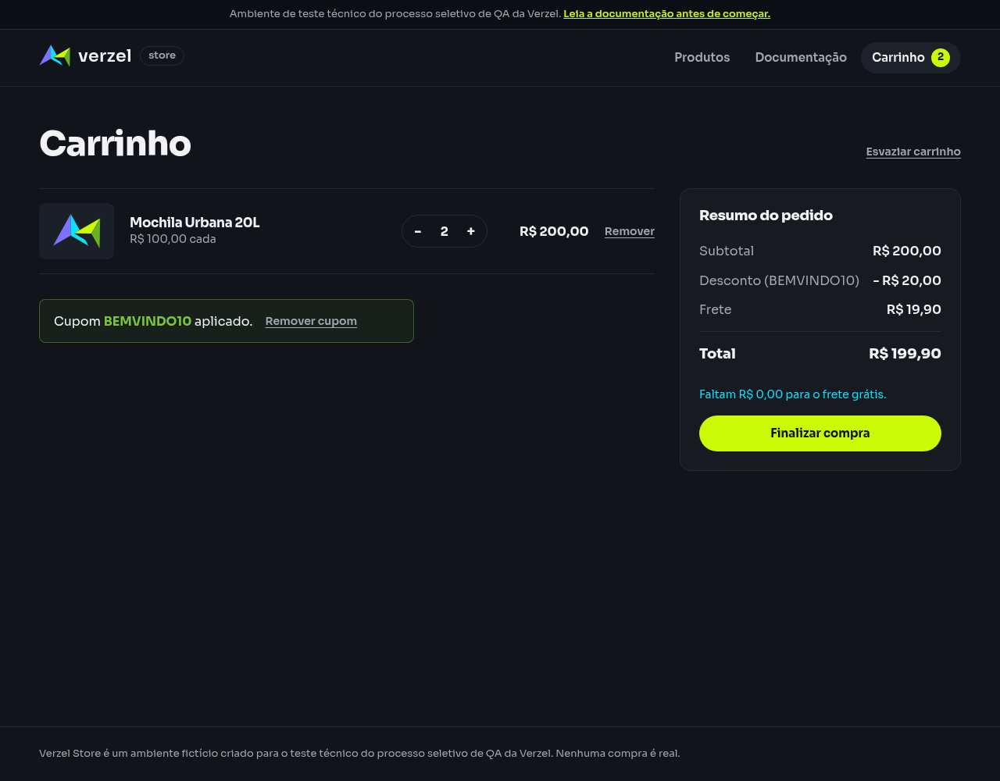

# Relatório de teste — Frete pelo subtotal anterior ao desconto

**Resultado: Falhou em um dos cinco exemplos.** Quatro passaram na API e na interface. Com subtotal de R$ 200,00, o desconto de R$ 20,00 foi correto, mas a loja cobrou R$ 19,90 de frete e mostrou total de R$ 199,90. O esperado era frete grátis e total de R$ 180,00.

**Data do teste na interface:** 08/10/2026, às 00h55 (horário de Fortaleza). Os horários individuais estão nas evidências.

**Loja:** Verzel Store, ambiente de testes.

**Referência:** VZS-142, versão 2.3.0, critérios CA01, CA06, CA08, CA09 e CA11; cenário em [frete_e_totais.feature](../../features/frete_e_totais.feature).

## O que foi testado

Conferimos os cinco carrinhos com BEMVINDO10, que concede 10% de desconto nos produtos. O frete grátis deve considerar o subtotal original: a partir de R$ 200,00, inclusive, o desconto não pode retirar esse benefício.

Cada exemplo começou em um contexto novo de navegador. Montamos os itens pelos botões da loja, aplicamos o cupom e comparamos a tela com a resposta de cálculo e com os valores esperados. Também enviamos os mesmos itens e cupom diretamente à API, o serviço que calcula a compra.

## Cenário BDD

```gherkin
Funcionalidade: Cálculo do subtotal, desconto, frete e total
  Os cálculos da API devem ser exibidos pela interface sem divergência.

@CA01 @CA06 @CA08 @CA09 @CA11 @api @interface
  Esquema do Cenário: Calcular frete pelo subtotal anterior ao desconto
    Dado um carrinho com os itens "<itens>"
    Quando calculo o carrinho com o cupom "BEMVINDO10"
    Então a API deve responder com status 200
    E a API e a interface devem apresentar o resumo:
      | subtotal   | desconto   | frete   | freteGratis | valorFaltanteFreteGratis | total   |
      | <subtotal> | <desconto> | <frete> | <gratis>    | <faltante>              | <total> |

    Exemplos:
      | itens         | subtotal | desconto | frete | gratis     | faltante | total  |
      | P005:1        | 100,00   | 10,00    | 19,90 | falso      | 100,00   | 109,90 |
      | P002:1,P001:1 | 199,80   | 19,98    | 19,90 | falso      | 0,20     | 199,72 |
      | P005:2        | 200,00   | 20,00    | 0,00  | verdadeiro | 0,00     | 180,00 |
      | P002:1,P004:2 | 239,70   | 23,97    | 0,00  | verdadeiro | 0,00     | 215,73 |
      | P001:3        | 179,70   | 17,97    | 19,90 | falso      | 20,30    | 181,63 |
```

Na lista de itens, `P005:2` significa duas unidades de P005; `P002:1,P004:2` significa uma unidade de P002 e duas de P004.

## Resultados da conferência

| Verificação | Esperado | Encontrado na API e na tela | Resultado |
| --- | --- | --- | --- |
| `P005:1` | Desconto R$ 10,00; frete R$ 19,90; total R$ 109,90 | Desconto R$ 10,00; frete R$ 19,90; total R$ 109,90 | Aprovado |
| `P002:1,P001:1` | Desconto R$ 19,98; frete R$ 19,90; total R$ 199,72 | Desconto R$ 19,98; frete R$ 19,90; total R$ 199,72 | Aprovado |
| `P005:2` | Desconto R$ 20,00; frete R$ 0,00; total R$ 180,00 | Desconto R$ 20,00; frete R$ 19,90; total R$ 199,90 | Falhou |
| `P002:1,P004:2` | Desconto R$ 23,97; frete R$ 0,00; total R$ 215,73 | Desconto R$ 23,97; frete R$ 0,00; total R$ 215,73 | Aprovado |
| `P001:3` | Desconto R$ 17,97; frete R$ 19,90; total R$ 181,63 | Desconto R$ 17,97; frete R$ 19,90; total R$ 181,63 | Aprovado |

BEMVINDO10 foi aplicado nos cinco exemplos. Todos os descontos corresponderam a 10% do subtotal dos produtos; o frete não recebeu desconto. As respostas diretas e as recebidas pelo navegador retornaram status 200, que indica um cálculo atendido com sucesso.

Todos os valores monetários retornados tiveram precisão de até duas casas decimais, incluindo os valores por item. Essa conferência usou números decimais exatos do JSON, o formato dos dados recebidos, sem exigir zeros finais na escrita dos números.

A interface reproduziu os valores da API nos cinco casos. Isso inclui o cálculo incorreto no subtotal de R$ 200,00: a concordância entre tela e serviço não torna a regra de frete correta.

### Carrinho `P005:1`

| Verificação | Esperado | Encontrado | Resultado |
| --- | --- | --- | --- |
| Subtotal | R$ 100,00 | R$ 100,00 na API; R$ 100,00 na tela | Aprovado |
| Desconto | R$ 10,00 | R$ 10,00 na API; - R$ 10,00 na tela | Aprovado |
| Frete | R$ 19,90 | R$ 19,90 na API; R$ 19,90 na tela | Aprovado |
| Frete grátis | Não | Não | Aprovado |
| Falta para frete grátis | R$ 100,00 | R$ 100,00 na API; Faltam R$ 100,00 para o frete grátis. | Aprovado |
| Total | R$ 109,90 | R$ 109,90 na API; R$ 109,90 na tela | Aprovado |

### Carrinho `P002:1,P001:1`

| Verificação | Esperado | Encontrado | Resultado |
| --- | --- | --- | --- |
| Subtotal | R$ 199,80 | R$ 199,80 na API; R$ 199,80 na tela | Aprovado |
| Desconto | R$ 19,98 | R$ 19,98 na API; - R$ 19,98 na tela | Aprovado |
| Frete | R$ 19,90 | R$ 19,90 na API; R$ 19,90 na tela | Aprovado |
| Frete grátis | Não | Não | Aprovado |
| Falta para frete grátis | R$ 0,20 | R$ 0,20 na API; Faltam R$ 0,20 para o frete grátis. | Aprovado |
| Total | R$ 199,72 | R$ 199,72 na API; R$ 199,72 na tela | Aprovado |

### Carrinho `P005:2`

| Verificação | Esperado | Encontrado | Resultado |
| --- | --- | --- | --- |
| Subtotal | R$ 200,00 | R$ 200,00 na API; R$ 200,00 na tela | Aprovado |
| Desconto | R$ 20,00 | R$ 20,00 na API; - R$ 20,00 na tela | Aprovado |
| Frete | R$ 0,00 | R$ 19,90 na API; R$ 19,90 na tela | Falhou |
| Frete grátis | Sim | Não | Falhou |
| Falta para frete grátis | R$ 0,00 | R$ 0,00 na API; Faltam R$ 0,00 para o frete grátis. | Aprovado |
| Total | R$ 180,00 | R$ 199,90 na API; R$ 199,90 na tela | Falhou |

### Carrinho `P002:1,P004:2`

| Verificação | Esperado | Encontrado | Resultado |
| --- | --- | --- | --- |
| Subtotal | R$ 239,70 | R$ 239,70 na API; R$ 239,70 na tela | Aprovado |
| Desconto | R$ 23,97 | R$ 23,97 na API; - R$ 23,97 na tela | Aprovado |
| Frete | R$ 0,00 | R$ 0,00 na API; Grátis na tela | Aprovado |
| Frete grátis | Sim | Sim | Aprovado |
| Falta para frete grátis | R$ 0,00 | R$ 0,00 na API; sem aviso na tela | Aprovado |
| Total | R$ 215,73 | R$ 215,73 na API; R$ 215,73 na tela | Aprovado |

### Carrinho `P001:3`

| Verificação | Esperado | Encontrado | Resultado |
| --- | --- | --- | --- |
| Subtotal | R$ 179,70 | R$ 179,70 na API; R$ 179,70 na tela | Aprovado |
| Desconto | R$ 17,97 | R$ 17,97 na API; - R$ 17,97 na tela | Aprovado |
| Frete | R$ 19,90 | R$ 19,90 na API; R$ 19,90 na tela | Aprovado |
| Frete grátis | Não | Não | Aprovado |
| Falta para frete grátis | R$ 20,30 | R$ 20,30 na API; Faltam R$ 20,30 para o frete grátis. | Aprovado |
| Total | R$ 181,63 | R$ 181,63 na API; R$ 181,63 na tela | Aprovado |

No carrinho elegível de R$ 239,70, a tela mostrou o frete como “Grátis”, equivalente a R$ 0,00. Esse texto foi aceito para a comparação de valor deste cenário, que não exige uma apresentação numérica específica de frete zero. Para carrinhos elegíveis, a API informa faltante zero e a tela não mostra aviso de quanto falta.

Nos carrinhos abaixo de R$ 200,00, o aviso de faltante foi calculado pelo subtotal original, mesmo com o cupom aplicado. No caso exato de R$ 200,00, a tela indevidamente manteve a cobrança e exibiu “Faltam R$ 0,00 para o frete grátis.”.

## Falhas encontradas

**F01 — Cobrança de frete no subtotal exato de R$ 200,00 com cupom.** Com duas unidades de P005 e BEMVINDO10, o esperado é subtotal de R$ 200,00, desconto de R$ 20,00, frete de R$ 0,00 e total de R$ 180,00. A API retornou frete de R$ 19,90, indicação de frete grátis falsa e total de R$ 199,90. A tela mostrou os mesmos valores.

**Impacto observado:** o total apresentado fica **R$ 19,90 acima do esperado**, embora a compra já tenha atingido o subtotal necessário para frete grátis. Nenhum pedido foi confirmado neste teste.

**Como reproduzir:** iniciar um carrinho vazio, adicionar duas unidades da Mochila Urbana 20L (P005), abrir o carrinho e aplicar BEMVINDO10. Conferir frete e total.

O desconto e o arredondamento desse caso passaram. A divergência está na concessão do frete gratuito e no total resultante. A mesma falha no limite de R$ 200,00 já foi observada [sem cupom](frete-limites-subtotal.md). Estas evidências não determinam a implementação que causou o erro nem permitem atribuí-lo exclusivamente ao uso do valor após desconto.

Não houve bloqueios, casos ignorados ou exemplos não executados.

## Comprovantes do teste

### Carrinho `P005:1`

- [Tela antes do cupom](evidencias/frete-subtotal-antes-desconto/20261008-005442/01-subtotal-100-00/interface/antes-do-cupom.png) e [tela após aplicar](evidencias/frete-subtotal-antes-desconto/20261008-005442/01-subtotal-100-00/interface/tela.png).
- [Texto exibido](evidencias/frete-subtotal-antes-desconto/20261008-005442/01-subtotal-100-00/interface/texto-tela.txt) e [estado do carrinho](evidencias/frete-subtotal-antes-desconto/20261008-005442/01-subtotal-100-00/interface/estado.json).
- [Dados enviados pela interface](evidencias/frete-subtotal-antes-desconto/20261008-005442/01-subtotal-100-00/interface/corpo-enviado.json), [resposta recebida](evidencias/frete-subtotal-antes-desconto/20261008-005442/01-subtotal-100-00/interface/corpo-recebido.json) e [status e cabeçalhos](evidencias/frete-subtotal-antes-desconto/20261008-005442/01-subtotal-100-00/interface/resposta-http.json).
- [Conferência da interface](evidencias/frete-subtotal-antes-desconto/20261008-005442/01-subtotal-100-00/interface/validacao-interface.json).
- [Consulta independente à API](evidencias/frete-subtotal-antes-desconto/20261008-005442/01-subtotal-100-00/api/resposta-http.txt), [corpo enviado](evidencias/frete-subtotal-antes-desconto/20261008-005442/01-subtotal-100-00/api/corpo-enviado.json), [dados recebidos](evidencias/frete-subtotal-antes-desconto/20261008-005442/01-subtotal-100-00/api/corpo.json) e [conferência da API](evidencias/frete-subtotal-antes-desconto/20261008-005442/01-subtotal-100-00/api/validacao-api.json).
- [Registro de erros da consulta](evidencias/frete-subtotal-antes-desconto/20261008-005442/01-subtotal-100-00/api/curl-stderr.txt): vazio nesta execução.

### Carrinho `P002:1,P001:1`

- [Tela antes do cupom](evidencias/frete-subtotal-antes-desconto/20261008-005442/02-subtotal-199-80/interface/antes-do-cupom.png) e [tela após aplicar](evidencias/frete-subtotal-antes-desconto/20261008-005442/02-subtotal-199-80/interface/tela.png).
- [Texto exibido](evidencias/frete-subtotal-antes-desconto/20261008-005442/02-subtotal-199-80/interface/texto-tela.txt) e [estado do carrinho](evidencias/frete-subtotal-antes-desconto/20261008-005442/02-subtotal-199-80/interface/estado.json).
- [Dados enviados pela interface](evidencias/frete-subtotal-antes-desconto/20261008-005442/02-subtotal-199-80/interface/corpo-enviado.json), [resposta recebida](evidencias/frete-subtotal-antes-desconto/20261008-005442/02-subtotal-199-80/interface/corpo-recebido.json) e [status e cabeçalhos](evidencias/frete-subtotal-antes-desconto/20261008-005442/02-subtotal-199-80/interface/resposta-http.json).
- [Conferência da interface](evidencias/frete-subtotal-antes-desconto/20261008-005442/02-subtotal-199-80/interface/validacao-interface.json).
- [Consulta independente à API](evidencias/frete-subtotal-antes-desconto/20261008-005442/02-subtotal-199-80/api/resposta-http.txt), [corpo enviado](evidencias/frete-subtotal-antes-desconto/20261008-005442/02-subtotal-199-80/api/corpo-enviado.json), [dados recebidos](evidencias/frete-subtotal-antes-desconto/20261008-005442/02-subtotal-199-80/api/corpo.json) e [conferência da API](evidencias/frete-subtotal-antes-desconto/20261008-005442/02-subtotal-199-80/api/validacao-api.json).
- [Registro de erros da consulta](evidencias/frete-subtotal-antes-desconto/20261008-005442/02-subtotal-199-80/api/curl-stderr.txt): vazio nesta execução.

### Carrinho `P005:2`

- [Tela antes do cupom](evidencias/frete-subtotal-antes-desconto/20261008-005442/03-subtotal-200-00/interface/antes-do-cupom.png) e [tela após aplicar](evidencias/frete-subtotal-antes-desconto/20261008-005442/03-subtotal-200-00/interface/tela.png).
- [Texto exibido](evidencias/frete-subtotal-antes-desconto/20261008-005442/03-subtotal-200-00/interface/texto-tela.txt) e [estado do carrinho](evidencias/frete-subtotal-antes-desconto/20261008-005442/03-subtotal-200-00/interface/estado.json).
- [Dados enviados pela interface](evidencias/frete-subtotal-antes-desconto/20261008-005442/03-subtotal-200-00/interface/corpo-enviado.json), [resposta recebida](evidencias/frete-subtotal-antes-desconto/20261008-005442/03-subtotal-200-00/interface/corpo-recebido.json) e [status e cabeçalhos](evidencias/frete-subtotal-antes-desconto/20261008-005442/03-subtotal-200-00/interface/resposta-http.json).
- [Conferência da interface](evidencias/frete-subtotal-antes-desconto/20261008-005442/03-subtotal-200-00/interface/validacao-interface.json).
- [Consulta independente à API](evidencias/frete-subtotal-antes-desconto/20261008-005442/03-subtotal-200-00/api/resposta-http.txt), [corpo enviado](evidencias/frete-subtotal-antes-desconto/20261008-005442/03-subtotal-200-00/api/corpo-enviado.json), [dados recebidos](evidencias/frete-subtotal-antes-desconto/20261008-005442/03-subtotal-200-00/api/corpo.json) e [conferência da API](evidencias/frete-subtotal-antes-desconto/20261008-005442/03-subtotal-200-00/api/validacao-api.json).
- [Registro de erros da consulta](evidencias/frete-subtotal-antes-desconto/20261008-005442/03-subtotal-200-00/api/curl-stderr.txt): vazio nesta execução.

### Carrinho `P002:1,P004:2`

- [Tela antes do cupom](evidencias/frete-subtotal-antes-desconto/20261008-005442/04-subtotal-239-70/interface/antes-do-cupom.png) e [tela após aplicar](evidencias/frete-subtotal-antes-desconto/20261008-005442/04-subtotal-239-70/interface/tela.png).
- [Texto exibido](evidencias/frete-subtotal-antes-desconto/20261008-005442/04-subtotal-239-70/interface/texto-tela.txt) e [estado do carrinho](evidencias/frete-subtotal-antes-desconto/20261008-005442/04-subtotal-239-70/interface/estado.json).
- [Dados enviados pela interface](evidencias/frete-subtotal-antes-desconto/20261008-005442/04-subtotal-239-70/interface/corpo-enviado.json), [resposta recebida](evidencias/frete-subtotal-antes-desconto/20261008-005442/04-subtotal-239-70/interface/corpo-recebido.json) e [status e cabeçalhos](evidencias/frete-subtotal-antes-desconto/20261008-005442/04-subtotal-239-70/interface/resposta-http.json).
- [Conferência da interface](evidencias/frete-subtotal-antes-desconto/20261008-005442/04-subtotal-239-70/interface/validacao-interface.json).
- [Consulta independente à API](evidencias/frete-subtotal-antes-desconto/20261008-005442/04-subtotal-239-70/api/resposta-http.txt), [corpo enviado](evidencias/frete-subtotal-antes-desconto/20261008-005442/04-subtotal-239-70/api/corpo-enviado.json), [dados recebidos](evidencias/frete-subtotal-antes-desconto/20261008-005442/04-subtotal-239-70/api/corpo.json) e [conferência da API](evidencias/frete-subtotal-antes-desconto/20261008-005442/04-subtotal-239-70/api/validacao-api.json).
- [Registro de erros da consulta](evidencias/frete-subtotal-antes-desconto/20261008-005442/04-subtotal-239-70/api/curl-stderr.txt): vazio nesta execução.

### Carrinho `P001:3`

- [Tela antes do cupom](evidencias/frete-subtotal-antes-desconto/20261008-005442/05-subtotal-179-70/interface/antes-do-cupom.png) e [tela após aplicar](evidencias/frete-subtotal-antes-desconto/20261008-005442/05-subtotal-179-70/interface/tela.png).
- [Texto exibido](evidencias/frete-subtotal-antes-desconto/20261008-005442/05-subtotal-179-70/interface/texto-tela.txt) e [estado do carrinho](evidencias/frete-subtotal-antes-desconto/20261008-005442/05-subtotal-179-70/interface/estado.json).
- [Dados enviados pela interface](evidencias/frete-subtotal-antes-desconto/20261008-005442/05-subtotal-179-70/interface/corpo-enviado.json), [resposta recebida](evidencias/frete-subtotal-antes-desconto/20261008-005442/05-subtotal-179-70/interface/corpo-recebido.json) e [status e cabeçalhos](evidencias/frete-subtotal-antes-desconto/20261008-005442/05-subtotal-179-70/interface/resposta-http.json).
- [Conferência da interface](evidencias/frete-subtotal-antes-desconto/20261008-005442/05-subtotal-179-70/interface/validacao-interface.json).
- [Consulta independente à API](evidencias/frete-subtotal-antes-desconto/20261008-005442/05-subtotal-179-70/api/resposta-http.txt), [corpo enviado](evidencias/frete-subtotal-antes-desconto/20261008-005442/05-subtotal-179-70/api/corpo-enviado.json), [dados recebidos](evidencias/frete-subtotal-antes-desconto/20261008-005442/05-subtotal-179-70/api/corpo.json) e [conferência da API](evidencias/frete-subtotal-antes-desconto/20261008-005442/05-subtotal-179-70/api/validacao-api.json).
- [Registro de erros da consulta](evidencias/frete-subtotal-antes-desconto/20261008-005442/05-subtotal-179-70/api/curl-stderr.txt): vazio nesta execução.

### Registros gerais

- [Itens e valores esperados dos cinco exemplos](evidencias/frete-subtotal-antes-desconto/20261008-005442/casos.json).
- [Resumo dos resultados e conferência de precisão decimal](evidencias/frete-subtotal-antes-desconto/20261008-005442/resumo-validacao.json).
- [Script da interface](evidencias/frete-subtotal-antes-desconto/20261008-005442/teste-interface.js) e [script das consultas diretas](evidencias/frete-subtotal-antes-desconto/20261008-005442/teste-api.py).
- [Saída do navegador](evidencias/frete-subtotal-antes-desconto/20261008-005442/navegador-stdout.txt) e [registro de erros](evidencias/frete-subtotal-antes-desconto/20261008-005442/navegador-stderr.txt): arquivo de erros vazio nesta execução.

### Tela do caso que falhou



Para a equipe técnica, estas foram as consultas diretas executadas:

```bash
# Carrinho P005:1
curl -i -X POST https://verzel-store.qa-test-verzel-store.workers.dev/api/carrinho/calcular -H 'Content-Type: application/json' --data-binary '{"itens":[{"produtoId":"P005","quantidade":1}],"cupom":"BEMVINDO10"}' --max-time 30 --silent --show-error --write-out '\nCURL_HTTP_STATUS:%{http_code}\n'

# Carrinho P002:1,P001:1
curl -i -X POST https://verzel-store.qa-test-verzel-store.workers.dev/api/carrinho/calcular -H 'Content-Type: application/json' --data-binary '{"itens":[{"produtoId":"P002","quantidade":1},{"produtoId":"P001","quantidade":1}],"cupom":"BEMVINDO10"}' --max-time 30 --silent --show-error --write-out '\nCURL_HTTP_STATUS:%{http_code}\n'

# Carrinho P005:2
curl -i -X POST https://verzel-store.qa-test-verzel-store.workers.dev/api/carrinho/calcular -H 'Content-Type: application/json' --data-binary '{"itens":[{"produtoId":"P005","quantidade":2}],"cupom":"BEMVINDO10"}' --max-time 30 --silent --show-error --write-out '\nCURL_HTTP_STATUS:%{http_code}\n'

# Carrinho P002:1,P004:2
curl -i -X POST https://verzel-store.qa-test-verzel-store.workers.dev/api/carrinho/calcular -H 'Content-Type: application/json' --data-binary '{"itens":[{"produtoId":"P002","quantidade":1},{"produtoId":"P004","quantidade":2}],"cupom":"BEMVINDO10"}' --max-time 30 --silent --show-error --write-out '\nCURL_HTTP_STATUS:%{http_code}\n'

# Carrinho P001:3
curl -i -X POST https://verzel-store.qa-test-verzel-store.workers.dev/api/carrinho/calcular -H 'Content-Type: application/json' --data-binary '{"itens":[{"produtoId":"P001","quantidade":3}],"cupom":"BEMVINDO10"}' --max-time 30 --silent --show-error --write-out '\nCURL_HTTP_STATUS:%{http_code}\n'
```

O marcador `CURL_HTTP_STATUS` é acrescentado pela ferramenta e não faz parte da resposta. A avaliação usa o status final da aplicação. As consultas e o navegador mantiveram a verificação de segurança da conexão ativa, usando a confiança no certificado oficial do proxy já autorizada pelo usuário.

## Limite desta avaliação

Foram executados somente os cinco exemplos solicitados, com BEMVINDO10, em carrinhos independentes. Não foram avaliados outros cupons, confirmação de pedidos, arredondamento de meio centavo ou alteração de quantidade depois de aplicar o cupom.

O caso de R$ 200,00 falhou, impedindo aprovar integralmente a regra. Os demais exemplos não incluem um subtotal estritamente maior que R$ 200,00 que caia abaixo de R$ 200,00 após o desconto. Portanto, o conjunto não isola completamente a regra da base do frete da falha de inclusão no limite exato. A aprovação dos quatro exemplos não comprova todas as combinações possíveis de CA08.
