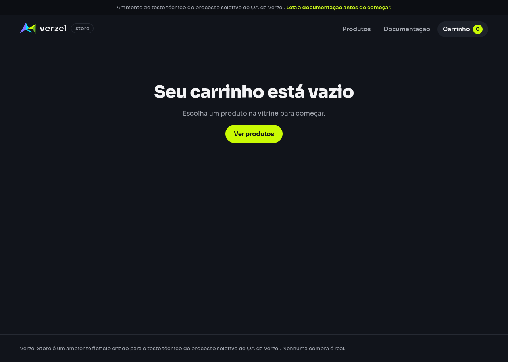
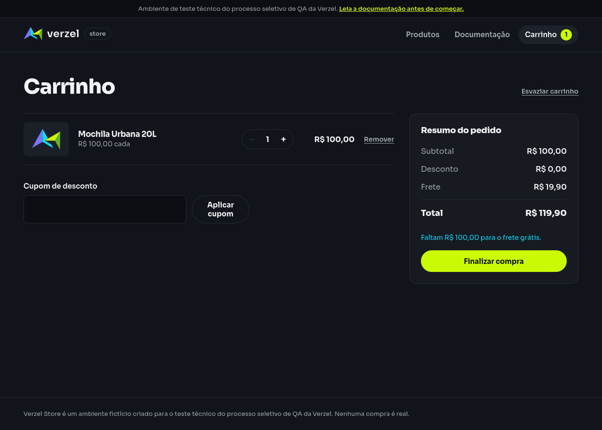

# Relatório de teste — Iniciar outro contexto de navegação com carrinho vazio

**Resultado: Aprovado — os três exemplos passaram com Firefox.** A nova aba, o outro navegador e a janela anônima começaram com o carrinho vazio. Em todos os casos, a aba original do Firefox manteve uma unidade de P005.

**Data do teste:** 08/10/2026, das 09h24min34s às 09h25min37s (America/Fortaleza).

**Loja:** [Verzel Store — ambiente de testes](https://verzel-store.qa-test-verzel-store.workers.dev).

**Referência:** [Documentação VZS-142, versão 2.3.0](https://verzel-store.qa-test-verzel-store.workers.dev/documentacao), regra de carrinho restrito à aba; cenário em [isolamento.feature](../../features/isolamento.feature).

**Navegadores utilizados:** Firefox ESR 153.4.0 nas abas originais, na nova aba e na janela privada; Chromium 151.0.7922.173 como outro navegador.

## O que foi testado

Executamos os três exemplos usando Firefox. Para cada caso, iniciamos uma sessão normal nova, adicionamos uma Mochila Urbana 20L (P005) pelo botão da loja e abrimos o carrinho.

- **Outra aba:** abrimos uma nova aba no mesmo perfil do Firefox e acessamos a loja, sem duplicar a original.
- **Outro navegador:** abrimos a loja no Chromium enquanto a aba original do Firefox continuava aberta.
- **Janela anônima:** abrimos uma janela privada do Firefox enquanto a aba original permanecia na sessão normal.

Em cada exemplo, conferimos a mensagem visível de carrinho vazio no novo contexto e depois voltamos à aba original para conferir P005. Também registramos os itens guardados pela loja em cada aba. Os navegadores foram controlados automaticamente, sem janela visível.

## Cenário BDD

```gherkin
Funcionalidade: Isolamento do carrinho e ausência de persistência da API
  O ambiente compartilhado não deve ser tratado como uma loja com pedidos persistidos ou estoque.

  @interface
  Esquema do Cenário: Iniciar outro contexto de navegação com carrinho vazio
    Dado que adicionei o produto "P005" ao carrinho da aba atual
    Quando abro a loja em "<contexto>"
    Então o carrinho do novo contexto deve estar vazio
    E o carrinho da aba original deve continuar contendo o produto "P005"

    Exemplos:
      | contexto        |
      | outra aba       |
      | outro navegador |
      | janela anônima  |
```

## Resultados da conferência

| Verificação | Esperado | Encontrado | Resultado |
| --- | --- | --- | --- |
| Nova aba do Firefox: novo carrinho | Carrinho vazio | “Seu carrinho está vazio”, contador zero e nenhum item guardado na nova aba | Aprovado |
| Nova aba do Firefox: original | Manter P005 | Mochila Urbana 20L visível, com uma unidade na aba original | Aprovado |
| Outro navegador, Chromium: novo carrinho | Carrinho vazio | “Seu carrinho está vazio”, contador zero e nenhum item guardado no Chromium | Aprovado |
| Outro navegador: original no Firefox | Manter P005 | Mochila Urbana 20L visível, com uma unidade no Firefox, enquanto o Chromium continuava aberto | Aprovado |
| Janela privada do Firefox: novo carrinho | Carrinho vazio | “Seu carrinho está vazio”, contador zero e nenhum item guardado na janela privada | Aprovado |
| Janela privada: original normal no Firefox | Manter P005 | Mochila Urbana 20L visível, com uma unidade na sessão normal | Aprovado |

Nos três preparativos, P005 foi adicionado corretamente e o cálculo respondeu com status 200, indicando que a solicitação foi atendida. Todos os exemplos chegaram ao fim sem bloqueio.

## Falhas encontradas

Nenhuma falha funcional foi encontrada nesta execução. Os três exemplos foram aprovados.

A ferramenta de automação registrou avisos ao limpar perfis temporários no encerramento do processo. As verificações e capturas já estavam concluídas, e o processo terminou com código zero. Esses avisos não representam falha funcional da loja.

## Comprovantes do teste

### Outra aba do Firefox — aprovado

- Aba original no Firefox: [tela antes](evidencias/carrinho-isolamento-contextos/20261008-092428/01-outra-aba/original-antes/tela.png), [estado antes](evidencias/carrinho-isolamento-contextos/20261008-092428/01-outra-aba/original-antes/estado.json), [tela depois](evidencias/carrinho-isolamento-contextos/20261008-092428/01-outra-aba/original-depois/tela.png) e [estado depois](evidencias/carrinho-isolamento-contextos/20261008-092428/01-outra-aba/original-depois/estado.json).
- Novo contexto: [tela do carrinho vazio](evidencias/carrinho-isolamento-contextos/20261008-092428/01-outra-aba/novo-contexto/tela.png), [texto exibido](evidencias/carrinho-isolamento-contextos/20261008-092428/01-outra-aba/novo-contexto/texto-tela.txt) e [estado sem itens](evidencias/carrinho-isolamento-contextos/20261008-092428/01-outra-aba/novo-contexto/estado.json).
- Preparo na interface: [dados enviados](evidencias/carrinho-isolamento-contextos/20261008-092428/01-outra-aba/corpo-enviado.json), [dados recebidos](evidencias/carrinho-isolamento-contextos/20261008-092428/01-outra-aba/corpo-recebido.json) e [status e cabeçalhos](evidencias/carrinho-isolamento-contextos/20261008-092428/01-outra-aba/resposta-http.json).
- [Conferência de cada passo, horário e versão do navegador](evidencias/carrinho-isolamento-contextos/20261008-092428/01-outra-aba/validacao-interface.json) e [registro do Firefox](evidencias/carrinho-isolamento-contextos/20261008-092428/01-outra-aba/firefox-gecko.log).
- [Abertura do contexto distinto da aba original](evidencias/carrinho-isolamento-contextos/20261008-092428/01-outra-aba/contexto-aberto.json).

### Outro navegador — Chromium com original no Firefox — aprovado

- Aba original no Firefox: [tela antes](evidencias/carrinho-isolamento-contextos/20261008-092428/02-outro-navegador/original-antes/tela.png), [estado antes](evidencias/carrinho-isolamento-contextos/20261008-092428/02-outro-navegador/original-antes/estado.json), [tela depois](evidencias/carrinho-isolamento-contextos/20261008-092428/02-outro-navegador/original-depois/tela.png) e [estado depois](evidencias/carrinho-isolamento-contextos/20261008-092428/02-outro-navegador/original-depois/estado.json).
- Novo contexto: [tela do carrinho vazio](evidencias/carrinho-isolamento-contextos/20261008-092428/02-outro-navegador/novo-contexto/tela.png), [texto exibido](evidencias/carrinho-isolamento-contextos/20261008-092428/02-outro-navegador/novo-contexto/texto-tela.txt) e [estado sem itens](evidencias/carrinho-isolamento-contextos/20261008-092428/02-outro-navegador/novo-contexto/estado.json).
- Preparo na interface: [dados enviados](evidencias/carrinho-isolamento-contextos/20261008-092428/02-outro-navegador/corpo-enviado.json), [dados recebidos](evidencias/carrinho-isolamento-contextos/20261008-092428/02-outro-navegador/corpo-recebido.json) e [status e cabeçalhos](evidencias/carrinho-isolamento-contextos/20261008-092428/02-outro-navegador/resposta-http.json).
- [Conferência de cada passo, horário e versão do navegador](evidencias/carrinho-isolamento-contextos/20261008-092428/02-outro-navegador/validacao-interface.json) e [registro do Firefox](evidencias/carrinho-isolamento-contextos/20261008-092428/02-outro-navegador/firefox-gecko.log).

### Janela privada do Firefox — aprovado

- Aba original no Firefox: [tela antes](evidencias/carrinho-isolamento-contextos/20261008-092428/03-janela-anonima/original-antes/tela.png), [estado antes](evidencias/carrinho-isolamento-contextos/20261008-092428/03-janela-anonima/original-antes/estado.json), [tela depois](evidencias/carrinho-isolamento-contextos/20261008-092428/03-janela-anonima/original-depois/tela.png) e [estado depois](evidencias/carrinho-isolamento-contextos/20261008-092428/03-janela-anonima/original-depois/estado.json).
- Novo contexto: [tela do carrinho vazio](evidencias/carrinho-isolamento-contextos/20261008-092428/03-janela-anonima/novo-contexto/tela.png), [texto exibido](evidencias/carrinho-isolamento-contextos/20261008-092428/03-janela-anonima/novo-contexto/texto-tela.txt) e [estado sem itens](evidencias/carrinho-isolamento-contextos/20261008-092428/03-janela-anonima/novo-contexto/estado.json).
- Preparo na interface: [dados enviados](evidencias/carrinho-isolamento-contextos/20261008-092428/03-janela-anonima/corpo-enviado.json), [dados recebidos](evidencias/carrinho-isolamento-contextos/20261008-092428/03-janela-anonima/corpo-recebido.json) e [status e cabeçalhos](evidencias/carrinho-isolamento-contextos/20261008-092428/03-janela-anonima/resposta-http.json).
- [Conferência de cada passo, horário e versão do navegador](evidencias/carrinho-isolamento-contextos/20261008-092428/03-janela-anonima/validacao-interface.json) e [registro do Firefox](evidencias/carrinho-isolamento-contextos/20261008-092428/03-janela-anonima/firefox-gecko.log).
- [Abertura do contexto distinto da aba original](evidencias/carrinho-isolamento-contextos/20261008-092428/03-janela-anonima/contexto-aberto.json). O registro da janela privada contém a opção `private: true`.





### Registros gerais e preparação

- [Resumo dos três exemplos e horários](evidencias/carrinho-isolamento-contextos/20261008-092428/resumo-interface.json), [script do Firefox](evidencias/carrinho-isolamento-contextos/20261008-092428/teste-firefox.py) e [script do Chromium](evidencias/carrinho-isolamento-contextos/20261008-092428/teste-chromium-novo.js).
- [Saída da execução](evidencias/carrinho-isolamento-contextos/20261008-092428/navegador-stdout.txt) e [mensagens da ferramenta, incluindo avisos de encerramento](evidencias/carrinho-isolamento-contextos/20261008-092428/navegador-stderr.txt).
- [Origem, versão e resumo de integridade do pacote Firefox](evidencias/carrinho-isolamento-contextos/20261008-092428/preparacao/ambiente.json), [fontes oficiais usadas](evidencias/carrinho-isolamento-contextos/20261008-092428/preparacao/sources.list), [atualização dos índices autenticados](evidencias/carrinho-isolamento-contextos/20261008-092428/preparacao/update-stdout.txt) e [download do pacote](evidencias/carrinho-isolamento-contextos/20261008-092428/preparacao/download-stdout.txt).
- [Script de instalação repetido com sucesso](evidencias/carrinho-isolamento-contextos/20261008-092428/preparacao/install-firefox.sh), [saída dessa instalação](evidencias/carrinho-isolamento-contextos/20261008-092428/preparacao/install-stdout.txt) e [mensagens da instalação](evidencias/carrinho-isolamento-contextos/20261008-092428/preparacao/install-stderr.txt).

Para reproduzir na interface: adicionar P005 em uma aba normal do Firefox, abrir uma nova aba, o Chromium ou uma janela privada do Firefox, acessar **Carrinho** e conferir a mensagem de vazio. Voltar à aba original e verificar que a Mochila Urbana 20L continua com uma unidade.

O certificado oficial do proxy foi confiado somente em perfis temporários do Firefox. A automação informou `acceptInsecureCerts: false` nos três exemplos. Os índices e o pacote Debian foram obtidos com a autenticação e a verificação de integridade do APT; o navegador não teve a verificação TLS desativada.

O corpo enviado, o recebido, o status e os cabeçalhos do cálculo foram capturados durante a inclusão do produto pela interface. Não foram usadas chamadas independentes à API para comprovar o isolamento.

## Limite desta avaliação

A aprovação vale para os três exemplos desta execução: Firefox nas abas originais, outra aba e janela privada; Chromium como outro navegador. A abertura entre navegadores foi testada na direção Firefox → Chromium.

A nova aba foi aberta sem vínculo de abertura com a original. Duplicação de aba, pop-ups, recarregamento e restauração de sessão não foram avaliados. Também não foram testados persistência da API, pedidos ou estoque; o título da funcionalidade não representa aprovação desses outros comportamentos.
