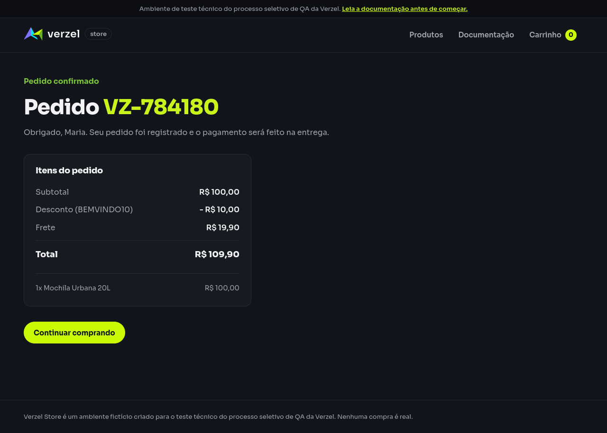

# Relatório de teste — Concluir compra com pagamento na entrega

**Resultado: Aprovado.** A compra foi concluída pela interface, com o pedido **VZ-784180** e total de **R$ 109,90**. A loja informou pagamento na entrega e não apresentou etapa de pagamento online no caminho percorrido.

**Data do teste:** 08/10/2026, das 11h11min06s às 11h11min23s (America/Fortaleza).

**Loja:** [Verzel Store — ambiente de testes](https://verzel-store.qa-test-verzel-store.workers.dev).

**Navegador:** Firefox 153.4.0, em um perfil novo, com janela de 1280 × 1000. A execução automatizada salvou capturas completas das telas.

**Referência:** [Documentação VZS-142, versão 2.3.0](https://verzel-store.qa-test-verzel-store.workers.dev/documentacao); cenário em [pedidos.feature](../../features/pedidos.feature).

## O que foi testado

Pelos botões da loja, adicionamos uma Mochila Urbana 20L (P005), de R$ 100,00, ao carrinho e aplicamos o cupom BEMVINDO10. Depois, clicamos em “Finalizar compra”, preenchemos Maria Silva, maria@exemplo.com e CEP 01310-100 e clicamos uma vez em “Confirmar pedido”.

Conferimos o número exibido, o total confirmado e a mensagem de pagamento na entrega. Registramos também as telas e os endereços percorridos para verificar a ausência de etapa de pagamento online. A confirmação foi enviada pela própria interface; não substituímos essa ação por uma chamada direta à API, o serviço da loja.

## Cenário BDD

```gherkin
@interface
Cenário: Concluir compra com pagamento na entrega
  Dado que o carrinho contém 1 unidade do produto "P005" de R$ 100,00
  E apliquei o cupom "BEMVINDO10"
  Quando finalizo a compra com nome "Maria Silva", e-mail "maria@exemplo.com" e CEP "01310-100"
  Então deve ser exibida a confirmação com número no formato "VZ-000000"
  E o total confirmado deve ser R$ 109,90
  E o pagamento deve ser na entrega
  E não deve existir etapa de pagamento online
```

## Resultados da conferência

| Verificação | Esperado | Encontrado | Resultado |
| --- | --- | --- | --- |
| Produto no catálogo | Mochila Urbana 20L (P005), por R$ 100,00 | Produto e preço exibidos corretamente | Aprovado |
| Carrinho preparado | Uma unidade de P005 | Uma unidade de P005 | Aprovado |
| Cupom aplicado | BEMVINDO10 aplicado | “Cupom BEMVINDO10 aplicado.” | Aprovado |
| Dados preenchidos | Maria Silva, maria@exemplo.com e 01310-100 | Os três valores informados nos campos da tela | Aprovado |
| Envio da confirmação | Uma confirmação após clicar no botão | Uma chamada de confirmação | Aprovado |
| Conteúdo enviado pela interface | Cliente informado, uma unidade de P005 e BEMVINDO10 | Pedido enviado com esses dados | Aprovado |
| Pedido aceito pela loja | Status 201, indicando confirmação aceita | Status 201 na resposta à interface | Aprovado |
| Número exibido | VZ- seguido por seis dígitos | VZ-784180, igual ao número retornado pela loja | Aprovado |
| Total exibido na confirmação | R$ 109,90 | R$ 109,90 | Aprovado |
| Total retornado à interface | R$ 109,90 | R$ 109,90 | Aprovado |
| Pagamento antes de confirmar | Informação de pagamento na entrega | “O pagamento é feito na entrega.” | Aprovado |
| Pagamento após confirmar | Informação de pagamento na entrega | “Seu pedido foi registrado e o pagamento será feito na entrega.” | Aprovado |
| Caminho sem pagamento online | Produtos → carrinho → dados de entrega → confirmação | Esse caminho, sem tela intermediária ou campos para pagamento online | Aprovado |

As 13 verificações passaram. A tela de confirmação mostrou subtotal de R$ 100,00, desconto de R$ 10,00 e frete de R$ 19,90: R$ 100,00 − R$ 10,00 + R$ 19,90 = R$ 109,90.

A tela de finalização pediu somente nome, e-mail e CEP. Após “Confirmar pedido”, a loja abriu diretamente a confirmação. Não houve campos de cartão, pagamento por Pix, seleção de pagamento online ou quadro de pagamento externo nas telas de finalização e confirmação.

## Falhas encontradas

Nenhuma falha do produto foi encontrada nesta execução. O número seguiu o formato esperado, o total foi correto e a loja informou pagamento na entrega. Não houve bloqueios nem passos sem execução.

## Comprovantes do teste

### Telas do caminho executado

| Etapa | Captura | Texto e estado da tela |
| --- | --- | --- |
| Produto no catálogo | [Ver imagem](evidencias/compra-pagamento-entrega/20261008-111106/01-produto/tela.png) | [Texto](evidencias/compra-pagamento-entrega/20261008-111106/01-produto/texto-tela.txt), [estado](evidencias/compra-pagamento-entrega/20261008-111106/01-produto/estado.json) e [HTML](evidencias/compra-pagamento-entrega/20261008-111106/01-produto/pagina.html) |
| Carrinho antes do cupom | [Ver imagem](evidencias/compra-pagamento-entrega/20261008-111106/02-carrinho-sem-cupom/tela.png) | [Texto](evidencias/compra-pagamento-entrega/20261008-111106/02-carrinho-sem-cupom/texto-tela.txt), [estado](evidencias/compra-pagamento-entrega/20261008-111106/02-carrinho-sem-cupom/estado.json) e [HTML](evidencias/compra-pagamento-entrega/20261008-111106/02-carrinho-sem-cupom/pagina.html) |
| Carrinho com BEMVINDO10 | [Ver imagem](evidencias/compra-pagamento-entrega/20261008-111106/03-carrinho-com-cupom/tela.png) | [Texto](evidencias/compra-pagamento-entrega/20261008-111106/03-carrinho-com-cupom/texto-tela.txt), [estado](evidencias/compra-pagamento-entrega/20261008-111106/03-carrinho-com-cupom/estado.json) e [HTML](evidencias/compra-pagamento-entrega/20261008-111106/03-carrinho-com-cupom/pagina.html) |
| Dados de entrega preenchidos | [Ver imagem](evidencias/compra-pagamento-entrega/20261008-111106/04-dados-para-entrega/tela.png) | [Texto](evidencias/compra-pagamento-entrega/20261008-111106/04-dados-para-entrega/texto-tela.txt), [estado](evidencias/compra-pagamento-entrega/20261008-111106/04-dados-para-entrega/estado.json) e [HTML](evidencias/compra-pagamento-entrega/20261008-111106/04-dados-para-entrega/pagina.html) |
| Pedido confirmado | [Ver imagem](evidencias/compra-pagamento-entrega/20261008-111106/05-pedido-confirmado/tela.png) | [Texto](evidencias/compra-pagamento-entrega/20261008-111106/05-pedido-confirmado/texto-tela.txt), [estado](evidencias/compra-pagamento-entrega/20261008-111106/05-pedido-confirmado/estado.json) e [HTML](evidencias/compra-pagamento-entrega/20261008-111106/05-pedido-confirmado/pagina.html) |



### Registros da execução

- [Conferência das 13 verificações, ações, horários e navegador](evidencias/compra-pagamento-entrega/20261008-111106/validacao-interface.json).
- [Critérios esperados](evidencias/compra-pagamento-entrega/20261008-111106/criterios.json).
- [Endereços percorridos](evidencias/compra-pagamento-entrega/20261008-111106/rotas-percorridas.json): `/`, `/carrinho`, `/checkout` e `/pedido-confirmado`.
- [Chamadas registradas no navegador](evidencias/compra-pagamento-entrega/20261008-111106/rede-navegador.json).
- [Confirmação enviada pela interface](evidencias/compra-pagamento-entrega/20261008-111106/pedido-corpo-enviado.json) e [resposta recebida](evidencias/compra-pagamento-entrega/20261008-111106/pedido-corpo-recebido.json).
- [Status 201, cabeçalhos acessíveis no navegador e corpos da confirmação](evidencias/compra-pagamento-entrega/20261008-111106/resposta-pedido-http.json).
- [Erros capturados na página](evidencias/compra-pagamento-entrega/20261008-111106/erros-pagina.json): lista vazia.
- [Script executado](evidencias/compra-pagamento-entrega/20261008-111106/teste-interface.py), [comando original](evidencias/compra-pagamento-entrega/20261008-111106/comando-execucao.txt) e [código de saída](evidencias/compra-pagamento-entrega/20261008-111106/registro-execucao.json).
- [Saída da execução](evidencias/compra-pagamento-entrega/20261008-111106/execucao-stdout.txt), [registro de mensagens da ferramenta](evidencias/compra-pagamento-entrega/20261008-111106/execucao-stderr.txt) e [log do Firefox](evidencias/compra-pagamento-entrega/20261008-111106/firefox-gecko.log).

O registro da ferramenta contém informações da versão do Firefox e avisos de limpeza do perfil no encerramento do Python. Esses avisos ocorreram após a confirmação e as capturas; o processo terminou com código 0 e todas as verificações passaram.

Para reproduzir pela interface, adicione uma unidade de P005, aplique BEMVINDO10, abra “Finalizar compra”, preencha os dados do BDD e clique em “Confirmar pedido”. Confira a mensagem, o número e o total na tela seguinte. Cada execução pode gerar um número diferente, sempre sujeito ao formato esperado.

Para repetir a automação neste ambiente, que já possui Firefox e o controlador Mozilla instalados:

```bash
PYTHONPATH=/tmp/verzel-marionette python reports/sucesso/evidencias/compra-pagamento-entrega/20261008-111106/teste-interface.py
```

A automação usou os campos e botões reais. As respostas foram copiadas para registro, sem substituir os dados retornados pela loja. A verificação de segurança da conexão permaneceu ativa, com o certificado oficial do proxy no perfil temporário do Firefox.

## Limite desta avaliação

A aprovação se aplica ao caminho executado no Firefox, com uma unidade de P005, cupom BEMVINDO10 e os dados apresentados. Não foram avaliados outros navegadores, telas menores, outros carrinhos ou situações de erro ao finalizar.

A ausência de pagamento online se refere às telas, campos e endereços percorridos nesta compra. O pagamento na entrega foi verificado pelas mensagens da interface; não foi realizada uma entrega física. Conforme a documentação, os pedidos e seus números são fictícios, não são armazenados e nenhuma cobrança real é feita.
