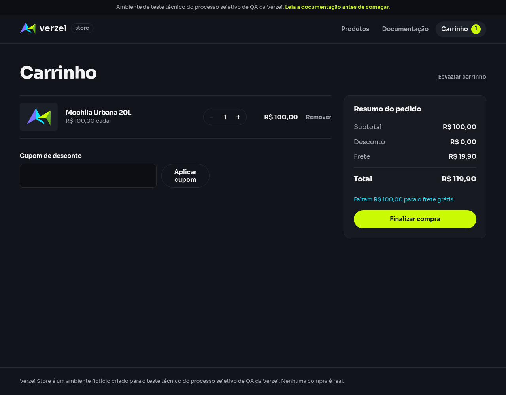

# Relatório de teste — Remover o cupom e recalcular o carrinho

**Resultado: Aprovado.** Remover BEMVINDO10 retirou o desconto e recalculou o total para R$ 119,90. Reaplicar o cupom restaurou o desconto de R$ 10,00, com apenas um cupom ativo e total de R$ 109,90. O frete permaneceu R$ 19,90 em todo o fluxo.

**Data do teste na interface:** 08/10/2026, às 00h27 (horário de Fortaleza). Os horários de cada etapa e das consultas complementares estão nas evidências.

**Loja:** Verzel Store, ambiente de testes.

**Referência:** VZS-142, versão 2.3.0, critério CA05; cenário em [cupons.feature](../../features/cupons.feature).

## O que foi testado

Preparamos um carrinho com uma unidade da Mochila Urbana 20L (P005), de R$ 100,00. Aplicamos BEMVINDO10, clicamos em “Remover cupom” e aplicamos novamente o mesmo código.

As três ações foram realizadas no mesmo carrinho e contexto de navegador, sem reiniciar a loja entre as etapas. Conferimos os valores na tela, a quantidade de cupons ativos e os cálculos recebidos do serviço. Após remover o cupom, o formulário voltou a ficar disponível para uma nova aplicação.

## Cenário BDD

O cenário abaixo descreve o comportamento esperado. O contexto prepara o produto necessário para os valores da compra.

```gherkin
Contexto:
    Dado que o carrinho contém 1 unidade do produto "P005" de R$ 100,00

@CA05
  Cenário: Remover o cupom e recalcular o carrinho
    Dado que apliquei o cupom "BEMVINDO10"
    Quando removo o cupom atual
    Então nenhum cupom deve estar aplicado
    E o desconto deve ser R$ 0,00
    E o frete deve ser R$ 19,90
    E o total deve ser R$ 119,90
    Quando aplico o cupom "BEMVINDO10"
    Então o desconto deve ser R$ 10,00
    E deve existir apenas um cupom aplicado
```

## Resultados da conferência

| Verificação | Esperado | Encontrado | Resultado |
| --- | --- | --- | --- |
| Primeira aplicação — Cupons ativos | 1 | 1 | Aprovado |
| Primeira aplicação — Desconto | R$ 10,00 | R$ 10,00 | Aprovado |
| Primeira aplicação — Frete | R$ 19,90 | R$ 19,90 | Aprovado |
| Primeira aplicação — Total | R$ 109,90 | R$ 109,90 | Aprovado |
| Remoção do cupom — Cupons ativos | 0 | 0 | Aprovado |
| Remoção do cupom — Desconto | R$ 0,00 | R$ 0,00 | Aprovado |
| Remoção do cupom — Frete | R$ 19,90 | R$ 19,90 | Aprovado |
| Remoção do cupom — Total | R$ 119,90 | R$ 119,90 | Aprovado |
| Reaplicação do cupom — Cupons ativos | 1 | 1 | Aprovado |
| Reaplicação do cupom — Desconto | R$ 10,00 | R$ 10,00 | Aprovado |
| Reaplicação do cupom — Frete | R$ 19,90 | R$ 19,90 | Aprovado |
| Reaplicação do cupom — Total | R$ 109,90 | R$ 109,90 | Aprovado |

O subtotal permaneceu **R$ 100,00**. Sem cupom, a conta foi **R$ 100,00 + R$ 19,90 = R$ 119,90**. Após reaplicação, voltou a ser **R$ 100,00 − R$ 10,00 + R$ 19,90 = R$ 109,90**. O desconto não foi acumulado.

Na remoção, não havia mais indicação de cupom aplicado nem botão para removê-lo; o campo e o botão de aplicar voltaram à tela. Na reaplicação, havia uma única confirmação de BEMVINDO10.

As respostas de cálculo recebidas durante o fluxo e as três consultas complementares ao serviço corresponderam aos valores da tela. Todas retornaram status 200. API significa esse serviço; status 200 indica uma consulta atendida com sucesso e JSON é o formato dos dados recebidos.

## Falhas encontradas

Nenhuma falha foi encontrada nas etapas de aplicação, remoção, recálculo e reaplicação. Não houve bloqueio de execução.

## Comprovantes do teste

### Primeira aplicação

- [Captura da tela](evidencias/cupom-remocao-reaplicacao/20261008-002744/interface/01-cupom-aplicado/tela.png), [texto exibido](evidencias/cupom-remocao-reaplicacao/20261008-002744/interface/01-cupom-aplicado/texto-tela.txt) e [estado do carrinho](evidencias/cupom-remocao-reaplicacao/20261008-002744/interface/01-cupom-aplicado/estado.json).
- [Dados enviados pela interface](evidencias/cupom-remocao-reaplicacao/20261008-002744/interface/01-cupom-aplicado/corpo-enviado.json), [resposta recebida](evidencias/cupom-remocao-reaplicacao/20261008-002744/interface/01-cupom-aplicado/corpo-recebido.json) e [status e cabeçalhos](evidencias/cupom-remocao-reaplicacao/20261008-002744/interface/01-cupom-aplicado/resposta-http.json).
- [Consulta independente ao serviço](evidencias/cupom-remocao-reaplicacao/20261008-002744/api/01-cupom-aplicado/resposta-http.txt), [corpo enviado](evidencias/cupom-remocao-reaplicacao/20261008-002744/api/01-cupom-aplicado/corpo-enviado.json), [dados recebidos](evidencias/cupom-remocao-reaplicacao/20261008-002744/api/01-cupom-aplicado/corpo.json) e [conferência da resposta](evidencias/cupom-remocao-reaplicacao/20261008-002744/api/01-cupom-aplicado/validacao-api.json).
- [Registro de erros da consulta](evidencias/cupom-remocao-reaplicacao/20261008-002744/api/01-cupom-aplicado/curl-stderr.txt): vazio nesta execução.

### Remoção do cupom

- [Captura da tela](evidencias/cupom-remocao-reaplicacao/20261008-002744/interface/02-cupom-removido/tela.png), [texto exibido](evidencias/cupom-remocao-reaplicacao/20261008-002744/interface/02-cupom-removido/texto-tela.txt) e [estado do carrinho](evidencias/cupom-remocao-reaplicacao/20261008-002744/interface/02-cupom-removido/estado.json).
- [Dados enviados pela interface](evidencias/cupom-remocao-reaplicacao/20261008-002744/interface/02-cupom-removido/corpo-enviado.json), [resposta recebida](evidencias/cupom-remocao-reaplicacao/20261008-002744/interface/02-cupom-removido/corpo-recebido.json) e [status e cabeçalhos](evidencias/cupom-remocao-reaplicacao/20261008-002744/interface/02-cupom-removido/resposta-http.json).
- [Consulta independente ao serviço](evidencias/cupom-remocao-reaplicacao/20261008-002744/api/02-cupom-removido/resposta-http.txt), [corpo enviado](evidencias/cupom-remocao-reaplicacao/20261008-002744/api/02-cupom-removido/corpo-enviado.json), [dados recebidos](evidencias/cupom-remocao-reaplicacao/20261008-002744/api/02-cupom-removido/corpo.json) e [conferência da resposta](evidencias/cupom-remocao-reaplicacao/20261008-002744/api/02-cupom-removido/validacao-api.json).
- [Registro de erros da consulta](evidencias/cupom-remocao-reaplicacao/20261008-002744/api/02-cupom-removido/curl-stderr.txt): vazio nesta execução.

### Reaplicação do cupom

- [Captura da tela](evidencias/cupom-remocao-reaplicacao/20261008-002744/interface/03-cupom-reaplicado/tela.png), [texto exibido](evidencias/cupom-remocao-reaplicacao/20261008-002744/interface/03-cupom-reaplicado/texto-tela.txt) e [estado do carrinho](evidencias/cupom-remocao-reaplicacao/20261008-002744/interface/03-cupom-reaplicado/estado.json).
- [Dados enviados pela interface](evidencias/cupom-remocao-reaplicacao/20261008-002744/interface/03-cupom-reaplicado/corpo-enviado.json), [resposta recebida](evidencias/cupom-remocao-reaplicacao/20261008-002744/interface/03-cupom-reaplicado/corpo-recebido.json) e [status e cabeçalhos](evidencias/cupom-remocao-reaplicacao/20261008-002744/interface/03-cupom-reaplicado/resposta-http.json).
- [Consulta independente ao serviço](evidencias/cupom-remocao-reaplicacao/20261008-002744/api/03-cupom-reaplicado/resposta-http.txt), [corpo enviado](evidencias/cupom-remocao-reaplicacao/20261008-002744/api/03-cupom-reaplicado/corpo-enviado.json), [dados recebidos](evidencias/cupom-remocao-reaplicacao/20261008-002744/api/03-cupom-reaplicado/corpo.json) e [conferência da resposta](evidencias/cupom-remocao-reaplicacao/20261008-002744/api/03-cupom-reaplicado/validacao-api.json).
- [Registro de erros da consulta](evidencias/cupom-remocao-reaplicacao/20261008-002744/api/03-cupom-reaplicado/curl-stderr.txt): vazio nesta execução.

### Registros gerais

- [Conferência detalhada do fluxo na interface](evidencias/cupom-remocao-reaplicacao/20261008-002744/validacao-interface.json).
- [Resumo dos resultados](evidencias/cupom-remocao-reaplicacao/20261008-002744/resumo-validacao.json).
- [Script de execução da interface](evidencias/cupom-remocao-reaplicacao/20261008-002744/teste-interface.js).
- [Saída da execução do navegador](evidencias/cupom-remocao-reaplicacao/20261008-002744/navegador-stdout.txt) e [registro de erros](evidencias/cupom-remocao-reaplicacao/20261008-002744/navegador-stderr.txt): arquivo de erros vazio nesta execução.

### Telas conferidas

### Remoção do cupom



### Reaplicação do cupom


Para a equipe técnica, estas foram as consultas complementares, usando os mesmos corpos enviados pela interface:

```bash
# Primeira aplicação — consulta independente
curl -i -X POST https://verzel-store.qa-test-verzel-store.workers.dev/api/carrinho/calcular -H 'Content-Type: application/json' --data-binary '{"itens":[{"produtoId":"P005","quantidade":1}],"cupom":"BEMVINDO10"}' --max-time 30 --silent --show-error --write-out '\nCURL_HTTP_STATUS:%{http_code}\n'

# Remoção do cupom — consulta independente
curl -i -X POST https://verzel-store.qa-test-verzel-store.workers.dev/api/carrinho/calcular -H 'Content-Type: application/json' --data-binary '{"itens":[{"produtoId":"P005","quantidade":1}]}' --max-time 30 --silent --show-error --write-out '\nCURL_HTTP_STATUS:%{http_code}\n'

# Reaplicação do cupom — consulta independente
curl -i -X POST https://verzel-store.qa-test-verzel-store.workers.dev/api/carrinho/calcular -H 'Content-Type: application/json' --data-binary '{"itens":[{"produtoId":"P005","quantidade":1}],"cupom":"BEMVINDO10"}' --max-time 30 --silent --show-error --write-out '\nCURL_HTTP_STATUS:%{http_code}\n'
```

Essas consultas diretas são independentes e não removem um cupom armazenado no serviço, pois a API não mantém estado. A remoção e a reaplicação do carrinho foram efetivamente executadas pelos botões da interface. As consultas diretas apenas confirmaram os cálculos de cada etapa.

O marcador `CURL_HTTP_STATUS` é acrescentado pela ferramenta e não faz parte da resposta. O navegador e as consultas mantiveram a verificação de segurança da conexão ativa, usando a confiança no certificado oficial do proxy já autorizada pelo usuário.

## Limite desta avaliação

O fluxo foi testado com uma unidade de P005 e BEMVINDO10. Não foram avaliados outros produtos, troca por outro cupom, múltiplos ciclos de remoção, cliques simultâneos ou confirmação de pedidos. A aprovação vale para as verificações e a execução descritas neste relatório.
