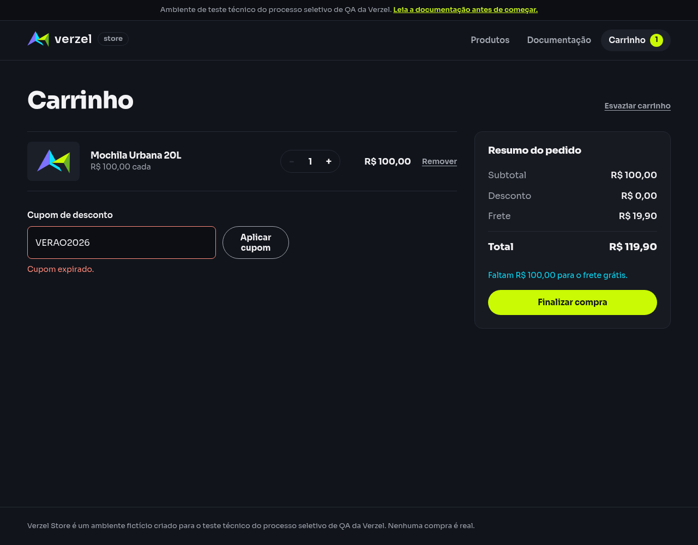

# Relatório de teste — Remover cupom válido e tentar cupom expirado

**Resultado: Aprovado.** Após remover BEMVINDO10, a loja recusou VERAO2026 com a mensagem “Cupom expirado.”. O carrinho ficou sem cupom aplicado, com desconto de R$ 0,00 e total de R$ 119,90.

**Data do teste na interface:** 08/10/2026, às 00h34 (horário de Fortaleza). Os horários de cada etapa e das consultas complementares estão nas evidências.

**Loja:** Verzel Store, ambiente de testes.

**Referência:** VZS-142, versão 2.3.0, critérios CA05 e CA04; cenário em [cupons.feature](../../features/cupons.feature).

## O que foi testado

Preparamos um carrinho com uma unidade da Mochila Urbana 20L (P005), de R$ 100,00. Aplicamos BEMVINDO10, removemos esse cupom e tentamos aplicar VERAO2026, que está expirado.

Todas as ações foram executadas no mesmo carrinho e contexto de navegador, sem reiniciar a loja entre as etapas. Conferimos se o desconto anterior foi retirado e se a tentativa com o cupom expirado manteve a compra sem desconto.

## Cenário BDD

O cenário abaixo descreve o comportamento esperado. O contexto prepara o produto necessário para os valores da compra.

```gherkin
Contexto:
    Dado que o carrinho contém 1 unidade do produto "P005" de R$ 100,00

@CA05 @CA04
  Cenário: Remover o cupom válido antes de tentar aplicar outro
    Dado que apliquei o cupom "BEMVINDO10"
    Quando removo o cupom atual
    E aplico o cupom "VERAO2026"
    Então deve ser exibida a mensagem "Cupom expirado."
    E nenhum cupom deve estar aplicado
    E o desconto deve ser R$ 0,00
    E o total deve ser R$ 119,90
```

## Resultados da conferência

| Verificação | Esperado | Encontrado | Resultado |
| --- | --- | --- | --- |
| Cupom válido inicialmente aplicado | BEMVINDO10 ativo | BEMVINDO10 ativo, com R$ 10,00 de desconto | Aprovado |
| Remoção do cupom válido | Nenhum cupom ativo; formulário disponível | Nenhum cupom ativo; formulário disponível | Aprovado |
| Retirada do desconto anterior | R$ 0,00 após remoção | R$ 0,00 após remoção | Aprovado |
| Mensagem após tentar VERAO2026 | Cupom expirado. | Cupom expirado. | Aprovado |
| Cupom ativo após a recusa | Nenhum | Nenhum | Aprovado |
| Desconto após a recusa | R$ 0,00 | R$ 0,00 | Aprovado |
| Frete após a recusa | R$ 19,90 | R$ 19,90 | Aprovado |
| Total após a recusa | R$ 119,90 | R$ 119,90 | Aprovado |
| Cálculo recebido e valores da tela | Valores iguais em cada etapa | Valores iguais nas três etapas | Aprovado |

### Evolução do carrinho

| Etapa | Cupom ativo | Desconto | Total |
| --- | --- | --- | --- |
| BEMVINDO10 aplicado | BEMVINDO10 | R$ 10,00 | R$ 109,90 |
| BEMVINDO10 removido | Nenhum | R$ 0,00 | R$ 119,90 |
| VERAO2026 recusado | Nenhum | R$ 0,00 | R$ 119,90 |

O subtotal permaneceu R$ 100,00 e o frete R$ 19,90. Após a remoção e a recusa, a conta foi **R$ 100,00 + R$ 19,90 = R$ 119,90**. O desconto do cupom anterior não permaneceu no carrinho.

O serviço de cálculo devolveu VERAO2026 como não aplicado e a mensagem “Cupom expirado.”. A resposta foi status 200, conforme a regra documentada para calcular o carrinho com cupom recusado. API significa esse serviço; status 200 indica que o cálculo foi atendido, e JSON é o formato dos dados recebidos.

## Falhas encontradas

Nenhuma falha foi encontrada na remoção do cupom válido, na recusa do cupom expirado ou nos valores do carrinho. Não houve bloqueio de execução.

## Comprovantes do teste

### Aplicação de BEMVINDO10

- [Captura da tela](evidencias/cupom-troca-expirado/20261008-003357/interface/01-cupom-aplicado/tela.png), [texto exibido](evidencias/cupom-troca-expirado/20261008-003357/interface/01-cupom-aplicado/texto-tela.txt) e [estado do carrinho](evidencias/cupom-troca-expirado/20261008-003357/interface/01-cupom-aplicado/estado.json).
- [Dados enviados pela interface](evidencias/cupom-troca-expirado/20261008-003357/interface/01-cupom-aplicado/corpo-enviado.json), [resposta recebida](evidencias/cupom-troca-expirado/20261008-003357/interface/01-cupom-aplicado/corpo-recebido.json) e [status e cabeçalhos](evidencias/cupom-troca-expirado/20261008-003357/interface/01-cupom-aplicado/resposta-http.json).
- [Consulta independente ao serviço](evidencias/cupom-troca-expirado/20261008-003357/api/01-cupom-aplicado/resposta-http.txt), [corpo enviado](evidencias/cupom-troca-expirado/20261008-003357/api/01-cupom-aplicado/corpo-enviado.json), [dados recebidos](evidencias/cupom-troca-expirado/20261008-003357/api/01-cupom-aplicado/corpo.json) e [conferência da resposta](evidencias/cupom-troca-expirado/20261008-003357/api/01-cupom-aplicado/validacao-api.json).
- [Registro de erros da consulta](evidencias/cupom-troca-expirado/20261008-003357/api/01-cupom-aplicado/curl-stderr.txt): vazio nesta execução.

### Remoção de BEMVINDO10

- [Captura da tela](evidencias/cupom-troca-expirado/20261008-003357/interface/02-cupom-removido/tela.png), [texto exibido](evidencias/cupom-troca-expirado/20261008-003357/interface/02-cupom-removido/texto-tela.txt) e [estado do carrinho](evidencias/cupom-troca-expirado/20261008-003357/interface/02-cupom-removido/estado.json).
- [Dados enviados pela interface](evidencias/cupom-troca-expirado/20261008-003357/interface/02-cupom-removido/corpo-enviado.json), [resposta recebida](evidencias/cupom-troca-expirado/20261008-003357/interface/02-cupom-removido/corpo-recebido.json) e [status e cabeçalhos](evidencias/cupom-troca-expirado/20261008-003357/interface/02-cupom-removido/resposta-http.json).
- [Consulta independente ao serviço](evidencias/cupom-troca-expirado/20261008-003357/api/02-cupom-removido/resposta-http.txt), [corpo enviado](evidencias/cupom-troca-expirado/20261008-003357/api/02-cupom-removido/corpo-enviado.json), [dados recebidos](evidencias/cupom-troca-expirado/20261008-003357/api/02-cupom-removido/corpo.json) e [conferência da resposta](evidencias/cupom-troca-expirado/20261008-003357/api/02-cupom-removido/validacao-api.json).
- [Registro de erros da consulta](evidencias/cupom-troca-expirado/20261008-003357/api/02-cupom-removido/curl-stderr.txt): vazio nesta execução.

### Tentativa com VERAO2026

- [Captura da tela](evidencias/cupom-troca-expirado/20261008-003357/interface/03-cupom-expirado/tela.png), [texto exibido](evidencias/cupom-troca-expirado/20261008-003357/interface/03-cupom-expirado/texto-tela.txt) e [estado do carrinho](evidencias/cupom-troca-expirado/20261008-003357/interface/03-cupom-expirado/estado.json).
- [Dados enviados pela interface](evidencias/cupom-troca-expirado/20261008-003357/interface/03-cupom-expirado/corpo-enviado.json), [resposta recebida](evidencias/cupom-troca-expirado/20261008-003357/interface/03-cupom-expirado/corpo-recebido.json) e [status e cabeçalhos](evidencias/cupom-troca-expirado/20261008-003357/interface/03-cupom-expirado/resposta-http.json).
- [Consulta independente ao serviço](evidencias/cupom-troca-expirado/20261008-003357/api/03-cupom-expirado/resposta-http.txt), [corpo enviado](evidencias/cupom-troca-expirado/20261008-003357/api/03-cupom-expirado/corpo-enviado.json), [dados recebidos](evidencias/cupom-troca-expirado/20261008-003357/api/03-cupom-expirado/corpo.json) e [conferência da resposta](evidencias/cupom-troca-expirado/20261008-003357/api/03-cupom-expirado/validacao-api.json).
- [Registro de erros da consulta](evidencias/cupom-troca-expirado/20261008-003357/api/03-cupom-expirado/curl-stderr.txt): vazio nesta execução.

### Registros gerais

- [Conferência detalhada do fluxo na interface](evidencias/cupom-troca-expirado/20261008-003357/validacao-interface.json).
- [Resumo dos resultados](evidencias/cupom-troca-expirado/20261008-003357/resumo-validacao.json).
- [Script da interface](evidencias/cupom-troca-expirado/20261008-003357/teste-interface.js) e [script das consultas complementares](evidencias/cupom-troca-expirado/20261008-003357/teste-api.py).
- [Saída do navegador](evidencias/cupom-troca-expirado/20261008-003357/navegador-stdout.txt) e [registro de erros](evidencias/cupom-troca-expirado/20261008-003357/navegador-stderr.txt): arquivo de erros vazio nesta execução.

### Tela após tentar o cupom expirado



Para a equipe técnica, estas foram as consultas complementares, com os mesmos corpos enviados pela interface:

```bash
# Aplicação de BEMVINDO10 — consulta independente
curl -i -X POST https://verzel-store.qa-test-verzel-store.workers.dev/api/carrinho/calcular -H 'Content-Type: application/json' --data-binary '{"itens":[{"produtoId":"P005","quantidade":1}],"cupom":"BEMVINDO10"}' --max-time 30 --silent --show-error --write-out '\nCURL_HTTP_STATUS:%{http_code}\n'

# Remoção de BEMVINDO10 — consulta independente
curl -i -X POST https://verzel-store.qa-test-verzel-store.workers.dev/api/carrinho/calcular -H 'Content-Type: application/json' --data-binary '{"itens":[{"produtoId":"P005","quantidade":1}]}' --max-time 30 --silent --show-error --write-out '\nCURL_HTTP_STATUS:%{http_code}\n'

# Tentativa com VERAO2026 — consulta independente
curl -i -X POST https://verzel-store.qa-test-verzel-store.workers.dev/api/carrinho/calcular -H 'Content-Type: application/json' --data-binary '{"itens":[{"produtoId":"P005","quantidade":1}],"cupom":"VERAO2026"}' --max-time 30 --silent --show-error --write-out '\nCURL_HTTP_STATUS:%{http_code}\n'
```

As consultas diretas são independentes: a API não mantém estado entre chamadas. A sequência de aplicação, remoção e tentativa do cupom expirado foi efetivamente executada pelos controles da interface. As consultas complementares confirmaram os cálculos de cada etapa.

O marcador `CURL_HTTP_STATUS` é acrescentado pela ferramenta e não faz parte da resposta. O navegador e as consultas mantiveram a verificação de segurança da conexão ativa, usando a confiança no certificado oficial do proxy já autorizada pelo usuário.

## Limite desta avaliação

O fluxo foi testado com uma unidade de P005, BEMVINDO10 como cupom inicial e VERAO2026 como tentativa após remoção. Outros produtos, outros cupons, troca entre dois cupons válidos, múltiplos ciclos e confirmação de pedidos não foram avaliados. A aprovação vale para as verificações e a execução descritas neste relatório.
