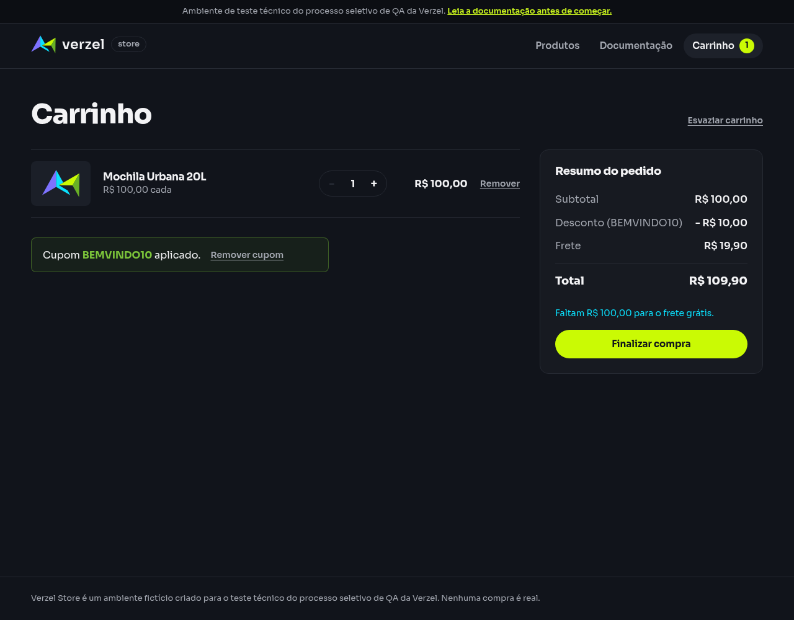

# Relatório de teste — Manter apenas um cupom aplicado

**Resultado: Aprovado para a proteção oferecida pela interface.** Após aplicar BEMVINDO10, a loja impede reaplicar um cupom antes de remover o atual. Permaneceu um único cupom, com desconto de R$ 10,00 e total de R$ 109,90.

**Data do teste na interface:** 08/10/2026, às 00h21 (horário de Fortaleza). Os horários das consultas independentes estão nas evidências.

**Loja:** Verzel Store, ambiente de testes.

**Referência:** VZS-142, versão 2.3.0, critério CA05; cenário em [cupons.feature](../../features/cupons.feature).

## O que foi testado

Preparamos um carrinho com uma unidade da Mochila Urbana 20L (P005), de R$ 100,00, e aplicamos BEMVINDO10. Em seguida, procuramos o fluxo de aplicação para tentar usar novamente o mesmo código, sem remover o cupom atual.

Após a primeira aplicação, o campo de cupom e o botão “Aplicar cupom” deixam de existir na tela. A loja mostra uma única confirmação de BEMVINDO10 e a opção “Remover cupom”. Portanto, a tentativa foi impedida pela própria interface: **nenhuma segunda aplicação foi enviada pela tela**. Conferimos que o cupom e os valores permaneceram iguais.

Como conferência complementar, enviamos duas consultas independentes ao serviço de cálculo com os mesmos produtos e cupom. Elas não representam uma segunda aplicação no carrinho do navegador: a API não mantém estado entre chamadas.

## Cenário BDD

O cenário abaixo descreve o comportamento esperado. O contexto prepara o produto necessário para os valores da compra.

```gherkin
Contexto:
    Dado que o carrinho contém 1 unidade do produto "P005" de R$ 100,00

@CA05
  Cenário: Manter apenas um cupom aplicado
    Dado que apliquei o cupom "BEMVINDO10"
    Quando tento aplicar novamente o cupom "BEMVINDO10" sem remover o atual
    Então deve continuar existindo apenas um cupom aplicado
    E o desconto deve continuar sendo R$ 10,00
    E o total deve continuar sendo R$ 109,90
```

O passo “tento aplicar novamente” foi avaliado pela disponibilidade do fluxo de aplicação: a interface impede essa ação enquanto há um cupom ativo. Não foram criados controles artificiais nem removido o cupom para realizar a tentativa.

## Resultados da conferência

| Verificação | Esperado | Encontrado | Resultado |
| --- | --- | --- | --- |
| Cupom inicial | BEMVINDO10 aplicado | BEMVINDO10 aplicado | Aprovado |
| Quantidade de cupons após a tentativa | Apenas 1 | Apenas 1 confirmação de cupom aplicado | Aprovado |
| Reaplicação sem remoção | Impedir acúmulo de cupons | Campo e botão de aplicar ausentes; só há opção de remover | Aprovado |
| Desconto após a primeira aplicação | R$ 10,00 | R$ 10,00 | Aprovado |
| Desconto após tentativa impedida | R$ 10,00 | R$ 10,00 | Aprovado |
| Total após a primeira aplicação | R$ 109,90 | R$ 109,90 | Aprovado |
| Total após tentativa impedida | R$ 109,90 | R$ 109,90 | Aprovado |
| Frete mantido | R$ 19,90 | R$ 19,90 | Aprovado |
| Consultas independentes ao serviço | R$ 10,00 de desconto e R$ 109,90 de total por consulta | Mesmos valores nas duas respostas, com status 200 | Aprovado |

A conta permaneceu **R$ 100,00 − R$ 10,00 + R$ 19,90 = R$ 109,90**. A contagem de solicitações de cálculo do navegador não aumentou durante a tentativa impedida.

API significa o serviço que calcula a compra. Status 200 indica uma consulta atendida com sucesso e JSON é o formato dos dados recebidos. As duas consultas independentes não acumularam desconto entre chamadas.

## Falhas encontradas

Nenhuma falha foi encontrada na manutenção do cupom único e dos valores verificados. A indisponibilidade do campo de reaplicação é uma proteção da interface, compatível com a regra de remover o cupom atual antes de aplicar outro.

Não houve impedimento de ambiente. A segunda aplicação efetiva pelo formulário não foi executada porque a interface não oferece essa ação enquanto o cupom está ativo; a aprovação se limita à proteção e ao estado observados.

## Comprovantes do teste

### Interface

- [Tela após a primeira aplicação](evidencias/cupom-unico/20261008-002130/interface/cupom-aplicado.png).
- [Tela após verificar a impossibilidade de reaplicação](evidencias/cupom-unico/20261008-002130/interface/apos-tentativa.png).
- [Estado após primeira aplicação](evidencias/cupom-unico/20261008-002130/interface/estado-apos-primeira-aplicacao.json) e [estado após tentativa](evidencias/cupom-unico/20261008-002130/interface/estado-apos-tentativa.json): contagem de cupons, disponibilidade de controles, valores e contagem de solicitações.
- [Texto exibido na tela](evidencias/cupom-unico/20261008-002130/interface/texto-depois.txt).
- [Dados enviados para aplicar o cupom](evidencias/cupom-unico/20261008-002130/interface/corpo-enviado.json), [resposta recebida](evidencias/cupom-unico/20261008-002130/interface/corpo-recebido.json) e [status e cabeçalhos](evidencias/cupom-unico/20261008-002130/interface/resposta-http.json).
- [Conferência detalhada da interface](evidencias/cupom-unico/20261008-002130/interface/validacao-interface.json).

### Consultas independentes ao serviço

| Consulta | Corpo enviado | Registro completo | Dados recebidos | Conferência | Erros da ferramenta |
| --- | --- | --- | --- | --- | --- |
| Primeira | [Enviado](evidencias/cupom-unico/20261008-002130/api/calculo-1/corpo-enviado.json) | [Resposta](evidencias/cupom-unico/20261008-002130/api/calculo-1/resposta-http.txt) | [Dados](evidencias/cupom-unico/20261008-002130/api/calculo-1/corpo.json) | [Validação](evidencias/cupom-unico/20261008-002130/api/calculo-1/validacao-api.json) | [Erros](evidencias/cupom-unico/20261008-002130/api/calculo-1/curl-stderr.txt) |
| Segunda | [Enviado](evidencias/cupom-unico/20261008-002130/api/calculo-2/corpo-enviado.json) | [Resposta](evidencias/cupom-unico/20261008-002130/api/calculo-2/resposta-http.txt) | [Dados](evidencias/cupom-unico/20261008-002130/api/calculo-2/corpo.json) | [Validação](evidencias/cupom-unico/20261008-002130/api/calculo-2/validacao-api.json) | [Erros](evidencias/cupom-unico/20261008-002130/api/calculo-2/curl-stderr.txt) |

### Registros gerais

- [Resumo dos resultados e limites da execução](evidencias/cupom-unico/20261008-002130/resumo-validacao.json).
- [Script da conferência da interface](evidencias/cupom-unico/20261008-002130/teste-interface.js).
- [Saída do navegador](evidencias/cupom-unico/20261008-002130/navegador-stdout.txt) e [registro de erros](evidencias/cupom-unico/20261008-002130/navegador-stderr.txt).

Os arquivos de erros da ferramenta e do navegador estão vazios nesta execução.

### Tela conferida



Para a equipe técnica, este foi o comando executado duas vezes nas consultas independentes:

```bash
curl -i -X POST https://verzel-store.qa-test-verzel-store.workers.dev/api/carrinho/calcular -H 'Content-Type: application/json' --data-binary '{"itens":[{"produtoId":"P005","quantidade":1}],"cupom":"BEMVINDO10"}' --max-time 30 --silent --show-error --write-out '\nCURL_HTTP_STATUS:%{http_code}\n'
```

O marcador `CURL_HTTP_STATUS` é acrescentado pela ferramenta e não faz parte da resposta. O teste da interface manteve a verificação de certificados ativa, usando a confiança no certificado oficial do proxy já autorizada pelo usuário.

## Limite desta avaliação

O teste verificou a proteção da interface e o estado de um carrinho com uma unidade de P005 e BEMVINDO10. Não foi enviada uma segunda aplicação pela tela, pois os controles não estão disponíveis após a primeira. As chamadas diretas de cálculo são independentes e não comprovam acúmulo ou alteração de estado do carrinho no navegador.

Outros cupons, remoção ou troca do cupom, cliques simultâneos, manipulação da interface e confirmação de pedidos não foram avaliados.
