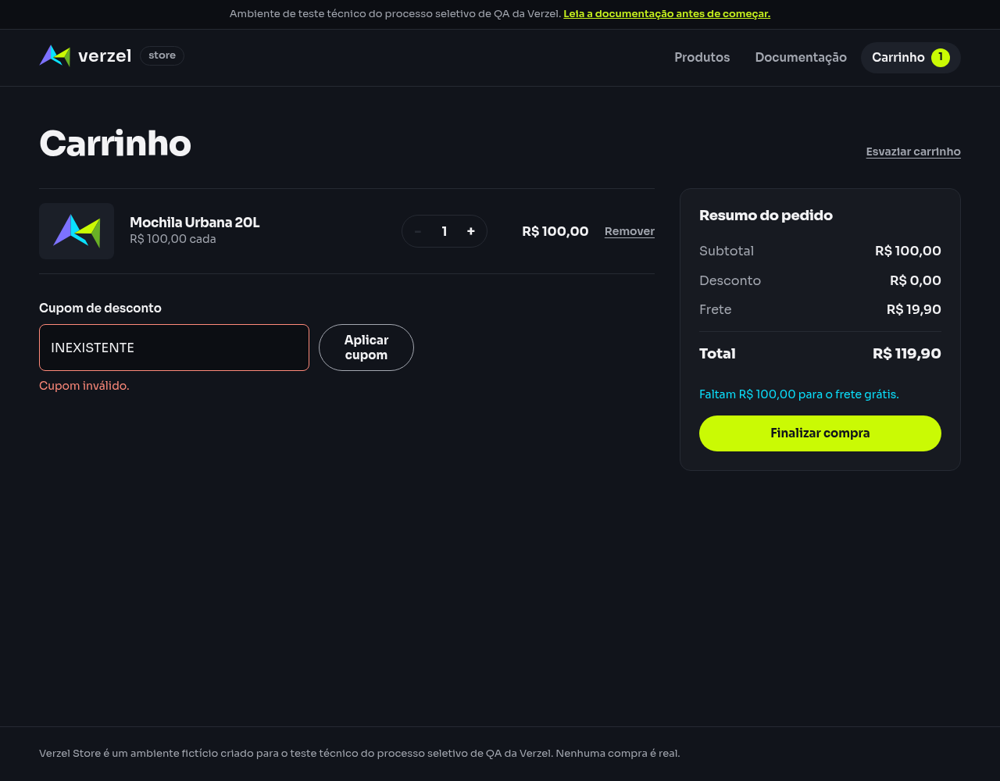

# Relatório de teste — Recusar cupom inexistente ou expirado

**Resultado: Aprovado nos dois exemplos.** A loja recusou INEXISTENTE com “Cupom inválido.” e VERAO2026 com “Cupom expirado.”. Nenhum cupom foi aplicado; o desconto permaneceu R$ 0,00 e o total R$ 119,90. Nenhuma falha funcional foi encontrada neste cenário.

**Data do teste na interface:** 08/10/2026, às 00h13 (horário de Fortaleza).

**Consultas independentes ao serviço:** iniciadas em 08/10/2026, às 00h13 (horário de Fortaleza). A primeira consulta de INEXISTENTE precisou ser repetida; os horários individuais estão nas evidências.

**Loja:** Verzel Store, ambiente de testes.

**Referência:** VZS-142, versão 2.3.0, critérios CA03 e CA04; cenário em [cupons.feature](../../features/cupons.feature).

## O que foi testado

Conferimos se a loja informa o motivo ao recusar um cupom inexistente ou expirado e mantém o carrinho sem desconto.

Cada exemplo foi executado em um contexto novo de navegador, com uma unidade da Mochila Urbana 20L (P005), de R$ 100,00, sem cupom anterior. Digitamos o código, clicamos em aplicar e conferimos a mensagem e os valores na tela. Também consultamos diretamente o serviço de cálculo com os mesmos dados.

## Cenário BDD

O cenário abaixo descreve o comportamento esperado. O contexto prepara um carrinho independente para cada exemplo.

```gherkin
Contexto:
    Dado que o carrinho contém 1 unidade do produto "P005" de R$ 100,00

@CA03 @CA04
  Esquema do Cenário: Recusar cupom inexistente ou expirado
    Quando aplico o cupom "<cupom>"
    Então deve ser exibida a mensagem "<mensagem>"
    E nenhum cupom deve estar aplicado
    E o desconto deve ser R$ 0,00
    E o total deve ser R$ 119,90

    Exemplos:
      | cupom       | mensagem        |
      | INEXISTENTE | Cupom inválido. |
      | VERAO2026   | Cupom expirado. |
```

## Resultados da conferência

| Verificação | Esperado | Encontrado | Resultado |
| --- | --- | --- | --- |
| `INEXISTENTE` — Mensagem exibida | Cupom inválido. | Cupom inválido. | Aprovado |
| `INEXISTENTE` — Cupom aplicado | Nenhum | Nenhum | Aprovado |
| `INEXISTENTE` — Desconto | R$ 0,00 | R$ 0,00 | Aprovado |
| `INEXISTENTE` — Total | R$ 119,90 | R$ 119,90 | Aprovado |
| `VERAO2026` — Mensagem exibida | Cupom expirado. | Cupom expirado. | Aprovado |
| `VERAO2026` — Cupom aplicado | Nenhum | Nenhum | Aprovado |
| `VERAO2026` — Desconto | R$ 0,00 | R$ 0,00 | Aprovado |
| `VERAO2026` — Total | R$ 119,90 | R$ 119,90 | Aprovado |

Nos dois exemplos, o subtotal foi R$ 100,00 e o frete R$ 19,90. A conta permaneceu **R$ 100,00 − R$ 0,00 + R$ 19,90 = R$ 119,90**. A tela continuou mostrando o formulário de cupom, sem indicação de cupom aplicado nem opção de removê-lo.

As consultas concluídas ao serviço também retornaram as mensagens esperadas e a indicação de que o cupom não foi aplicado. API significa o serviço que calcula o carrinho; JSON é o formato dos dados recebidos.

O cálculo respondeu com status 200, mesmo ao recusar o cupom. Isso está correto: conforme a documentação, ele devolve o carrinho sem desconto e informa o motivo em `cupom.mensagem`. A confirmação de pedidos tem regras diferentes e não foi testada nesta execução.

## Falhas encontradas

Nenhuma falha funcional foi encontrada nos dois exemplos, nas mensagens ou nos valores.

**Ocorrência de ambiente resolvida:** a primeira consulta direta de INEXISTENTE não chegou a obter uma resposta da aplicação. O registro indica `CONNECT tunnel failed, response 502`, um erro do proxy de conexão, e código de saída 56 da ferramenta. A consulta de VERAO2026 concluiu normalmente. Repetimos somente a consulta afetada, com prazo maior, e ela passou. O status do proxy não foi usado como resultado funcional da loja; as duas tentativas foram preservadas.

Um acionamento inicial da automação ocorreu antes de o script terminar de ser preparado e não executou o cenário. Esse registro de diagnóstico foi preservado. Após concluir a preparação, ambos os casos foram executados na tela e conferidos com sucesso.

## Comprovantes do teste

### Cupom `INEXISTENTE`

- [Tela antes de aplicar](evidencias/cupons-inexistente-expirado/20261008-001301/inexistente/interface/antes-de-aplicar.png) e [tela com a mensagem de recusa](evidencias/cupons-inexistente-expirado/20261008-001301/inexistente/interface/depois-de-aplicar.png).
- [Texto da tela antes](evidencias/cupons-inexistente-expirado/20261008-001301/inexistente/interface/texto-antes.txt) e [depois](evidencias/cupons-inexistente-expirado/20261008-001301/inexistente/interface/texto-depois.txt).
- [Código digitado](evidencias/cupons-inexistente-expirado/20261008-001301/inexistente/interface/cupom-digitado.txt).
- [Dados enviados pela interface](evidencias/cupons-inexistente-expirado/20261008-001301/inexistente/interface/corpo-enviado.json), [resposta recebida](evidencias/cupons-inexistente-expirado/20261008-001301/inexistente/interface/corpo-recebido.json) e [status e cabeçalhos](evidencias/cupons-inexistente-expirado/20261008-001301/inexistente/interface/resposta-http.json).
- [Conferência da interface](evidencias/cupons-inexistente-expirado/20261008-001301/inexistente/interface/validacao-interface.json).
- [Consulta independente concluída](evidencias/cupons-inexistente-expirado/20261008-001301/inexistente/api-repeticao-1/resposta-http.txt), [corpo enviado](evidencias/cupons-inexistente-expirado/20261008-001301/inexistente/api-repeticao-1/corpo-enviado.json) e [dados recebidos](evidencias/cupons-inexistente-expirado/20261008-001301/inexistente/api-repeticao-1/corpo.json).
- [Conferência da API](evidencias/cupons-inexistente-expirado/20261008-001301/inexistente/api-repeticao-1/validacao-api.json) e [erros da ferramenta](evidencias/cupons-inexistente-expirado/20261008-001301/inexistente/api-repeticao-1/curl-stderr.txt): arquivo de erros vazio na consulta concluída.

### Cupom `VERAO2026`

- [Tela antes de aplicar](evidencias/cupons-inexistente-expirado/20261008-001301/expirado/interface/antes-de-aplicar.png) e [tela com a mensagem de recusa](evidencias/cupons-inexistente-expirado/20261008-001301/expirado/interface/depois-de-aplicar.png).
- [Texto da tela antes](evidencias/cupons-inexistente-expirado/20261008-001301/expirado/interface/texto-antes.txt) e [depois](evidencias/cupons-inexistente-expirado/20261008-001301/expirado/interface/texto-depois.txt).
- [Código digitado](evidencias/cupons-inexistente-expirado/20261008-001301/expirado/interface/cupom-digitado.txt).
- [Dados enviados pela interface](evidencias/cupons-inexistente-expirado/20261008-001301/expirado/interface/corpo-enviado.json), [resposta recebida](evidencias/cupons-inexistente-expirado/20261008-001301/expirado/interface/corpo-recebido.json) e [status e cabeçalhos](evidencias/cupons-inexistente-expirado/20261008-001301/expirado/interface/resposta-http.json).
- [Conferência da interface](evidencias/cupons-inexistente-expirado/20261008-001301/expirado/interface/validacao-interface.json).
- [Consulta independente concluída](evidencias/cupons-inexistente-expirado/20261008-001301/expirado/api/resposta-http.txt), [corpo enviado](evidencias/cupons-inexistente-expirado/20261008-001301/expirado/api/corpo-enviado.json) e [dados recebidos](evidencias/cupons-inexistente-expirado/20261008-001301/expirado/api/corpo.json).
- [Conferência da API](evidencias/cupons-inexistente-expirado/20261008-001301/expirado/api/validacao-api.json) e [erros da ferramenta](evidencias/cupons-inexistente-expirado/20261008-001301/expirado/api/curl-stderr.txt): arquivo de erros vazio na consulta concluída.

### Histórico e registros gerais

- [Primeira consulta de INEXISTENTE, bloqueada pelo proxy](evidencias/cupons-inexistente-expirado/20261008-001301/inexistente/api/resposta-http.txt), [erro da conexão](evidencias/cupons-inexistente-expirado/20261008-001301/inexistente/api/curl-stderr.txt) e [validação inicial](evidencias/cupons-inexistente-expirado/20261008-001301/inexistente/api/validacao-api.json).
- [Resumo dos resultados e histórico](evidencias/cupons-inexistente-expirado/20261008-001301/resumo-validacao.json).
- [Script de conferência da interface](evidencias/cupons-inexistente-expirado/20261008-001301/teste-interface.js).
- [Saída da execução do navegador](evidencias/cupons-inexistente-expirado/20261008-001301/navegador-stdout.txt) e [registro de erros](evidencias/cupons-inexistente-expirado/20261008-001301/navegador-stderr.txt): arquivo de erros vazio na execução concluída.
- [Diagnóstico da preparação inicial da automação](evidencias/cupons-inexistente-expirado/20261008-001301/diagnostico-inicial-navegador-stderr.txt).

### Telas conferidas




Para a equipe técnica, estas foram as consultas independentes que concluíram a validação, com a verificação de segurança da conexão ativa:

```bash
curl -i -X POST https://verzel-store.qa-test-verzel-store.workers.dev/api/carrinho/calcular -H 'Content-Type: application/json' --data-binary '{"itens":[{"produtoId":"P005","quantidade":1}],"cupom":"INEXISTENTE"}' --max-time 60 --silent --show-error --write-out '\nCURL_HTTP_STATUS:%{http_code}\n'

curl -i -X POST https://verzel-store.qa-test-verzel-store.workers.dev/api/carrinho/calcular -H 'Content-Type: application/json' --data-binary '{"itens":[{"produtoId":"P005","quantidade":1}],"cupom":"VERAO2026"}' --max-time 30 --silent --show-error --write-out '\nCURL_HTTP_STATUS:%{http_code}\n'
```

O marcador `CURL_HTTP_STATUS` é acrescentado pela ferramenta e não faz parte da resposta do serviço. O navegador manteve a verificação de certificados ativa, usando a confiança no certificado oficial do proxy já autorizada pelo usuário.

## Limite desta avaliação

Foram testados INEXISTENTE e VERAO2026 em carrinhos inicialmente sem cupom, com uma unidade de P005. Outros códigos, troca de um cupom já aplicado, confirmação de pedidos e outras funcionalidades não foram avaliados. A aprovação se aplica aos comportamentos e às execuções descritos acima.
