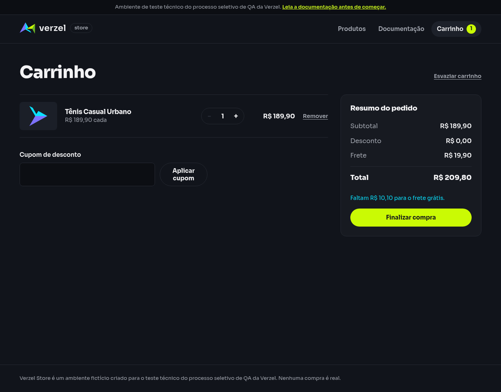

# Relatório de teste — Informar quanto falta para frete grátis

**Resultado: Aprovado.** Com uma unidade do Tênis Casual Urbano (P003), o carrinho mostrou frete de R$ 19,90 e informou corretamente que faltam R$ 10,10 para ganhar frete grátis.

**Data do teste na interface:** 08/10/2026, das 01h03min49s às 01h03min52s (America/Fortaleza). A consulta complementar ao cálculo foi feita às 01h03min32s.

**Loja:** [Verzel Store — ambiente de testes](https://verzel-store.qa-test-verzel-store.workers.dev).

**Referência:** [Documentação VZS-142, versão 2.3.0](https://verzel-store.qa-test-verzel-store.workers.dev/documentacao), critério CA07; cenário em [frete_e_totais.feature](../../features/frete_e_totais.feature).

## O que foi testado

Verificamos se a pessoa que compra consegue ver o valor do frete e quanto precisa acrescentar em produtos para alcançar o frete grátis.

Iniciamos um carrinho vazio em uma nova sessão do navegador, adicionamos uma unidade de P003 pelo botão da loja e abrimos o carrinho, sem aplicar cupom. Conferimos os valores e a mensagem visível na tela. Também consultamos o serviço de cálculo da loja (API) para comparar os dados recebidos.

## Cenário BDD

```gherkin
@CA07 @interface
Cenário: Informar quanto falta para frete grátis
  Dado que o carrinho contém 1 unidade do produto "P003" de R$ 189,90
  Quando visualizo o carrinho
  Então o frete deve ser R$ 19,90
  E o carrinho deve informar que faltam R$ 10,10 para o frete grátis
```

## Resultados da conferência

| Verificação | Esperado | Encontrado | Resultado |
| --- | --- | --- | --- |
| Produto e quantidade no carrinho | Uma unidade de P003, a R$ 189,90 | Uma unidade de Tênis Casual Urbano, a R$ 189,90 | Aprovado |
| Frete exibido | R$ 19,90 | R$ 19,90, visível no resumo do pedido | Aprovado |
| Aviso de quanto falta | Informar que faltam R$ 10,10 para frete grátis | “Faltam R$ 10,10 para o frete grátis.”, visível abaixo do total | Aprovado |
| Cálculo recebido pela tela e consulta complementar | Frete R$ 19,90 e faltante R$ 10,10 | Ambos retornaram frete R$ 19,90 e faltante R$ 10,10 | Aprovado |

O valor faltante está correto: R$ 200,00, o valor necessário para frete grátis, menos R$ 189,90 em produtos resulta em R$ 10,10. A tela também mostrou subtotal de R$ 189,90, desconto de R$ 0,00 e total de R$ 209,80.

Os dois cálculos retornaram status 200, que indica que a solicitação foi atendida. A aprovação do cenário se baseia na interação e na mensagem visível no carrinho, além dos dados do cálculo.

## Falhas encontradas

Nenhuma falha foi encontrada neste cenário. Os dois resultados solicitados — frete e aviso de quanto falta — foram aprovados. Não houve bloqueio na execução.

## Comprovantes do teste

- [Captura do carrinho](evidencias/frete-valor-faltante/20261008-010332/01-p003/interface/tela.png), [texto exibido](evidencias/frete-valor-faltante/20261008-010332/01-p003/interface/texto-tela.txt) e [valores e visibilidade do aviso](evidencias/frete-valor-faltante/20261008-010332/01-p003/interface/estado.json).
- [Produto antes da inclusão](evidencias/frete-valor-faltante/20261008-010332/01-p003/interface/produto-texto.txt) e [conferência da interface com horários](evidencias/frete-valor-faltante/20261008-010332/01-p003/interface/validacao-interface.json).
- [Dados enviados pela tela](evidencias/frete-valor-faltante/20261008-010332/01-p003/interface/corpo-enviado.json), [dados recebidos](evidencias/frete-valor-faltante/20261008-010332/01-p003/interface/corpo-recebido.json) e [status e cabeçalhos recebidos](evidencias/frete-valor-faltante/20261008-010332/01-p003/interface/resposta-http.json).
- Consulta complementar: [resposta HTTP completa](evidencias/frete-valor-faltante/20261008-010332/01-p003/api/resposta-http.txt), [corpo enviado](evidencias/frete-valor-faltante/20261008-010332/01-p003/api/corpo-enviado.json), [corpo recebido](evidencias/frete-valor-faltante/20261008-010332/01-p003/api/corpo.json) e [comparações, horário e comando](evidencias/frete-valor-faltante/20261008-010332/01-p003/api/validacao-api.json).
- [Itens e valores esperados](evidencias/frete-valor-faltante/20261008-010332/casos.json) e [resumo da consulta complementar](evidencias/frete-valor-faltante/20261008-010332/resumo-api.json).
- Scripts executados: [interface](evidencias/frete-valor-faltante/20261008-010332/teste-interface.js) e [consulta complementar](evidencias/frete-valor-faltante/20261008-010332/teste-api.py).
- [Saída do navegador](evidencias/frete-valor-faltante/20261008-010332/navegador-stdout.txt). Os registros de erros do [navegador](evidencias/frete-valor-faltante/20261008-010332/navegador-stderr.txt) e do [curl](evidencias/frete-valor-faltante/20261008-010332/01-p003/api/curl-stderr.txt) ficaram vazios.



Para repetir a conferência na tela: abrir a loja com carrinho vazio, adicionar uma unidade do Tênis Casual Urbano, acessar **Carrinho** e verificar o frete e o aviso abaixo do total.

Para a equipe técnica, esta foi a consulta complementar executada:

```bash
curl -i -X POST \
  'https://verzel-store.qa-test-verzel-store.workers.dev/api/carrinho/calcular' \
  -H 'Content-Type: application/json' \
  --data-binary '{"itens":[{"produtoId":"P003","quantidade":1}]}' \
  --max-time 30 --silent --show-error \
  --write-out '\nCURL_HTTP_STATUS:%{http_code}\n'
```

O marcador `CURL_HTTP_STATUS` foi acrescentado pela ferramenta; a conferência usou o status final da aplicação. O navegador e a consulta mantiveram a verificação de segurança da conexão ativa, com a confiança no certificado oficial do proxy já autorizada pelo usuário.

## Limite desta avaliação

O resultado vale para esta execução, com uma unidade de P003 e sem cupom. Não foram testadas outras quantidades, outros valores de carrinho ou a confirmação de um pedido. A aprovação deste aviso não substitui os testes dos limites para conceder frete grátis.
