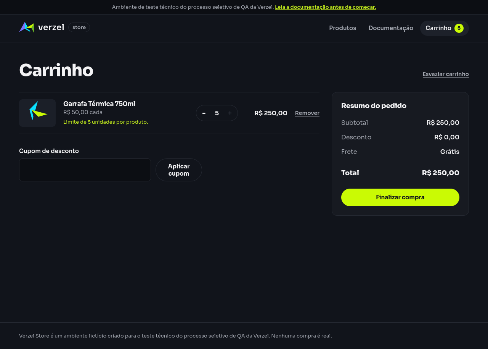

# Relatório de teste — Permitir até cinco unidades de um produto

**Resultado: Aprovado para o cenário de quantidade.** A loja permitiu adicionar a quinta unidade de P008 e manteve o subtotal em R$ 250,00. Ao tentar adicionar a sexta, a quantidade continuou em cinco e o subtotal permaneceu em R$ 250,00.

**Data do teste:** 08/10/2026, das 11h20min09s às 11h20min30s (America/Fortaleza).

**Loja:** [Verzel Store — ambiente de testes](https://verzel-store.qa-test-verzel-store.workers.dev).

**Navegador:** Firefox 153.4.0, em perfil novo, com janela de 1280 × 1000. A execução automatizada salvou capturas completas das telas.

**Referência:** [Documentação VZS-142, versão 2.3.0](https://verzel-store.qa-test-verzel-store.workers.dev/documentacao), critério CA10; cenário em [quantidades_e_itens.feature](../../features/quantidades_e_itens.feature).

## O que foi testado

Adicionamos quatro unidades da Garrafa Térmica 750ml (P008), de R$ 50,00 cada, pelos botões do catálogo. Em seguida, abrimos o carrinho e clicamos no botão “+” para adicionar a quinta unidade.

Ao chegar a cinco, a loja desabilitou o botão “+”. Tentamos clicar novamente nesse mesmo botão e conferimos se o carrinho continuava com cinco unidades e subtotal de R$ 250,00. O teste manteve o bloqueio da interface e não alterou os dados do carrinho por fora dos controles da loja.

Registramos quantidade, subtotal, aviso do limite, estado do botão e chamadas de cálculo feitas pela própria interface. Não foi aplicado cupom.

## Cenário BDD

```gherkin
@VZS-142 @itens
Funcionalidade: Validação dos itens e limite por produto

  @CA10 @interface
  Cenário: Permitir até 5 unidades de um produto
    Dado que o carrinho contém 4 unidades do produto "P008" de R$ 50,00
    Quando adiciono mais 1 unidade do produto "P008"
    Então o carrinho deve conter 5 unidades do produto "P008"
    E o subtotal deve ser R$ 250,00
    Quando tento adicionar mais 1 unidade do produto "P008"
    Então o carrinho deve continuar contendo 5 unidades do produto "P008"
    E o subtotal deve continuar sendo R$ 250,00
```

## Resultados da conferência

| Verificação | Esperado | Encontrado | Resultado |
| --- | --- | --- | --- |
| Produto e preço | Garrafa Térmica 750ml (P008), por R$ 50,00 | Produto e preço corretos no catálogo | Aprovado |
| Preparação do carrinho | Quatro unidades de P008 | Quatro unidades de P008 | Aprovado |
| Subtotal inicial | R$ 200,00 | R$ 200,00 | Aprovado |
| Adição da quinta unidade | Cinco unidades de P008 | Cinco unidades de P008 | Aprovado |
| Subtotal com cinco unidades | R$ 250,00 | R$ 250,00 | Aprovado |
| Quantidade após tentar a sexta | Continuar com cinco unidades | Continuou com cinco unidades | Aprovado |
| Subtotal após tentar a sexta | Continuar em R$ 250,00 | Continuou em R$ 250,00 | Aprovado |
| Proteção do limite | Botão de aumento desabilitado ao chegar a cinco | Botão “+” desabilitado antes e depois da tentativa | Aprovado |
| Aviso do limite | Informar o limite de cinco unidades | “Limite de 5 unidades por produto.” | Aprovado |
| Cálculo da quinta unidade | Resposta aceita pelo serviço da loja | Status 200 | Aprovado |
| Subtotal retornado à interface | R$ 250,00 | R$ 250,00 | Aprovado |
| Tentativa acima do limite | Nenhum envio de quantidade acima de cinco | Nenhum envio acima de cinco; cinco chamadas de cálculo antes e depois da tentativa | Aprovado |

As 12 verificações passaram. As cinco chamadas de cálculo corresponderam à preparação de uma, duas, três e quatro unidades e à adição da quinta. A tentativa no botão desabilitado não gerou uma sexta chamada no período observado. O status 200 indica que o serviço da loja atendeu ao cálculo da quinta unidade.

O subtotal corresponde a cinco unidades × R$ 50,00 = R$ 250,00, mantendo-se igual após a tentativa de ultrapassar o limite.

## Falhas encontradas

Nenhuma falha foi encontrada nos critérios deste cenário: quantidade máxima e subtotal. Não houve bloqueios de execução nem passos deixados sem avaliação. O botão desabilitado foi a proteção esperada da loja, e a tentativa de interação ficou registrada.

**Observação adicional sobre frete:** ao preparar quatro unidades, o subtotal era R$ 200,00, mas a tela mostrou frete de R$ 19,90 e total de R$ 219,90. A documentação prevê frete grátis nesse subtotal, com total de R$ 200,00 sem cupom. Essa divergência já foi registrada no [relatório de frete nos limites do subtotal](../falhas/frete-limites-subtotal.md) e reapareceu na captura da preparação. Ela está fora dos critérios de quantidade e subtotal deste cenário; a aprovação acima não abrange esse cálculo de frete.

## Comprovantes do teste

### Telas do caminho executado

| Etapa | Captura | Texto e estado da tela |
| --- | --- | --- |
| Produto no catálogo | [Ver imagem](evidencias/limite-cinco-unidades/20261008-112009/01-produto/tela.png) | [Texto](evidencias/limite-cinco-unidades/20261008-112009/01-produto/texto-tela.txt), [estado](evidencias/limite-cinco-unidades/20261008-112009/01-produto/estado.json) e [HTML](evidencias/limite-cinco-unidades/20261008-112009/01-produto/pagina.html) |
| Quatro unidades | [Ver imagem](evidencias/limite-cinco-unidades/20261008-112009/02-quatro-unidades/tela.png) | [Texto](evidencias/limite-cinco-unidades/20261008-112009/02-quatro-unidades/texto-tela.txt), [estado](evidencias/limite-cinco-unidades/20261008-112009/02-quatro-unidades/estado.json) e [HTML](evidencias/limite-cinco-unidades/20261008-112009/02-quatro-unidades/pagina.html) |
| Quinta unidade adicionada | [Ver imagem](evidencias/limite-cinco-unidades/20261008-112009/03-cinco-unidades/tela.png) | [Texto](evidencias/limite-cinco-unidades/20261008-112009/03-cinco-unidades/texto-tela.txt), [estado](evidencias/limite-cinco-unidades/20261008-112009/03-cinco-unidades/estado.json) e [HTML](evidencias/limite-cinco-unidades/20261008-112009/03-cinco-unidades/pagina.html) |
| Após tentar adicionar a sexta | [Ver imagem](evidencias/limite-cinco-unidades/20261008-112009/04-apos-tentar-sexta/tela.png) | [Texto](evidencias/limite-cinco-unidades/20261008-112009/04-apos-tentar-sexta/texto-tela.txt), [estado](evidencias/limite-cinco-unidades/20261008-112009/04-apos-tentar-sexta/estado.json) e [HTML](evidencias/limite-cinco-unidades/20261008-112009/04-apos-tentar-sexta/pagina.html) |



### Registros da execução

- [Conferência das 12 verificações, ações, horários e navegador](evidencias/limite-cinco-unidades/20261008-112009/validacao-interface.json).
- [Critérios esperados](evidencias/limite-cinco-unidades/20261008-112009/criterios.json).
- [Tentativa da sexta unidade](evidencias/limite-cinco-unidades/20261008-112009/tentativa-sexta-unidade.json): botão desabilitado, tentativa de clique concluída sem alteração e mesma contagem de chamadas após a observação.
- [Todas as chamadas de cálculo registradas no navegador](evidencias/limite-cinco-unidades/20261008-112009/rede-navegador.json).
- Cálculo de quatro unidades: [corpo enviado](evidencias/limite-cinco-unidades/20261008-112009/calculo-quatro-unidades/corpo-enviado.json), [corpo recebido](evidencias/limite-cinco-unidades/20261008-112009/calculo-quatro-unidades/corpo-recebido.json) e [status e cabeçalhos acessíveis no navegador](evidencias/limite-cinco-unidades/20261008-112009/calculo-quatro-unidades/resposta-http.json).
- Cálculo de cinco unidades: [corpo enviado](evidencias/limite-cinco-unidades/20261008-112009/calculo-cinco-unidades/corpo-enviado.json), [corpo recebido](evidencias/limite-cinco-unidades/20261008-112009/calculo-cinco-unidades/corpo-recebido.json) e [status e cabeçalhos acessíveis no navegador](evidencias/limite-cinco-unidades/20261008-112009/calculo-cinco-unidades/resposta-http.json).
- [Erros capturados na página](evidencias/limite-cinco-unidades/20261008-112009/erros-pagina.json): lista vazia.
- [Script executado](evidencias/limite-cinco-unidades/20261008-112009/teste-interface.py), [comando original](evidencias/limite-cinco-unidades/20261008-112009/comando-execucao.txt) e [código de saída](evidencias/limite-cinco-unidades/20261008-112009/registro-execucao.json).
- [Saída da execução](evidencias/limite-cinco-unidades/20261008-112009/execucao-stdout.txt), [mensagens da ferramenta](evidencias/limite-cinco-unidades/20261008-112009/execucao-stderr.txt) e [log do Firefox](evidencias/limite-cinco-unidades/20261008-112009/firefox-gecko.log).

O registro da ferramenta contém informações da versão do Firefox e avisos de limpeza do perfil no encerramento do Python. Esses avisos ocorreram após as verificações e capturas; o processo terminou com código 0. Não foram tratados como falha funcional.

Para reproduzir pela interface, adicione quatro unidades de P008 no catálogo, abra o carrinho, clique no botão “+” uma vez e tente clicar novamente. Confira quantidade, subtotal e aviso do limite nas duas etapas.

Para repetir a automação neste ambiente, que já possui Firefox e o controlador Mozilla instalados:

```bash
PYTHONPATH=/tmp/verzel-marionette python reports/sucesso/evidencias/limite-cinco-unidades/20261008-112009/teste-interface.py
```

A automação utilizou os botões reais, sem habilitar artificialmente o botão bloqueado. As respostas da loja foram copiadas para registro, sem substituição. A verificação de segurança da conexão permaneceu ativa, com o certificado oficial do proxy no perfil temporário do Firefox.

## Limite desta avaliação

A aprovação se aplica ao limite de quantidade e ao subtotal de P008 no caminho executado no Firefox. A observação de frete na preparação foi registrada separadamente e não faz parte dessa aprovação.

A tentativa da sexta unidade avaliou a proteção da interface e o estado do carrinho após o clique, com uma espera de um segundo antes da captura final. Não foi enviada diretamente à API uma quantidade acima de cinco. Outros produtos, limites independentes entre produtos, outros navegadores e tentativas pelo botão do catálogo após chegar a cinco não foram avaliados nesta execução.
