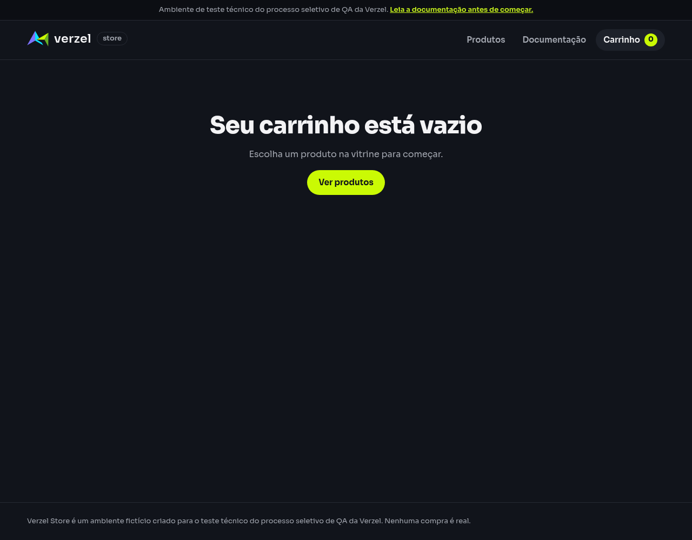

# Relatório de teste — Iniciar outro contexto de navegação com carrinho vazio

**Resultado: Bloqueado parcialmente — dois exemplos aprovados e um bloqueado.** Outra aba e janela anônima começaram com o carrinho vazio, enquanto a aba original manteve uma unidade de P005. O exemplo de outro navegador não pôde ser executado porque o ambiente bloqueou o download do Firefox.

**Data do teste na interface:** 08/10/2026, das 09h03min21s às 09h03min43s (America/Fortaleza).

**Loja:** [Verzel Store — ambiente de testes](https://verzel-store.qa-test-verzel-store.workers.dev).

**Referência:** [Documentação VZS-142, versão 2.3.0](https://verzel-store.qa-test-verzel-store.workers.dev/documentacao), regra de carrinho restrito à aba; cenário em [isolamento.feature](../features/isolamento.feature).

## O que foi testado

Verificamos se abrir a loja em outro contexto inicia um carrinho vazio e mantém os produtos da aba original.

Para cada exemplo, começamos com uma sessão normal nova do Chromium, adicionamos uma Mochila Urbana 20L (P005) pelo botão da loja e abrimos o carrinho. Salvamos a tela original antes da tentativa e voltamos a ela ao final para conferir o produto.

- **Outra aba:** abrimos uma aba nova no mesmo perfil do navegador, digitando o endereço da loja, sem duplicar a aba original.
- **Janela anônima:** abrimos a loja em um contexto anônimo do Chromium, separado da sessão normal da aba original.
- **Outro navegador:** escolhemos Firefox para comparar com Chromium. A preparação do carrinho original foi executada, mas a abertura no Firefox ficou bloqueada por indisponibilidade desse navegador.

Os casos executados usaram Chromium 151.0.7922.173 em modo automatizado, sem janela visível. Além das capturas, conferimos a mensagem de carrinho vazio, a quantidade exibida e os itens guardados pela própria loja em cada aba.

## Cenário BDD

```gherkin
Funcionalidade: Isolamento do carrinho e ausência de persistência da API
  O ambiente compartilhado não deve ser tratado como uma loja com pedidos persistidos ou estoque.

  @interface
  Esquema do Cenário: Iniciar outro contexto de navegação com carrinho vazio
    Dado que adicionei o produto "P005" ao carrinho da aba atual
    Quando abro a loja em "<contexto>"
    Então o carrinho do novo contexto deve estar vazio
    E o carrinho da aba original deve continuar contendo o produto "P005"

    Exemplos:
      | contexto        |
      | outra aba       |
      | outro navegador |
      | janela anônima  |
```

## Resultados da conferência

| Verificação | Esperado | Encontrado | Resultado |
| --- | --- | --- | --- |
| Outra aba: novo carrinho | Carrinho vazio | “Seu carrinho está vazio”, contador zero e nenhum item guardado nessa aba | Aprovado |
| Outra aba: carrinho original | Manter P005 | Mochila Urbana 20L visível, com uma unidade | Aprovado |
| Outro navegador: novo carrinho | Carrinho vazio no Firefox | Abertura não executada: Firefox indisponível | Bloqueado |
| Outro navegador: original após a abertura | Manter P005 após abrir a loja no outro navegador | Essa sequência não foi executada. A aba preparada continuou com P005 ao final da tentativa | Bloqueado |
| Janela anônima: novo carrinho | Carrinho vazio | “Seu carrinho está vazio”, contador zero e nenhum item guardado nesse contexto | Aprovado |
| Janela anônima: carrinho original | Manter P005 | Mochila Urbana 20L visível, com uma unidade | Aprovado |

Nos três preparativos, P005 foi adicionado corretamente e o cálculo retornou status 200, indicando que a solicitação foi atendida. A observação da aba preparada no exemplo de Firefox não aprova esse cenário: a ação de abrir outro navegador não ocorreu.

## Falhas encontradas

**Nenhuma falha funcional foi encontrada nos dois exemplos executados.** Os carrinhos da nova aba e da janela anônima começaram vazios, e as abas originais conservaram P005.

**B01 — Outro navegador indisponível no ambiente.** O Firefox não estava instalado. O download oficial pelo Playwright foi recusado com HTTP 403 e mensagem “Domain forbidden”, tanto na tentativa padrão quanto na tentativa com permissão ampliada. Uma fonte oficial alternativa da Mozilla também recebeu 403.

**Impacto na avaliação:** não é possível aprovar ou reprovar o isolamento entre Chromium e Firefox nesta execução. Esse bloqueio pertence ao ambiente de testes e não demonstra defeito na loja.

**Para concluir o exemplo pendente:** permitir o download oficial de Firefox em `cdn.playwright.dev` nas configurações de rede do ambiente, instalar o navegador e repetir o caso. A ferramenta também oferece o domínio alternativo `playwright.download.prss.microsoft.com`. Nenhuma restrição de conexão foi desativada.

## Comprovantes do teste

### Outra aba — aprovado

- Aba original: [tela antes](evidencias/carrinho-isolamento-contextos/20261008-090029/01-outra-aba/original-antes/tela.png), [estado antes](evidencias/carrinho-isolamento-contextos/20261008-090029/01-outra-aba/original-antes/estado.json), [tela depois](evidencias/carrinho-isolamento-contextos/20261008-090029/01-outra-aba/original-depois/tela.png) e [estado depois](evidencias/carrinho-isolamento-contextos/20261008-090029/01-outra-aba/original-depois/estado.json).
- Nova aba: [tela do carrinho vazio](evidencias/carrinho-isolamento-contextos/20261008-090029/01-outra-aba/novo-contexto/tela.png), [texto exibido](evidencias/carrinho-isolamento-contextos/20261008-090029/01-outra-aba/novo-contexto/texto-tela.txt) e [estado sem itens](evidencias/carrinho-isolamento-contextos/20261008-090029/01-outra-aba/novo-contexto/estado.json).
- [Dados enviados no preparo](evidencias/carrinho-isolamento-contextos/20261008-090029/01-outra-aba/corpo-enviado.json), [dados recebidos](evidencias/carrinho-isolamento-contextos/20261008-090029/01-outra-aba/corpo-recebido.json), [status e cabeçalhos](evidencias/carrinho-isolamento-contextos/20261008-090029/01-outra-aba/resposta-http.json) e [conferência detalhada](evidencias/carrinho-isolamento-contextos/20261008-090029/01-outra-aba/validacao-interface.json).




### Outro navegador — bloqueado

- Preparo no Chromium: [tela original antes](evidencias/carrinho-isolamento-contextos/20261008-090029/02-outro-navegador/original-antes/tela.png), [estado antes](evidencias/carrinho-isolamento-contextos/20261008-090029/02-outro-navegador/original-antes/estado.json), [tela ao final da tentativa](evidencias/carrinho-isolamento-contextos/20261008-090029/02-outro-navegador/original-depois/tela.png) e [estado ao final](evidencias/carrinho-isolamento-contextos/20261008-090029/02-outro-navegador/original-depois/estado.json).
- [Dados enviados no preparo](evidencias/carrinho-isolamento-contextos/20261008-090029/02-outro-navegador/corpo-enviado.json), [dados recebidos](evidencias/carrinho-isolamento-contextos/20261008-090029/02-outro-navegador/corpo-recebido.json), [status e cabeçalhos](evidencias/carrinho-isolamento-contextos/20261008-090029/02-outro-navegador/resposta-http.json) e [resultado bloqueado](evidencias/carrinho-isolamento-contextos/20261008-090029/02-outro-navegador/validacao-interface.json).
- [Resumo das tentativas de obter Firefox, comandos e erros observados](evidencias/carrinho-isolamento-contextos/20261008-090029/bloqueio-firefox.json). Esse arquivo é um resumo das saídas das ferramentas, não uma transcrição integral. Não há captura de carrinho no Firefox, pois ele não foi iniciado.

### Janela anônima — aprovado

- Aba original: [tela antes](evidencias/carrinho-isolamento-contextos/20261008-090029/03-janela-anonima/original-antes/tela.png), [estado antes](evidencias/carrinho-isolamento-contextos/20261008-090029/03-janela-anonima/original-antes/estado.json), [tela depois](evidencias/carrinho-isolamento-contextos/20261008-090029/03-janela-anonima/original-depois/tela.png) e [estado depois](evidencias/carrinho-isolamento-contextos/20261008-090029/03-janela-anonima/original-depois/estado.json).
- Contexto anônimo: [tela do carrinho vazio](evidencias/carrinho-isolamento-contextos/20261008-090029/03-janela-anonima/novo-contexto/tela.png), [texto exibido](evidencias/carrinho-isolamento-contextos/20261008-090029/03-janela-anonima/novo-contexto/texto-tela.txt) e [estado sem itens](evidencias/carrinho-isolamento-contextos/20261008-090029/03-janela-anonima/novo-contexto/estado.json).
- [Dados enviados no preparo](evidencias/carrinho-isolamento-contextos/20261008-090029/03-janela-anonima/corpo-enviado.json), [dados recebidos](evidencias/carrinho-isolamento-contextos/20261008-090029/03-janela-anonima/corpo-recebido.json), [status e cabeçalhos](evidencias/carrinho-isolamento-contextos/20261008-090029/03-janela-anonima/resposta-http.json) e [conferência detalhada](evidencias/carrinho-isolamento-contextos/20261008-090029/03-janela-anonima/validacao-interface.json).

### Registros gerais e reprodução

- [Resumo dos resultados e horários](evidencias/carrinho-isolamento-contextos/20261008-090029/resumo-interface.json), [script executado](evidencias/carrinho-isolamento-contextos/20261008-090029/teste-interface.js) e [saída do navegador](evidencias/carrinho-isolamento-contextos/20261008-090029/navegador-stdout.txt).
- [Registro de erros da execução do Chromium](evidencias/carrinho-isolamento-contextos/20261008-090029/navegador-stderr.txt): vazio. O bloqueio de Firefox está registrado separadamente.

Para repetir os casos executados: adicionar P005 na aba normal, abrir uma nova aba com o endereço da loja ou abrir uma janela anônima, acessar **Carrinho** e conferir a mensagem de vazio. Em seguida, voltar à aba original e verificar que a Mochila Urbana 20L continua com uma unidade.

O script salvou o corpo enviado e o recebido, além do status e dos cabeçalhos do cálculo disparado pela interface durante cada preparo. Não foram feitas consultas diretas para comprovar isolamento. O navegador manteve a verificação de segurança da conexão ativa, com a confiança no certificado oficial do proxy já autorizada pelo usuário.

## Limite desta avaliação

Foram concluídos os exemplos de nova aba e janela anônima no Chromium. O exemplo de outro navegador permanece pendente; o conjunto completo não está aprovado.

A nova aba foi aberta sem vínculo de abertura com a original. Duplicação de aba e abertura por scripts ou pop-ups não foram avaliadas. Também não foram testados recarregamento, restauração de sessão, persistência da API, pedidos ou estoque; o título da funcionalidade não representa aprovação desses outros comportamentos.
