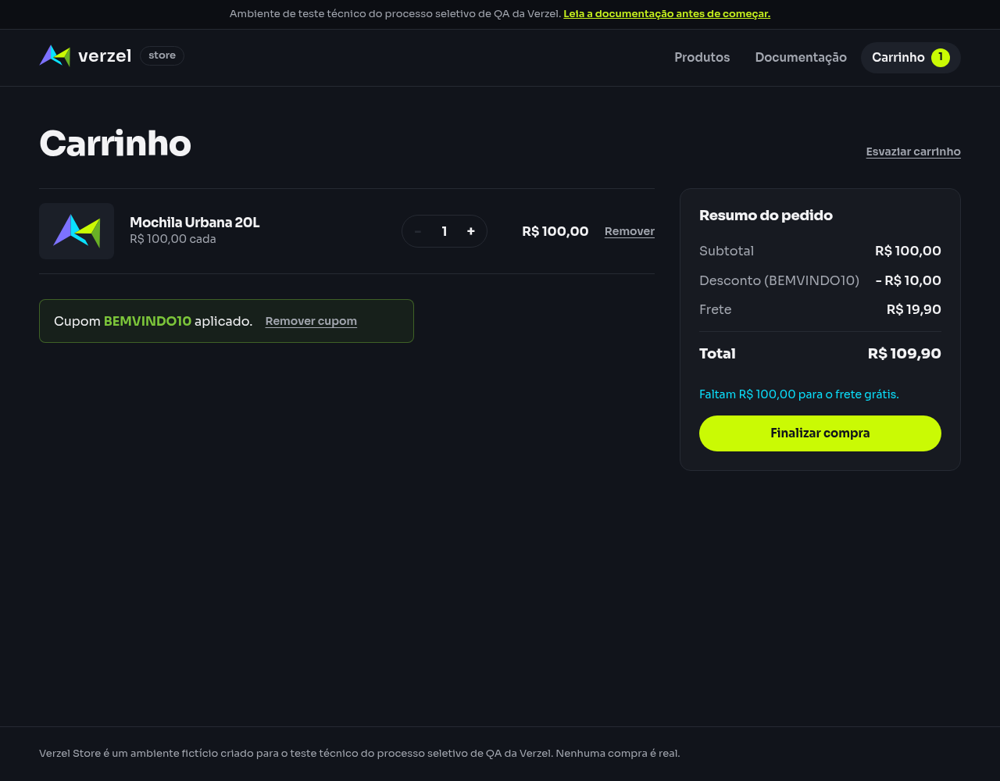

# Relatório de teste — Aplicar desconto apenas aos produtos

**Resultado: Falhou na mensagem exibida.** O cupom foi aplicado e todos os valores ficaram corretos. Porém, a tela mostrou “Cupom BEMVINDO10 aplicado.” em vez da mensagem exigida pelo cenário: “Cupom aplicado: 10% de desconto nos produtos.”

**Data do teste na interface:** 07/10/2026, às 23h39 (horário de Fortaleza).

**Consulta independente da API:** 07/10/2026, às 23h31 (horário de Fortaleza). Os registros de cada execução foram preservados.

**Loja:** Verzel Store, ambiente de testes.

**Referência:** VZS-142, versão 2.3.0, critérios CA01 e CA09; cenário em [cupons.feature](../features/cupons.feature).

## O que foi testado

Abrimos a loja com um carrinho vazio, adicionamos uma Mochila Urbana 20L (P005), de R$ 100,00, e aplicamos BEMVINDO10 pelo formulário do carrinho. Conferimos os valores e a mensagem realmente exibidos na tela, além da resposta do serviço que calcula a compra.

## Cenário BDD

O cenário descreve a experiência esperada do cliente. API é o serviço que calcula os valores; neste teste, também conferimos a exibição na tela.

```gherkin
Contexto:
    Dado que o carrinho contém 1 unidade do produto "P005" de R$ 100,00

  @CA01 @CA09
  Cenário: Aplicar desconto apenas aos produtos
    Quando aplico o cupom "BEMVINDO10"
    Então o subtotal deve ser R$ 100,00
    E o desconto deve ser R$ 10,00
    E o frete deve ser R$ 19,90
    E o total deve ser R$ 109,90
    E deve ser exibida a mensagem "Cupom aplicado: 10% de desconto nos produtos."
```

## Resultados da conferência

| Verificação | Esperado | Encontrado | Resultado |
| --- | --- | --- | --- |
| Produto e quantidade | 1 unidade de P005 por R$ 100,00 | 1 unidade de P005 por R$ 100,00 | Aprovado |
| Aplicação do cupom na tela | BEMVINDO10 aplicado | BEMVINDO10 aplicado, com opção de remover | Aprovado |
| Subtotal | R$ 100,00 | R$ 100,00 | Aprovado |
| Desconto sobre produtos | R$ 10,00 | R$ 10,00, apresentado como abatimento | Aprovado |
| Frete sem desconto | R$ 19,90 | R$ 19,90 | Aprovado |
| Total da compra | R$ 109,90 | R$ 109,90 | Aprovado |
| Mensagem devolvida pelo serviço | Cupom aplicado: 10% de desconto nos produtos. | Cupom aplicado: 10% de desconto nos produtos. | Aprovado |
| Mensagem exibida ao cliente | Cupom aplicado: 10% de desconto nos produtos. | Cupom BEMVINDO10 aplicado. | Falhou |

Antes do cupom, o total era R$ 119,90. Depois, a conta conferida foi **R$ 100,00 − R$ 10,00 + R$ 19,90 = R$ 109,90**. O frete permaneceu integral, como exigem CA01 e CA09.

## Falhas encontradas

**F01 — Mensagem da tela diferente do cenário.** A interface confirma a aplicação do cupom, mas não exibe o texto que informa “10% de desconto nos produtos”. A mensagem exigida está presente na resposta do serviço, porém não é apresentada ao cliente na tela conferida.

**Impacto observado:** o valor cobrado está correto, mas a confirmação visível não explica o percentual nem que o desconto vale somente para os produtos. A falha se refere ao texto exigido por este cenário; nenhuma divergência nos cálculos foi encontrada.

**Como reproduzir:** abrir a loja com carrinho vazio, adicionar uma unidade da Mochila Urbana 20L, abrir o carrinho e aplicar BEMVINDO10. Conferir a mensagem na área do cupom.

A tentativa anterior foi bloqueada pelo certificado do ambiente. Após autorização do usuário para importar a autoridade certificadora oficial do proxy, a navegação e a interação foram concluídas com a verificação de segurança ativa. O bloqueio anterior está preservado no histórico e não é o resultado final deste teste. Uma tentativa intermediária também foi interrompida por um seletor de automação inadequado; o seletor foi corrigido para observar o estado real do cupom aplicado, e a execução final conferiu todos os passos sem alterar os resultados esperados.

## Comprovantes do teste

- [Tela antes de aplicar o cupom](evidencias/cupom-desconto-produtos/interface-2026-10-08T02-39-40-039Z/carrinho-antes.png).
- [Tela depois de aplicar o cupom](evidencias/cupom-desconto-produtos/interface-2026-10-08T02-39-40-039Z/carrinho-com-cupom.png).
- [Texto exibido antes](evidencias/cupom-desconto-produtos/interface-2026-10-08T02-39-40-039Z/texto-antes.txt) e [depois](evidencias/cupom-desconto-produtos/interface-2026-10-08T02-39-40-039Z/texto-depois.txt).
- [Dados enviados pela interface](evidencias/cupom-desconto-produtos/interface-2026-10-08T02-39-40-039Z/requisicao-calculo-interface.json).
- [Resposta recebida durante a aplicação do cupom](evidencias/cupom-desconto-produtos/interface-2026-10-08T02-39-40-039Z/resposta-calculo-interface.json).
- [Status da consulta feita pela interface](evidencias/cupom-desconto-produtos/interface-2026-10-08T02-39-40-039Z/status-calculo-interface.json).
- [Conferência detalhada na interface](evidencias/cupom-desconto-produtos/interface-2026-10-08T02-39-40-039Z/validacao-interface.json) e [resumo do resultado](evidencias/cupom-desconto-produtos/interface-2026-10-08T02-39-40-039Z/resumo-validacao.json).
- [Script da conferência da interface](evidencias/cupom-desconto-produtos/interface-2026-10-08T02-39-40-039Z/teste-interface.js).
- [Consulta independente da API](evidencias/cupom-desconto-produtos/20261007-233126/resposta-http.txt), [corpo recebido](evidencias/cupom-desconto-produtos/20261007-233126/corpo.json) e [registro da execução](evidencias/cupom-desconto-produtos/20261007-233126/execucao-api.json).
- [Registro do bloqueio anterior](evidencias/cupom-desconto-produtos/20261007-233126/execucao-interface.json) e [relatório anterior preservado](evidencias/cupom-desconto-produtos/20261007-233126/relatorio-bloqueado.txt).

### Tela conferida



Para a equipe técnica, a consulta independente foi realizada com este comando, sem desativar a verificação de segurança:

```bash
curl -i -X POST https://verzel-store.qa-test-verzel-store.workers.dev/api/carrinho/calcular -H 'Content-Type: application/json' --data-binary '{"itens":[{"produtoId":"P005","quantidade":1}],"cupom":"BEMVINDO10"}' --max-time 30 --silent --show-error --write-out '\nCURL_HTTP_STATUS:%{http_code}\n'
```

O marcador `CURL_HTTP_STATUS` é acrescentado pela ferramenta e não faz parte da resposta. A avaliação utiliza o status final da aplicação. O script da interface usa Playwright e Chromium, inicia um contexto de navegador vazio e compara o texto e os valores visíveis; nenhum erro de certificado foi ignorado.

## Limite desta avaliação

O cenário foi executado para uma unidade de P005 com BEMVINDO10. Os cálculos passaram e a mensagem visível falhou em relação ao texto exigido. Outros produtos, cupons, troca ou remoção de cupom e confirmação de pedidos não foram avaliados. Os horários e as evidências da consulta independente e da execução na interface são distintos e estão identificados acima.
