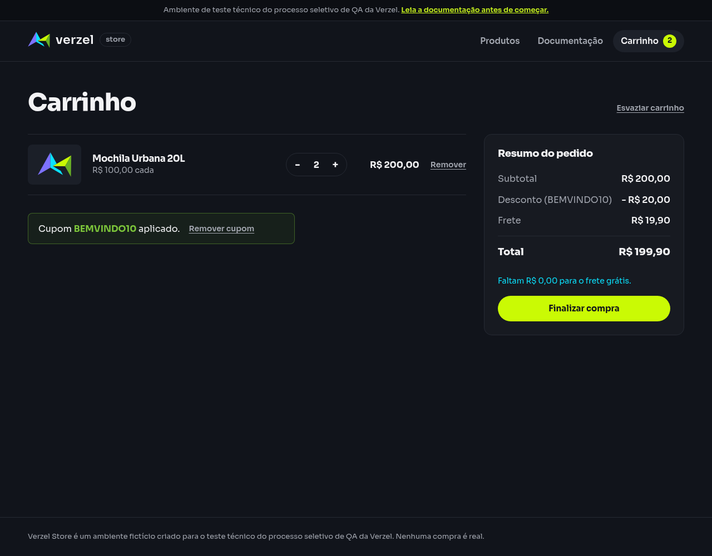

# Relatório de teste — Recalcular frete após alterar a quantidade com cupom aplicado

**Resultado: Falhou.** Ao aumentar P005 para duas unidades, a loja cobrou R$ 19,90 de frete e mostrou total de R$ 199,90. O esperado era frete grátis e total de R$ 180,00. Ao voltar para uma unidade, os valores e o aviso de quanto falta para frete grátis ficaram corretos.

**Data do teste na interface:** 08/10/2026, das 01h12min46s às 01h12min49s (America/Fortaleza). Os horários das consultas complementares estão nas evidências.

**Loja:** [Verzel Store — ambiente de testes](https://verzel-store.qa-test-verzel-store.workers.dev).

**Referência:** [Documentação VZS-142, versão 2.3.0](https://verzel-store.qa-test-verzel-store.workers.dev/documentacao), critérios CA06, CA07 e CA08; cenário em [frete_e_totais.feature](../features/frete_e_totais.feature).

## O que foi testado

Verificamos se o carrinho atualiza o subtotal, o desconto e o frete ao mudar a quantidade, mantendo BEMVINDO10 aplicado. O frete grátis deve considerar o valor dos produtos antes do desconto: duas unidades de P005 atingem os R$ 200,00 necessários.

Começamos com um carrinho vazio, adicionamos uma Mochila Urbana 20L (P005), abrimos o carrinho e aplicamos o cupom. Usamos o botão de aumentar para chegar a duas unidades e depois o botão de diminuir para voltar a uma. Toda a sequência ocorreu na mesma sessão, sem remover nem reaplicar o cupom.

Também consultamos separadamente o serviço de cálculo da loja (API) com uma e duas unidades, para comparar os resultados. Essas consultas complementam as evidências; a mudança de quantidade foi executada pelos botões da interface.

## Cenário BDD

```gherkin
@CA06 @CA07 @CA08 @interface
Cenário: Recalcular frete após alterar a quantidade com cupom aplicado
  Dado que o carrinho contém 1 unidade do produto "P005" de R$ 100,00
  E apliquei o cupom "BEMVINDO10"
  Quando altero a quantidade do produto "P005" para 2
  Então o subtotal deve ser R$ 200,00
  E o desconto deve ser R$ 20,00
  E o frete deve ser R$ 0,00
  E o total deve ser R$ 180,00
  Quando altero a quantidade do produto "P005" para 1
  Então o subtotal deve ser R$ 100,00
  E o desconto deve ser R$ 10,00
  E o frete deve ser R$ 19,90
  E o total deve ser R$ 109,90
  E o carrinho deve informar que faltam R$ 100,00 para o frete grátis
```

## Resultados da conferência

### Preparação: uma unidade com cupom

| Verificação | Esperado | Encontrado | Resultado |
| --- | --- | --- | --- |
| Produto e quantidade | Uma unidade de P005 | Uma unidade de Mochila Urbana 20L, a R$ 100,00 | Aprovado |
| Cupom | BEMVINDO10 aplicado | Um cupom BEMVINDO10 aplicado | Aprovado |
| Valores iniciais | Subtotal R$ 100,00; desconto R$ 10,00; frete R$ 19,90; total R$ 109,90 | Valores correspondentes na tela e no cálculo recebido | Aprovado |

### Após aumentar para duas unidades

| Verificação | Esperado | Encontrado | Resultado |
| --- | --- | --- | --- |
| Quantidade | Duas unidades de P005 | Duas unidades | Aprovado |
| Subtotal | R$ 200,00 | R$ 200,00 na tela e no cálculo recebido | Aprovado |
| Desconto | R$ 20,00 | R$ 20,00 na tela e no cálculo recebido | Aprovado |
| Frete | R$ 0,00 | R$ 19,90 na tela e no cálculo recebido | Falhou |
| Total | R$ 180,00 | R$ 199,90 na tela e no cálculo recebido | Falhou |
| Manutenção do cupom | BEMVINDO10 aplicado | Um cupom BEMVINDO10 aplicado | Aprovado |

A tela também exibiu “Faltam R$ 0,00 para o frete grátis.”, mesmo mantendo a cobrança de frete.

### Após voltar para uma unidade

| Verificação | Esperado | Encontrado | Resultado |
| --- | --- | --- | --- |
| Quantidade | Uma unidade de P005 | Uma unidade | Aprovado |
| Subtotal | R$ 100,00 | R$ 100,00 na tela e no cálculo recebido | Aprovado |
| Desconto | R$ 10,00 | R$ 10,00 na tela e no cálculo recebido | Aprovado |
| Frete | R$ 19,90 | R$ 19,90 na tela e no cálculo recebido | Aprovado |
| Total | R$ 109,90 | R$ 109,90 na tela e no cálculo recebido | Aprovado |
| Aviso de quanto falta | Informar que faltam R$ 100,00 para frete grátis | “Faltam R$ 100,00 para o frete grátis.”, visível na tela | Aprovado |
| Manutenção do cupom | BEMVINDO10 aplicado | Um cupom BEMVINDO10 aplicado | Aprovado |

O desconto aparece com sinal de menos na tela, indicando a redução do valor da compra. O cupom permaneceu aplicado nas três etapas.

Todos os cálculos recebidos pelo navegador retornaram status 200, que indica que a solicitação foi atendida. As duas consultas complementares também retornaram 200 e reproduziram os valores da tela: uma unidade passou; duas unidades apresentaram a mesma cobrança indevida de frete.

## Falhas encontradas

**F01 — Frete grátis não concedido ao atingir R$ 200,00 em produtos.** Após aumentar P005 de uma para duas unidades, o subtotal chegou a R$ 200,00 e o desconto foi atualizado corretamente para R$ 20,00. A loja manteve o frete de R$ 19,90, elevando o total para R$ 199,90 em vez de R$ 180,00.

**Impacto observado:** o total apresentado fica **R$ 19,90 acima do esperado**. O aviso de que faltam R$ 0,00 também pode confundir a pessoa que compra, pois a cobrança de frete continua. Nenhum pedido foi confirmado.

**Como reproduzir:** adicionar uma unidade de P005 ao carrinho, aplicar BEMVINDO10 e usar o botão **+** para aumentar para duas unidades. Conferir frete, total e aviso abaixo do total.

A mesma divergência no subtotal exato de R$ 200,00 foi registrada nos testes de [limites sem cupom](frete-limites-subtotal.md) e [frete com desconto](frete-subtotal-antes-desconto.md). Nesta execução, ela também ocorreu ao alterar a quantidade na interface. As evidências não determinam a implementação que causou o erro.

O teste continuou após a falha e executou a redução para uma unidade. Os valores dessa etapa passaram. Não houve bloqueios nem etapas deixadas sem execução.

## Comprovantes do teste

### Uma unidade com cupom, antes da alteração

- [Captura de tela](evidencias/frete-alteracao-quantidade/20261008-011208/interface/01-cupom-quantidade-1/tela.png), [texto exibido](evidencias/frete-alteracao-quantidade/20261008-011208/interface/01-cupom-quantidade-1/texto-tela.txt) e [estado do carrinho](evidencias/frete-alteracao-quantidade/20261008-011208/interface/01-cupom-quantidade-1/estado.json).
- [Dados enviados](evidencias/frete-alteracao-quantidade/20261008-011208/interface/01-cupom-quantidade-1/corpo-enviado.json), [dados recebidos](evidencias/frete-alteracao-quantidade/20261008-011208/interface/01-cupom-quantidade-1/corpo-recebido.json), [status e cabeçalhos](evidencias/frete-alteracao-quantidade/20261008-011208/interface/01-cupom-quantidade-1/resposta-http.json) e [conferência detalhada](evidencias/frete-alteracao-quantidade/20261008-011208/interface/01-cupom-quantidade-1/validacao-interface.json).

### Após aumentar para duas unidades — etapa com falha

- [Captura de tela](evidencias/frete-alteracao-quantidade/20261008-011208/interface/02-aumentar-para-2/tela.png), [texto exibido](evidencias/frete-alteracao-quantidade/20261008-011208/interface/02-aumentar-para-2/texto-tela.txt) e [estado do carrinho](evidencias/frete-alteracao-quantidade/20261008-011208/interface/02-aumentar-para-2/estado.json).
- [Dados enviados](evidencias/frete-alteracao-quantidade/20261008-011208/interface/02-aumentar-para-2/corpo-enviado.json), [dados recebidos](evidencias/frete-alteracao-quantidade/20261008-011208/interface/02-aumentar-para-2/corpo-recebido.json), [status e cabeçalhos](evidencias/frete-alteracao-quantidade/20261008-011208/interface/02-aumentar-para-2/resposta-http.json) e [comparações aprovadas e falhas](evidencias/frete-alteracao-quantidade/20261008-011208/interface/02-aumentar-para-2/validacao-interface.json).



### Após voltar para uma unidade — etapa aprovada

- [Captura de tela](evidencias/frete-alteracao-quantidade/20261008-011208/interface/03-diminuir-para-1/tela.png), [texto exibido](evidencias/frete-alteracao-quantidade/20261008-011208/interface/03-diminuir-para-1/texto-tela.txt) e [estado do carrinho](evidencias/frete-alteracao-quantidade/20261008-011208/interface/03-diminuir-para-1/estado.json).
- [Dados enviados](evidencias/frete-alteracao-quantidade/20261008-011208/interface/03-diminuir-para-1/corpo-enviado.json), [dados recebidos](evidencias/frete-alteracao-quantidade/20261008-011208/interface/03-diminuir-para-1/corpo-recebido.json), [status e cabeçalhos](evidencias/frete-alteracao-quantidade/20261008-011208/interface/03-diminuir-para-1/resposta-http.json) e [conferência detalhada](evidencias/frete-alteracao-quantidade/20261008-011208/interface/03-diminuir-para-1/validacao-interface.json).

### Consultas complementares ao cálculo

- Uma unidade: [resposta HTTP completa](evidencias/frete-alteracao-quantidade/20261008-011208/api/quantidade-1/resposta-http.txt), [corpo enviado](evidencias/frete-alteracao-quantidade/20261008-011208/api/quantidade-1/corpo-enviado.json), [corpo recebido](evidencias/frete-alteracao-quantidade/20261008-011208/api/quantidade-1/corpo.json), [comparações, horário e comando](evidencias/frete-alteracao-quantidade/20261008-011208/api/quantidade-1/validacao-api.json) e [registro de erros](evidencias/frete-alteracao-quantidade/20261008-011208/api/quantidade-1/curl-stderr.txt), vazio.
- Duas unidades: [resposta HTTP completa](evidencias/frete-alteracao-quantidade/20261008-011208/api/quantidade-2/resposta-http.txt), [corpo enviado](evidencias/frete-alteracao-quantidade/20261008-011208/api/quantidade-2/corpo-enviado.json), [corpo recebido](evidencias/frete-alteracao-quantidade/20261008-011208/api/quantidade-2/corpo.json), [comparações, horário e comando](evidencias/frete-alteracao-quantidade/20261008-011208/api/quantidade-2/validacao-api.json) e [registro de erros](evidencias/frete-alteracao-quantidade/20261008-011208/api/quantidade-2/curl-stderr.txt), vazio.

### Registros gerais e reprodução

- [Resumo das três etapas na mesma sessão](evidencias/frete-alteracao-quantidade/20261008-011208/resumo-interface.json) e [resumo das consultas complementares](evidencias/frete-alteracao-quantidade/20261008-011208/resumo-api.json).
- Scripts executados: [interface](evidencias/frete-alteracao-quantidade/20261008-011208/teste-interface.js) e [consultas complementares](evidencias/frete-alteracao-quantidade/20261008-011208/teste-api.py).
- [Saída do navegador](evidencias/frete-alteracao-quantidade/20261008-011208/navegador-stdout.txt) e [registro de erros do navegador](evidencias/frete-alteracao-quantidade/20261008-011208/navegador-stderr.txt), vazio.

Para a equipe técnica, estas foram as consultas complementares executadas:

```bash
# Uma unidade com cupom
curl -i -X POST 'https://verzel-store.qa-test-verzel-store.workers.dev/api/carrinho/calcular' \
  -H 'Content-Type: application/json' \
  --data-binary '{"itens":[{"produtoId":"P005","quantidade":1}],"cupom":"BEMVINDO10"}' \
  --max-time 30 --silent --show-error --write-out '\nCURL_HTTP_STATUS:%{http_code}\n'

# Duas unidades com cupom
curl -i -X POST 'https://verzel-store.qa-test-verzel-store.workers.dev/api/carrinho/calcular' \
  -H 'Content-Type: application/json' \
  --data-binary '{"itens":[{"produtoId":"P005","quantidade":2}],"cupom":"BEMVINDO10"}' \
  --max-time 30 --silent --show-error --write-out '\nCURL_HTTP_STATUS:%{http_code}\n'
```

O marcador `CURL_HTTP_STATUS` é acrescentado pela ferramenta e não faz parte da resposta. A conferência usa o status final da aplicação. O navegador e as consultas mantiveram a verificação de segurança da conexão ativa, com a confiança no certificado oficial do proxy já autorizada pelo usuário.

## Limite desta avaliação

Foi executada a sequência de uma para duas unidades e de volta para uma, com P005 e BEMVINDO10 na mesma sessão. Não foram testados outros produtos, cupons, quantidades ou confirmação de pedido.

A volta para uma unidade apresentou os valores corretos, mas não comprova uma transição de frete grátis para pago: a etapa anterior já havia mantido o frete pago indevidamente. O cenário também não permite isolar a regra de usar o subtotal antes do desconto da falha já observada no limite exato de R$ 200,00.
