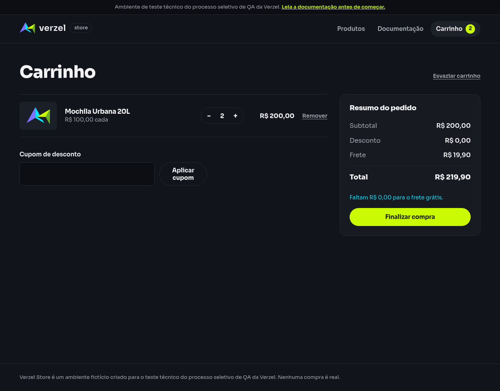

# Relatório de teste — Frete nos limites do subtotal

**Resultado: Falhou.** Dos quatro exemplos executados, dois passaram integralmente. No subtotal exato de R$ 200,00, a loja cobrou frete indevidamente. No subtotal de R$ 229,90, o cálculo passou, mas a tela mostrou “Grátis” em vez de um valor de frete com duas casas decimais, exigido pelo cenário.

**Data do teste na interface:** 08/10/2026, às 00h46 (horário de Fortaleza). Os horários de cada caso e consulta independente estão nas evidências.

**Loja:** Verzel Store, ambiente de testes.

**Referência:** VZS-142, versão 2.3.0, critérios CA06, CA07 e CA11; cenário em [frete_e_totais.feature](../features/frete_e_totais.feature).

## O que foi testado

Conferimos se o frete é cobrado abaixo de R$ 200,00 e se passa a ser grátis a partir desse valor, inclusive. Também verificamos quanto falta para atingir o benefício, o total da compra e a apresentação dos valores com duas casas decimais.

Cada exemplo foi executado em um carrinho novo, sem cupom. A lista de produtos foi enviada diretamente à API e montada pelos botões da loja em um navegador. Comparamos o resumo recebido com os valores exibidos na tela. API é o serviço que calcula o carrinho; JSON é o formato de seus dados, e status 200 indica que o cálculo foi atendido.

## Cenário BDD

```gherkin
Funcionalidade: Cálculo do subtotal, desconto, frete e total
  Os cálculos da API devem ser exibidos pela interface sem divergência.

  @CA06 @CA07 @CA11 @api @interface
  Esquema do Cenário: Calcular frete nos limites do subtotal
    Dado um carrinho com os itens "<itens>"
    Quando calculo o carrinho sem cupom
    Então a API deve responder com status 200
    E os valores monetários retornados devem ter precisão de até 2 casas decimais
    E a interface deve exibir os valores com 2 casas decimais
    E a API e a interface devem apresentar o resumo:
      | subtotal | desconto | frete   | freteGratis | valorFaltanteFreteGratis | total   |
      | <subtotal> | 0,00   | <frete> | <gratis>    | <faltante>              | <total> |

    Exemplos:
      | itens          | subtotal | frete | gratis | faltante | total  |
      | P003:1         | 189,90   | 19,90 | falso  | 10,10    | 209,80 |
      | P002:1,P001:1  | 199,80   | 19,90 | falso  | 0,20     | 219,70 |
      | P005:2         | 200,00   | 0,00  | verdadeiro | 0,00 | 200,00 |
      | P007:1         | 229,90   | 0,00  | verdadeiro | 0,00 | 229,90 |
```

Na lista de itens, `P005:2` significa duas unidades de P005. `P002:1,P001:1` significa uma unidade de cada um desses dois produtos.

## Resultados da conferência

| Verificação | Esperado | Encontrado | Resultado |
| --- | --- | --- | --- |
| `P003:1` — subtotal R$ 189,90 | Frete R$ 19,90, total R$ 209,80; valores com 2 casas na tela | Valores e apresentação corretos | Aprovado |
| `P002:1,P001:1` — subtotal R$ 199,80 | Frete R$ 19,90, total R$ 219,70; valores com 2 casas na tela | Valores e apresentação corretos | Aprovado |
| `P005:2` — subtotal R$ 200,00 | Frete R$ 0,00, total R$ 200,00; valores com 2 casas na tela | API e tela cobram R$ 19,90 de frete e totalizam R$ 219,90 | Falhou |
| `P007:1` — subtotal R$ 229,90 | Frete R$ 0,00, total R$ 229,90; valores com 2 casas na tela | Valores corretos; frete exibido como “Grátis”, sem valor numérico | Falhou |

As quatro consultas diretas e os cálculos recebidos durante as interações responderam com status 200. Todos os valores monetários da API tiveram precisão de até duas casas decimais, incluindo os valores por produto. Essa precisão foi verificada como número decimal, sem confundir imprecisões internas de ferramentas com a resposta real.

A tela reproduziu os valores calculados pela API nos quatro casos, inclusive o cálculo incorreto no limite de R$ 200,00. A indicação “Grátis” foi considerada equivalente a frete de R$ 0,00 para comparar o valor; a ausência do número com duas casas foi avaliada separadamente como apresentação.

### Carrinho `P003:1`

| Verificação | Esperado | Encontrado | Resultado |
| --- | --- | --- | --- |
| Subtotal | R$ 189,90 | R$ 189,90 na API; R$ 189,90 na tela | Aprovado |
| Desconto | R$ 0,00 | R$ 0,00 na API; R$ 0,00 na tela | Aprovado |
| Frete | R$ 19,90 | R$ 19,90 na API; R$ 19,90 na tela | Aprovado |
| Frete grátis | Não | Não | Aprovado |
| Falta para frete grátis | R$ 10,10 | R$ 10,10 na API; Faltam R$ 10,10 para o frete grátis. | Aprovado |
| Total | R$ 209,80 | R$ 209,80 na API; R$ 209,80 na tela | Aprovado |

### Carrinho `P002:1,P001:1`

| Verificação | Esperado | Encontrado | Resultado |
| --- | --- | --- | --- |
| Subtotal | R$ 199,80 | R$ 199,80 na API; R$ 199,80 na tela | Aprovado |
| Desconto | R$ 0,00 | R$ 0,00 na API; R$ 0,00 na tela | Aprovado |
| Frete | R$ 19,90 | R$ 19,90 na API; R$ 19,90 na tela | Aprovado |
| Frete grátis | Não | Não | Aprovado |
| Falta para frete grátis | R$ 0,20 | R$ 0,20 na API; Faltam R$ 0,20 para o frete grátis. | Aprovado |
| Total | R$ 219,70 | R$ 219,70 na API; R$ 219,70 na tela | Aprovado |

### Carrinho `P005:2`

| Verificação | Esperado | Encontrado | Resultado |
| --- | --- | --- | --- |
| Subtotal | R$ 200,00 | R$ 200,00 na API; R$ 200,00 na tela | Aprovado |
| Desconto | R$ 0,00 | R$ 0,00 na API; R$ 0,00 na tela | Aprovado |
| Frete | R$ 0,00 | R$ 19,90 na API; R$ 19,90 na tela | Falhou |
| Frete grátis | Sim | Não | Falhou |
| Falta para frete grátis | R$ 0,00 | R$ 0,00 na API; Faltam R$ 0,00 para o frete grátis. | Aprovado |
| Total | R$ 200,00 | R$ 219,90 na API; R$ 219,90 na tela | Falhou |

### Carrinho `P007:1`

| Verificação | Esperado | Encontrado | Resultado |
| --- | --- | --- | --- |
| Subtotal | R$ 229,90 | R$ 229,90 na API; R$ 229,90 na tela | Aprovado |
| Desconto | R$ 0,00 | R$ 0,00 na API; R$ 0,00 na tela | Aprovado |
| Frete | R$ 0,00 | R$ 0,00 na API; Grátis na tela | Aprovado |
| Frete grátis | Sim | Sim | Aprovado |
| Falta para frete grátis | R$ 0,00 | R$ 0,00 na API; sem aviso na tela | Aprovado |
| Total | R$ 229,90 | R$ 229,90 na API; R$ 229,90 na tela | Aprovado |

Nos carrinhos com frete grátis, o aviso de quanto falta não é apresentado. O valor zero permanece na resposta da API; CA07 exige informar o faltante nos carrinhos abaixo do limite. No caso exato de R$ 200,00, a tela indevidamente manteve a cobrança e exibiu “Faltam R$ 0,00 para o frete grátis.”.

## Falhas encontradas

**F01 — Frete cobrado no subtotal exato de R$ 200,00 (CA06).** Com duas unidades da Mochila Urbana 20L (P005), o esperado é frete de R$ 0,00 e total de R$ 200,00. A API retornou frete de R$ 19,90, indicação de frete grátis falsa e total de R$ 219,90. A tela mostrou esses mesmos valores.

**Impacto observado:** a compra elegível ao benefício é apresentada com **R$ 19,90 a mais**. O aviso “Faltam R$ 0,00 para o frete grátis.” também comunica que nada falta, embora o frete continue cobrado. Nenhum pedido foi confirmado neste teste.

**Como reproduzir:** iniciar um carrinho vazio, adicionar duas unidades de P005 e abrir o carrinho sem cupom. A divergência apareceu tanto na consulta direta quanto no cálculo recebido pelo navegador.

**F02 — Frete grátis sem apresentação numérica de duas casas.** Com uma Jaqueta Corta-Vento (P007), subtotal de R$ 229,90, a API retornou frete zero e total correto de R$ 229,90. A tela apresentou o frete como “Grátis”, sem `R$ 0,00`.

**Impacto observado:** não há diferença monetária nesse caso. A divergência se limita à exigência literal do passo “a interface deve exibir os valores com 2 casas decimais”. O cálculo e a concessão do benefício passaram.

**Ponto a confirmar com Produto:** se “Grátis” for a apresentação desejada para frete zero, explicitar essa exceção no cenário. CA11 documenta arredondamento e a API o cumpriu; este relatório não trata o texto “Grátis” como erro de arredondamento. A falha de cobrança no limite de R$ 200,00 continua independente dessa decisão de apresentação.

Não houve casos bloqueados nem exemplos não executados.

## Comprovantes do teste

### Carrinho `P003:1`

- [Captura da tela](evidencias/frete-limites-subtotal/20261008-004502/01-abaixo-189-90/interface/tela.png), [texto exibido](evidencias/frete-limites-subtotal/20261008-004502/01-abaixo-189-90/interface/texto-tela.txt) e [estado do carrinho](evidencias/frete-limites-subtotal/20261008-004502/01-abaixo-189-90/interface/estado.json).
- [Dados enviados pela interface](evidencias/frete-limites-subtotal/20261008-004502/01-abaixo-189-90/interface/corpo-enviado.json), [resposta recebida](evidencias/frete-limites-subtotal/20261008-004502/01-abaixo-189-90/interface/corpo-recebido.json) e [status e cabeçalhos](evidencias/frete-limites-subtotal/20261008-004502/01-abaixo-189-90/interface/resposta-http.json).
- [Conferência da interface](evidencias/frete-limites-subtotal/20261008-004502/01-abaixo-189-90/interface/validacao-interface.json).
- [Consulta independente à API](evidencias/frete-limites-subtotal/20261008-004502/01-abaixo-189-90/api/resposta-http.txt), [corpo enviado](evidencias/frete-limites-subtotal/20261008-004502/01-abaixo-189-90/api/corpo-enviado.json), [dados recebidos](evidencias/frete-limites-subtotal/20261008-004502/01-abaixo-189-90/api/corpo.json) e [conferência da API](evidencias/frete-limites-subtotal/20261008-004502/01-abaixo-189-90/api/validacao-api.json).
- [Registro de erros da consulta](evidencias/frete-limites-subtotal/20261008-004502/01-abaixo-189-90/api/curl-stderr.txt): vazio nesta execução.

### Carrinho `P002:1,P001:1`

- [Captura da tela](evidencias/frete-limites-subtotal/20261008-004502/02-abaixo-199-80/interface/tela.png), [texto exibido](evidencias/frete-limites-subtotal/20261008-004502/02-abaixo-199-80/interface/texto-tela.txt) e [estado do carrinho](evidencias/frete-limites-subtotal/20261008-004502/02-abaixo-199-80/interface/estado.json).
- [Dados enviados pela interface](evidencias/frete-limites-subtotal/20261008-004502/02-abaixo-199-80/interface/corpo-enviado.json), [resposta recebida](evidencias/frete-limites-subtotal/20261008-004502/02-abaixo-199-80/interface/corpo-recebido.json) e [status e cabeçalhos](evidencias/frete-limites-subtotal/20261008-004502/02-abaixo-199-80/interface/resposta-http.json).
- [Conferência da interface](evidencias/frete-limites-subtotal/20261008-004502/02-abaixo-199-80/interface/validacao-interface.json).
- [Consulta independente à API](evidencias/frete-limites-subtotal/20261008-004502/02-abaixo-199-80/api/resposta-http.txt), [corpo enviado](evidencias/frete-limites-subtotal/20261008-004502/02-abaixo-199-80/api/corpo-enviado.json), [dados recebidos](evidencias/frete-limites-subtotal/20261008-004502/02-abaixo-199-80/api/corpo.json) e [conferência da API](evidencias/frete-limites-subtotal/20261008-004502/02-abaixo-199-80/api/validacao-api.json).
- [Registro de erros da consulta](evidencias/frete-limites-subtotal/20261008-004502/02-abaixo-199-80/api/curl-stderr.txt): vazio nesta execução.

### Carrinho `P005:2`

- [Captura da tela](evidencias/frete-limites-subtotal/20261008-004502/03-limite-200-00/interface/tela.png), [texto exibido](evidencias/frete-limites-subtotal/20261008-004502/03-limite-200-00/interface/texto-tela.txt) e [estado do carrinho](evidencias/frete-limites-subtotal/20261008-004502/03-limite-200-00/interface/estado.json).
- [Dados enviados pela interface](evidencias/frete-limites-subtotal/20261008-004502/03-limite-200-00/interface/corpo-enviado.json), [resposta recebida](evidencias/frete-limites-subtotal/20261008-004502/03-limite-200-00/interface/corpo-recebido.json) e [status e cabeçalhos](evidencias/frete-limites-subtotal/20261008-004502/03-limite-200-00/interface/resposta-http.json).
- [Conferência da interface](evidencias/frete-limites-subtotal/20261008-004502/03-limite-200-00/interface/validacao-interface.json).
- [Consulta independente à API](evidencias/frete-limites-subtotal/20261008-004502/03-limite-200-00/api/resposta-http.txt), [corpo enviado](evidencias/frete-limites-subtotal/20261008-004502/03-limite-200-00/api/corpo-enviado.json), [dados recebidos](evidencias/frete-limites-subtotal/20261008-004502/03-limite-200-00/api/corpo.json) e [conferência da API](evidencias/frete-limites-subtotal/20261008-004502/03-limite-200-00/api/validacao-api.json).
- [Registro de erros da consulta](evidencias/frete-limites-subtotal/20261008-004502/03-limite-200-00/api/curl-stderr.txt): vazio nesta execução.

### Carrinho `P007:1`

- [Captura da tela](evidencias/frete-limites-subtotal/20261008-004502/04-acima-229-90/interface/tela.png), [texto exibido](evidencias/frete-limites-subtotal/20261008-004502/04-acima-229-90/interface/texto-tela.txt) e [estado do carrinho](evidencias/frete-limites-subtotal/20261008-004502/04-acima-229-90/interface/estado.json).
- [Dados enviados pela interface](evidencias/frete-limites-subtotal/20261008-004502/04-acima-229-90/interface/corpo-enviado.json), [resposta recebida](evidencias/frete-limites-subtotal/20261008-004502/04-acima-229-90/interface/corpo-recebido.json) e [status e cabeçalhos](evidencias/frete-limites-subtotal/20261008-004502/04-acima-229-90/interface/resposta-http.json).
- [Conferência da interface](evidencias/frete-limites-subtotal/20261008-004502/04-acima-229-90/interface/validacao-interface.json).
- [Consulta independente à API](evidencias/frete-limites-subtotal/20261008-004502/04-acima-229-90/api/resposta-http.txt), [corpo enviado](evidencias/frete-limites-subtotal/20261008-004502/04-acima-229-90/api/corpo-enviado.json), [dados recebidos](evidencias/frete-limites-subtotal/20261008-004502/04-acima-229-90/api/corpo.json) e [conferência da API](evidencias/frete-limites-subtotal/20261008-004502/04-acima-229-90/api/validacao-api.json).
- [Registro de erros da consulta](evidencias/frete-limites-subtotal/20261008-004502/04-acima-229-90/api/curl-stderr.txt): vazio nesta execução.

### Registros gerais

- [Dados e valores esperados dos quatro exemplos](evidencias/frete-limites-subtotal/20261008-004502/casos.json).
- [Resumo dos resultados](evidencias/frete-limites-subtotal/20261008-004502/resumo-validacao.json).
- [Script de execução da interface](evidencias/frete-limites-subtotal/20261008-004502/teste-interface.js).
- [Saída do navegador](evidencias/frete-limites-subtotal/20261008-004502/navegador-stdout.txt) e [registro de erros](evidencias/frete-limites-subtotal/20261008-004502/navegador-stderr.txt): arquivo de erros vazio nesta execução.

### Cobrança no limite de R$ 200,00



### Apresentação acima do limite


Para a equipe técnica, estas foram as consultas diretas executadas:

```bash
# Carrinho P003:1
curl -i -X POST https://verzel-store.qa-test-verzel-store.workers.dev/api/carrinho/calcular -H 'Content-Type: application/json' --data-binary '{"itens":[{"produtoId":"P003","quantidade":1}]}' --max-time 30 --silent --show-error --write-out '\nCURL_HTTP_STATUS:%{http_code}\n'

# Carrinho P002:1,P001:1
curl -i -X POST https://verzel-store.qa-test-verzel-store.workers.dev/api/carrinho/calcular -H 'Content-Type: application/json' --data-binary '{"itens":[{"produtoId":"P002","quantidade":1},{"produtoId":"P001","quantidade":1}]}' --max-time 30 --silent --show-error --write-out '\nCURL_HTTP_STATUS:%{http_code}\n'

# Carrinho P005:2
curl -i -X POST https://verzel-store.qa-test-verzel-store.workers.dev/api/carrinho/calcular -H 'Content-Type: application/json' --data-binary '{"itens":[{"produtoId":"P005","quantidade":2}]}' --max-time 30 --silent --show-error --write-out '\nCURL_HTTP_STATUS:%{http_code}\n'

# Carrinho P007:1
curl -i -X POST https://verzel-store.qa-test-verzel-store.workers.dev/api/carrinho/calcular -H 'Content-Type: application/json' --data-binary '{"itens":[{"produtoId":"P007","quantidade":1}]}' --max-time 30 --silent --show-error --write-out '\nCURL_HTTP_STATUS:%{http_code}\n'
```

O marcador `CURL_HTTP_STATUS` é acrescentado pela ferramenta e não faz parte da resposta. A avaliação usa o status final da aplicação. As consultas e o navegador mantiveram a verificação de segurança da conexão ativa, usando a confiança no certificado oficial do proxy já autorizada pelo usuário.

Números JSON como `200` e `0` são válidos e equivalem a R$ 200,00 e R$ 0,00. A regra da API é precisão de até duas casas; zeros finais não são exigidos na escrita do JSON. A verificação de exatamente duas casas se aplica à apresentação monetária da interface descrita no cenário.

## Limite desta avaliação

Foram executados os quatro exemplos solicitados, sem cupom, em carrinhos independentes. Não foram avaliados outros valores de fronteira, combinação com desconto, alteração de quantidade no mesmo carrinho, arredondamento de meio centavo ou confirmação de pedidos. Nenhuma cobrança real foi realizada. O resultado corresponde às respostas e telas da execução indicada.
