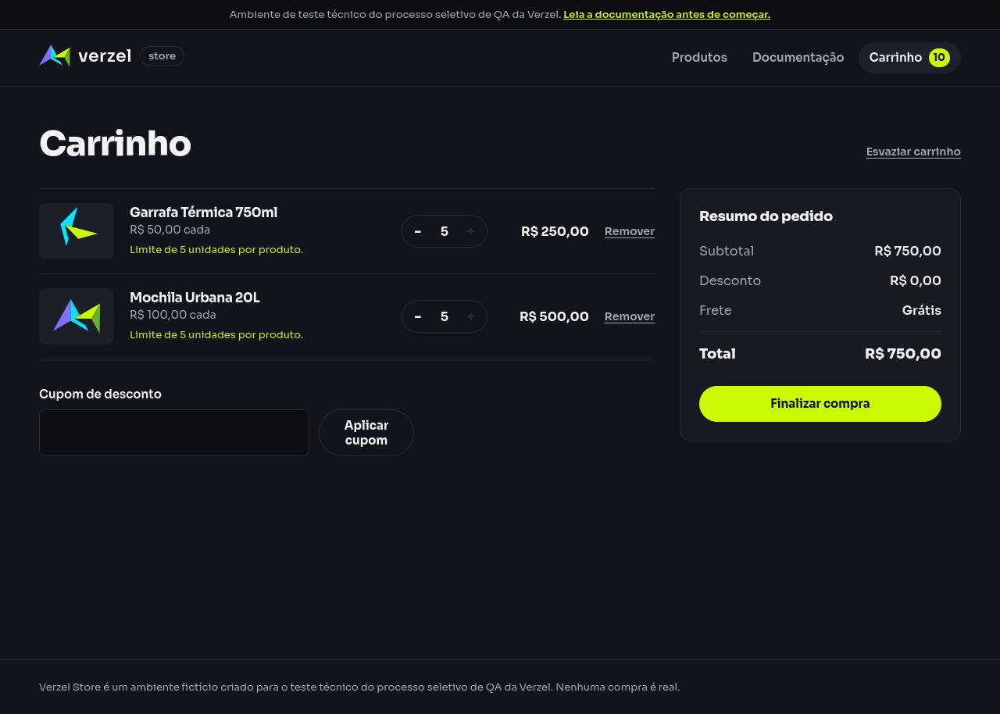

# Relatório de teste — Limitar cada produto independentemente

**Resultado: Aprovado.** Mesmo com cinco unidades de P008 no carrinho, a loja permitiu adicionar cinco unidades de P005. O carrinho terminou com cinco unidades de cada produto e subtotal de **R$ 750,00**.

**Data do teste:** 08/10/2026, das 11h30min21s às 11h30min30s (America/Fortaleza).

**Loja:** [Verzel Store — ambiente de testes](https://verzel-store.qa-test-verzel-store.workers.dev).

**Navegador:** Firefox 153.4.0, em perfil novo, com janela de 1280 × 1000. A execução automatizada salvou capturas completas das telas.

**Referência:** [Documentação VZS-142, versão 2.3.0](https://verzel-store.qa-test-verzel-store.workers.dev/documentacao), critério CA10; cenário em [quantidades_e_itens.feature](../features/quantidades_e_itens.feature).

## O que foi testado

Adicionamos cinco unidades da Garrafa Térmica 750ml (P008), de R$ 50,00 cada, pelos botões do catálogo. Abrimos o carrinho para conferir essa preparação e voltamos ao catálogo.

Nesse momento, o botão de adicionar P008 estava desabilitado por atingir o limite. O botão de P005, a Mochila Urbana 20L de R$ 100,00, continuava disponível. Adicionamos cinco unidades de P005, uma de cada vez, verificando a cada adição que P008 permanecia com cinco unidades.

Por fim, abrimos o carrinho e conferimos as duas quantidades e o subtotal. O teste usou somente os controles reais da interface, sem alterar os dados do carrinho por fora da loja. Não foi aplicado cupom.

## Cenário BDD

```gherkin
@CA10 @interface
Cenário: Limitar cada produto independentemente
  Dado que o carrinho contém 5 unidades do produto "P008" de R$ 50,00
  Quando adiciono 5 unidades do produto "P005" de R$ 100,00
  Então o carrinho deve conter 5 unidades de cada produto
  E o subtotal deve ser R$ 750,00
```

## Resultados da conferência

| Verificação | Esperado | Encontrado | Resultado |
| --- | --- | --- | --- |
| Produto P008 | Garrafa Térmica 750ml, por R$ 50,00 | Nome e preço corretos no catálogo | Aprovado |
| Produto P005 | Mochila Urbana 20L, por R$ 100,00 | Nome e preço corretos no catálogo | Aprovado |
| Preparação do carrinho | Cinco unidades de P008 | Cinco unidades de P008 | Aprovado |
| Subtotal da preparação | R$ 250,00 | R$ 250,00 | Aprovado |
| Limite de P008 no catálogo | Adição de P008 bloqueada ao chegar a cinco | Botão de P008 desabilitado | Aprovado |
| Disponibilidade de P005 | Permitir adicionar P005 mesmo com P008 no limite | Botão de P005 habilitado | Aprovado |
| P008 durante as cinco adições de P005 | Manter cinco unidades de P008 em cada etapa | P008 permaneceu com cinco em todas as etapas; P005 passou de uma até cinco unidades | Aprovado |
| Quantidade final de P008 | Cinco unidades | Cinco unidades exibidas no carrinho | Aprovado |
| Quantidade final de P005 | Cinco unidades | Cinco unidades exibidas no carrinho | Aprovado |
| Subtotal final exibido | R$ 750,00 | R$ 750,00 | Aprovado |
| Cálculo final aceito pela loja | Status 200 | Status 200 | Aprovado |
| Subtotal retornado à interface | R$ 750,00 | R$ 750,00 | Aprovado |
| Produtos retornados no cálculo | P008: cinco unidades; P005: cinco unidades | Os dois produtos, com cinco unidades cada | Aprovado |
| Produtos enviados pela interface | P008: cinco unidades; P005: cinco unidades | Os dois produtos enviados corretamente | Aprovado |

As **18 verificações passaram**. A linha sobre preservar P008 reúne cinco verificações, uma para cada adição de P005. O status 200 indica que o serviço da loja atendeu ao cálculo final.

O subtotal corresponde a cinco garrafas × R$ 50,00 = R$ 250,00, mais cinco mochilas × R$ 100,00 = R$ 500,00, somando R$ 750,00. A tela mostrou dez unidades no carrinho, distribuídas entre os dois produtos, sem tratar cinco como um limite para o carrinho inteiro.

## Falhas encontradas

Nenhuma falha foi encontrada neste cenário. O limite atingido por P008 não impediu adicionar P005, e as quantidades e o subtotal finais foram corretos. Não houve bloqueios nem passos sem execução.

## Comprovantes do teste

### Telas do caminho executado

| Etapa | Captura | Texto e estado da tela |
| --- | --- | --- |
| Produtos no catálogo | [Ver imagem](evidencias/limites-independentes-produtos/20261008-113021/01-produtos/tela.png) | [Texto](evidencias/limites-independentes-produtos/20261008-113021/01-produtos/texto-tela.txt), [estado](evidencias/limites-independentes-produtos/20261008-113021/01-produtos/estado.json) e [HTML](evidencias/limites-independentes-produtos/20261008-113021/01-produtos/pagina.html) |
| Carrinho com cinco P008 | [Ver imagem](evidencias/limites-independentes-produtos/20261008-113021/02-p008-no-limite/tela.png) | [Texto](evidencias/limites-independentes-produtos/20261008-113021/02-p008-no-limite/texto-tela.txt), [estado](evidencias/limites-independentes-produtos/20261008-113021/02-p008-no-limite/estado.json) e [HTML](evidencias/limites-independentes-produtos/20261008-113021/02-p008-no-limite/pagina.html) |
| P008 no limite e P005 disponível no catálogo | [Ver imagem](evidencias/limites-independentes-produtos/20261008-113021/03-p005-disponivel/tela.png) | [Texto](evidencias/limites-independentes-produtos/20261008-113021/03-p005-disponivel/texto-tela.txt), [estado](evidencias/limites-independentes-produtos/20261008-113021/03-p005-disponivel/estado.json) e [HTML](evidencias/limites-independentes-produtos/20261008-113021/03-p005-disponivel/pagina.html) |
| Carrinho com cinco de cada produto | [Ver imagem](evidencias/limites-independentes-produtos/20261008-113021/04-cinco-de-cada-produto/tela.png) | [Texto](evidencias/limites-independentes-produtos/20261008-113021/04-cinco-de-cada-produto/texto-tela.txt), [estado](evidencias/limites-independentes-produtos/20261008-113021/04-cinco-de-cada-produto/estado.json) e [HTML](evidencias/limites-independentes-produtos/20261008-113021/04-cinco-de-cada-produto/pagina.html) |



### Registros da execução

- [Conferência das 18 verificações, ações, horários e navegador](evidencias/limites-independentes-produtos/20261008-113021/validacao-interface.json).
- [Critérios esperados](evidencias/limites-independentes-produtos/20261008-113021/criterios.json).
- [Chamadas de cálculo registradas no navegador](evidencias/limites-independentes-produtos/20261008-113021/rede-navegador.json): cinco adições de P008 e cinco de P005.
- Cálculo final: [corpo enviado pela interface](evidencias/limites-independentes-produtos/20261008-113021/calculo-final-corpo-enviado.json), [corpo recebido](evidencias/limites-independentes-produtos/20261008-113021/calculo-final-corpo-recebido.json) e [status e cabeçalhos acessíveis no navegador](evidencias/limites-independentes-produtos/20261008-113021/calculo-final-http.json).
- [Erros capturados na página](evidencias/limites-independentes-produtos/20261008-113021/erros-pagina.json): lista vazia.
- [Script executado](evidencias/limites-independentes-produtos/20261008-113021/teste-interface.py), [comando original](evidencias/limites-independentes-produtos/20261008-113021/comando-execucao.txt) e [código de saída](evidencias/limites-independentes-produtos/20261008-113021/registro-execucao.json).
- [Saída da execução](evidencias/limites-independentes-produtos/20261008-113021/execucao-stdout.txt), [mensagens da ferramenta](evidencias/limites-independentes-produtos/20261008-113021/execucao-stderr.txt) e [log do Firefox](evidencias/limites-independentes-produtos/20261008-113021/firefox-gecko.log).

O registro da ferramenta contém informações da versão do Firefox e avisos de limpeza do perfil no encerramento do Python. Esses avisos ocorreram após as verificações e capturas; o processo terminou com código 0. Não foram tratados como falha funcional.

Para reproduzir pela interface, adicione cinco unidades de P008 no catálogo, confira o carrinho, volte ao catálogo e adicione cinco unidades de P005. Abra novamente o carrinho e confira cinco unidades em cada linha e subtotal de R$ 750,00.

Para repetir a automação neste ambiente, que já possui Firefox e o controlador Mozilla instalados:

```bash
PYTHONPATH=/tmp/verzel-marionette python reports/evidencias/limites-independentes-produtos/20261008-113021/teste-interface.py
```

A automação usou os botões reais e copiou as respostas da loja somente para registro. A verificação de segurança da conexão permaneceu ativa, com o certificado oficial do proxy no perfil temporário do Firefox.

## Limite desta avaliação

A aprovação se aplica à combinação de P008 e P005, adicionados nessa ordem e sem cupom, no Firefox. Outras combinações de produtos, a ordem inversa, tentativas de adicionar a sexta unidade e outros navegadores não foram avaliados nesta execução.

As respostas registradas foram geradas pelas ações da interface. Não houve teste separado com chamadas diretas à API nem confirmação de pedido.
